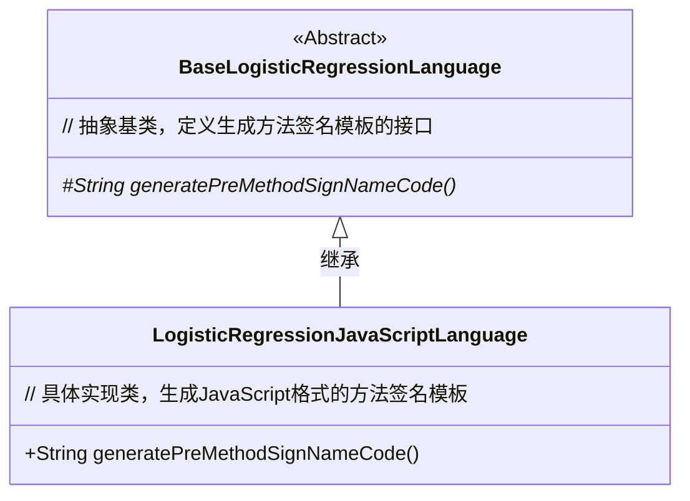
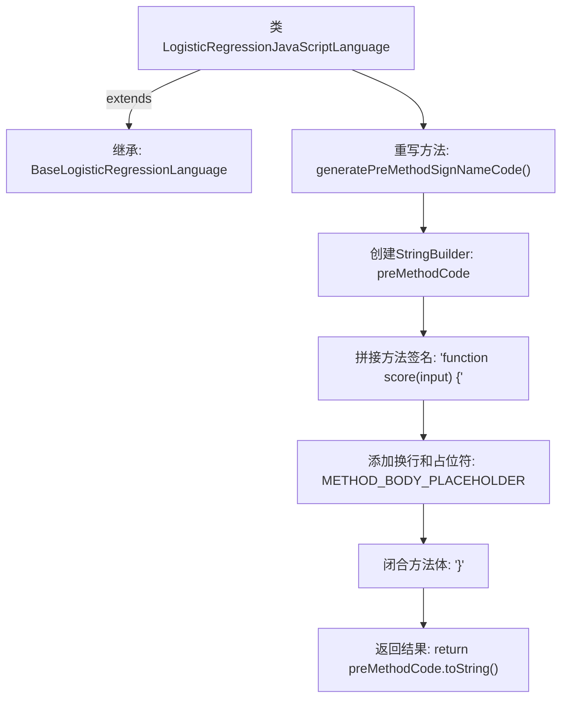

# 基础信息

|      |      |
|------|------|
| 名称 | LogisticRegressionJavaScriptLanguage |
| 编码语言 | .java |
| 代码路径 | WeFe/board/board-service/src/main/java/com/welab/wefe/board/service/service/modelexport/LogisticRegressionJavaScriptLanguage.java |
| 包名 | com.welab.wefe.board.service.service.modelexport |
| 依赖项 | [] |
| 概述说明 | LogisticRegressionJavaScriptLanguage类继承BaseLogisticRegressionLanguage，重写generatePreMethodSignNameCode方法生成JavaScript评分函数模板。 |

# 说明

这段代码描述了一个名为LogisticRegressionJavaScriptLanguage的类，继承自BaseLogisticRegressionLanguage。该类重写了generatePreMethodSignNameCode方法，用于生成JavaScript语言中逻辑回归评分函数的框架。方法内部使用StringBuilder构建了一个基本的函数结构，包含function score(input)的声明、方法体占位符以及右大括号。生成的代码字符串将作为后续方法体填充的模板。

# 类列表 Class Summary

| 名称   | 类型  | 说明 |
|-------|------|-------------|
| LogisticRegressionJavaScriptLanguage | class | LogisticRegressionJavaScriptLanguage类继承BaseLogisticRegressionLanguage，重写generatePreMethodSignNameCode方法生成JavaScript评分函数模板。 |

## 类 LogisticRegressionJavaScriptLanguage

|      |      |
|------|------|
| 访问范围 | public |
| 类型 | class |
| 名称 | LogisticRegressionJavaScriptLanguage |
| 说明 | LogisticRegressionJavaScriptLanguage类继承BaseLogisticRegressionLanguage，重写generatePreMethodSignNameCode方法生成JavaScript评分函数模板。 |

### UML类图

类图描述：该结构展示了一个机器学习代码生成框架中的语言适配层，BaseLogisticRegressionLanguage作为抽象基类定义了生成方法签名的接口，其子类LogisticRegressionJavaScriptLanguage专门实现JavaScript语言的方法签名模板生成，通过方法拼接返回"function score(input) {...}"的标准JS函数结构。

### 内部方法调用关系图

该流程图描述了JavaScript逻辑回归代码生成器的核心逻辑。类继承自基础类并重写方法，通过StringBuilder逐步构建函数模板：先声明方法签名，插入占位符，最后闭合函数体。整个过程严格遵循代码生成规范，确保输出符合JavaScript语法要求。

### 字段列表 Field List

| 名称  | 类型  | 说明 |
|-------|-------|------|

### 方法列表

| 名称  | 类型  | 说明 |
|-------|-------|------|
| generatePreMethodSignNameCode | String | 生成预定义方法签名代码，包含函数声明、占位符和格式缩进。 |

