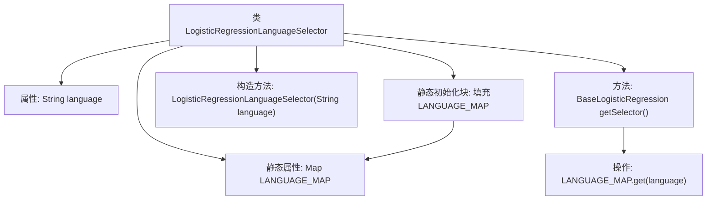

# 基础信息

|      |      |
|------|------|
| 名称 | LogisticRegressionLanguageSelector |
| 编码语言 | .java |
| 代码路径 | WeFe/board/board-service/src/main/java/com/welab/wefe/board/service/service/modelexport/LogisticRegressionLanguageSelector.java |
| 包名 | com.welab.wefe.board.service.service.modelexport |
| 依赖项 | ['com.welab.wefe.common.wefe.enums.ModelExportLanguage', 'java.util.HashMap', 'java.util.Map'] |
| 概述说明 | LogisticRegressionLanguageSelector类通过静态映射存储不同语言的逻辑回归实现，根据输入语言返回对应实例。 |

# 说明

该代码定义了一个LogisticRegressionLanguageSelector类，用于根据输入语言选择对应的逻辑回归实现。类中包含一个静态映射表LANGUAGE_MAP，预先存储了14种编程语言（如C、C#、Python等）和PMML对应的逻辑回归实现类。构造函数接收语言参数，getSelector方法返回匹配的实现类实例。通过静态初始化块预先填充映射表，实现了多语言支持的功能。

# 类列表 Class Summary

| 名称   | 类型  | 说明 |
|-------|------|-------------|
| LogisticRegressionLanguageSelector | class | LogisticRegressionLanguageSelector类通过静态映射支持多种语言的逻辑回归模型选择，根据输入语言返回对应实现。 |

## 类 LogisticRegressionLanguageSelector

|      |      |
|------|------|
| 访问范围 | public |
| 类型 | class |
| 名称 | LogisticRegressionLanguageSelector |
| 说明 | LogisticRegressionLanguageSelector类通过静态映射支持多种语言的逻辑回归模型选择，根据输入语言返回对应实现。 |

### UML类图

```mermaid
classDiagram
    class LogisticRegressionLanguageSelector {
        -String language
        -static Map~String, BaseLogisticRegressionLanguage~ LANGUAGE_MAP
        +LogisticRegressionLanguageSelector(String language)
        +BaseLogisticRegressionLanguage getSelector()
    }

    class BaseLogisticRegressionLanguage {
        <<Interface>>
    }

    class LogisticRegressionCLanguage {
        +implements BaseLogisticRegressionLanguage
    }
    class LogisticRegressionCSharpLanguage {
        +implements BaseLogisticRegressionLanguage
    }
    class LogisticRegressionDartLanguage {
        +implements BaseLogisticRegressionLanguage
    }
    class LogisticRegressionGoLanguage {
        +implements BaseLogisticRegressionLanguage
    }
    class LogisticRegressionHaskellLanguage {
        +implements BaseLogisticRegressionLanguage
    }
    class LogisticRegressionJavaLanguage {
        +implements BaseLogisticRegressionLanguage
    }
    class LogisticRegressionJavaScriptLanguage {
        +implements BaseLogisticRegressionLanguage
    }
    class LogisticRegressionPhpLanguage {
        +implements BaseLogisticRegressionLanguage
    }
    class LogisticRegressionPowerShellLanguage {
        +implements BaseLogisticRegressionLanguage
    }
    class LogisticRegressionPythonLanguage {
        +implements BaseLogisticRegressionLanguage
    }
    class LogisticRegressionRLanguage {
        +implements BaseLogisticRegressionLanguage
    }
    class LogisticRegressionRubyLanguage {
        +implements BaseLogisticRegressionLanguage
    }
    class LogisticRegressionVisualBasicLanguage {
        +implements BaseLogisticRegressionLanguage
    }
    class LogisticRegressionPmmlLanguage {
        +implements BaseLogisticRegressionLanguage
    }

    LogisticRegressionLanguageSelector --> BaseLogisticRegressionLanguage : 依赖
    LogisticRegressionCLanguage --|> BaseLogisticRegressionLanguage
    LogisticRegressionCSharpLanguage --|> BaseLogisticRegressionLanguage
    LogisticRegressionDartLanguage --|> BaseLogisticRegressionLanguage
    LogisticRegressionGoLanguage --|> BaseLogisticRegressionLanguage
    LogisticRegressionHaskellLanguage --|> BaseLogisticRegressionLanguage
    LogisticRegressionJavaLanguage --|> BaseLogisticRegressionLanguage
    LogisticRegressionJavaScriptLanguage --|> BaseLogisticRegressionLanguage
    LogisticRegressionPhpLanguage --|> BaseLogisticRegressionLanguage
    LogisticRegressionPowerShellLanguage --|> BaseLogisticRegressionLanguage
    LogisticRegressionPythonLanguage --|> BaseLogisticRegressionLanguage
    LogisticRegressionRLanguage --|> BaseLogisticRegressionLanguage
    LogisticRegressionRubyLanguage --|> BaseLogisticRegressionLanguage
    LogisticRegressionVisualBasicLanguage --|> BaseLogisticRegressionLanguage
    LogisticRegressionPmmlLanguage --|> BaseLogisticRegressionLanguage
```

这段代码实现了一个逻辑回归语言选择器，通过静态初始化将不同编程语言的逻辑回归实现类注册到映射表中。LogisticRegressionLanguageSelector类根据输入的语言名称返回对应的实现类，所有具体语言实现类都继承自BaseLogisticRegressionLanguage接口。这种设计模式实现了语言实现的解耦和动态选择，支持多种编程语言的逻辑回归模型导出功能。

### 内部方法调用关系图

这段代码描述了一个逻辑回归语言选择器类，通过静态初始化块预加载了14种编程语言的逻辑回归实现到哈希表中。类包含语言属性和静态映射表，构造方法接收语言参数，getSelector方法根据语言键从映射表中获取对应的实现类。流程图展示了类结构、初始化过程和方法调用关系，突出静态数据预加载和运行时动态查询的设计模式。

### 字段列表 Field List

| 名称  | 类型  | 说明 |
|-------|-------|------|
| language | String | 私有不可变字符串变量language。 |
| LANGUAGE_MAP = new HashMap<>(16) | Map<String, BaseLogisticRegressionLanguage> | 定义静态常量LANGUAGE_MAP，使用HashMap存储字符串到BaseLogisticRegressionLanguage的映射，初始容量16。 |

### 方法列表

| 名称  | 类型  | 说明 |
|-------|-------|------|
| getSelector | BaseLogisticRegressionLanguage | 获取指定语言的逻辑回归语言选择器。 |

