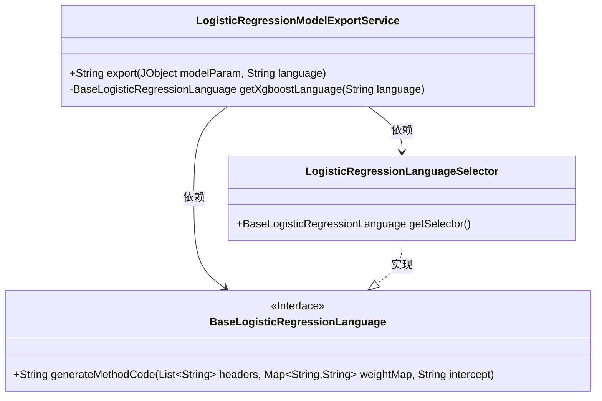
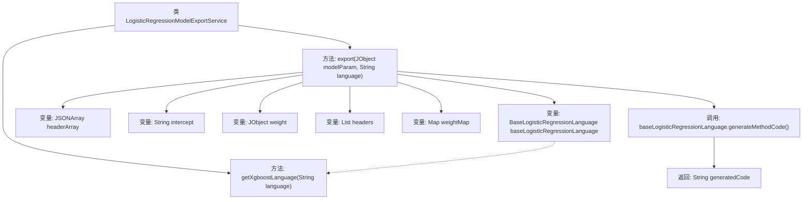

# 基础信息

|      |      |
|------|------|
| 名称 | LogisticRegressionModelExportService |
| 编码语言 | .java |
| 代码路径 | WeFe/board/board-service/src/main/java/com/welab/wefe/board/service/service/modelexport/LogisticRegressionModelExportService.java |
| 包名 | com.welab.wefe.board.service.service.modelexport |
| 依赖项 | ['com.alibaba.fastjson.JSONArray', 'com.welab.wefe.common.util.JObject', 'org.springframework.stereotype.Service', 'java.util.ArrayList', 'java.util.HashMap', 'java.util.List', 'java.util.Map'] |
| 概述说明 | LogisticRegressionModelExportService类提供模型导出功能，根据参数和语言生成对应代码。方法export处理模型参数，提取头信息、截距和权重，调用语言解释器生成代码。getXgboostLanguage方法选择对应语言解释器。 |

# 说明

LogisticRegressionModelExportService是一个服务类，提供模型导出功能。它包含export方法，接收模型参数和语言参数，通过getXgboostLanguage方法获取对应语言的解释器。export方法解析模型参数中的header数组、intercept值和weight对象，将header转换为字符串列表，weight转换为键值对映射。最后调用解释器的generateMethodCode方法生成代码并返回。getXgboostLanguage方法通过LogisticRegressionLanguageSelector选择对应语言的解释器。

# 类列表 Class Summary

| 名称   | 类型  | 说明 |
|-------|------|-------------|
| LogisticRegressionModelExportService | class | LogisticRegressionModelExportService类提供模型导出功能，根据语言参数生成对应代码，处理模型参数、头信息和权重，返回方法代码。 |

## 类 LogisticRegressionModelExportService

|      |      |
|------|------|
| 访问范围 | @Service;public |
| 类型 | class |
| 名称 | LogisticRegressionModelExportService |
| 说明 | LogisticRegressionModelExportService类提供模型导出功能，根据语言参数生成对应代码，处理模型参数、头信息和权重，返回方法代码。 |

### UML类图

该代码实现了一个逻辑回归模型导出服务，通过`LogisticRegressionModelExportService`类处理模型参数并调用特定语言解释器生成代码。服务依赖`BaseLogisticRegressionLanguage`接口定义的语言生成规范，具体实现由`LogisticRegressionLanguageSelector`选择器提供。类图清晰展示了服务与语言解释器之间的依赖关系及接口实现层级。

### 内部方法调用关系图

该流程图展示了LogisticRegressionModelExportService类的核心逻辑。主要流程从export方法开始，依次解析模型参数、构建头信息和权重映射表，最后通过语言选择器生成目标语言代码。getXgboostLanguage方法负责根据语言类型返回对应的代码生成器实现，最终由generateMethodCode完成代码生成并返回结果字符串。整个过程体现了参数解析、数据处理和多语言支持的协作机制。

### 字段列表 Field List

| 名称  | 类型  | 说明 |
|-------|-------|------|

### 方法列表

| 名称  | 类型  | 说明 |
|-------|-------|------|
| getXgboostLanguage | BaseLogisticRegressionLanguage | 该方法根据输入语言参数，通过LogisticRegressionLanguageSelector选择并返回对应的Xgboost逻辑回归语言模型。 |
| export | String | 该方法根据语言参数获取对应的逻辑回归语言解释器，解析模型参数中的表头、截距和权重，生成并返回对应语言的代码。 |

