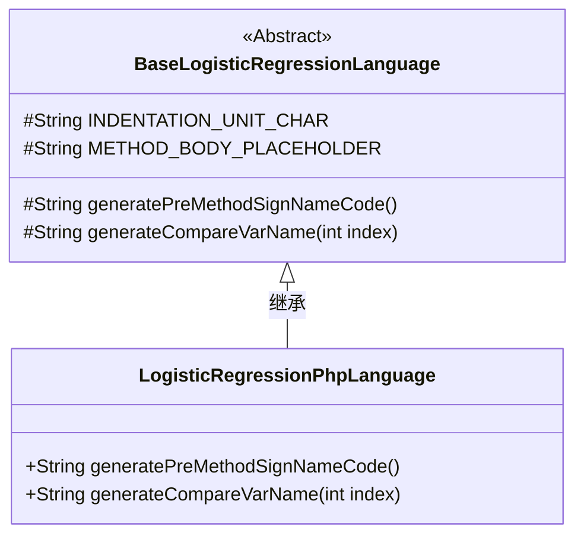
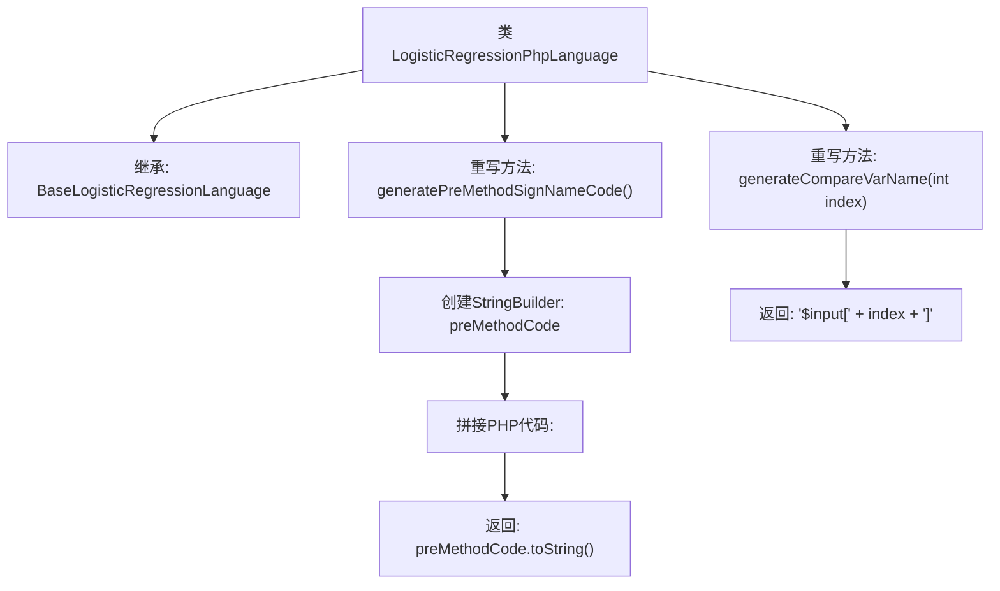

# 基础信息

|      |      |
|------|------|
| 名称 | LogisticRegressionPhpLanguage |
| 编码语言 | .java |
| 代码路径 | WeFe/board/board-service/src/main/java/com/welab/wefe/board/service/service/modelexport/LogisticRegressionPhpLanguage.java |
| 包名 | com.welab.wefe.board.service.service.modelexport |
| 依赖项 | [] |
| 概述说明 | PHP逻辑回归类，生成评分函数框架和输入变量索引代码。 |

# 说明

该代码定义了一个名为LogisticRegressionPhpLanguage的类，继承自BaseLogisticRegressionLanguage。它重写了两个方法：generatePreMethodSignNameCode生成PHP函数签名代码，包含PHP起始标签和score函数框架；generateCompareVarName生成用于比较的变量名，格式为PHP数组访问形式$input[index]。类专注于为逻辑回归模型生成PHP语言特定的代码结构。

# 类列表 Class Summary

| 名称   | 类型  | 说明 |
|-------|------|-------------|
| LogisticRegressionPhpLanguage | class | PHP逻辑回归类，生成评分函数框架和输入变量索引代码。 |

## 类 LogisticRegressionPhpLanguage

|      |      |
|------|------|
| 访问范围 | public |
| 类型 | class |
| 名称 | LogisticRegressionPhpLanguage |
| 说明 | PHP逻辑回归类，生成评分函数框架和输入变量索引代码。 |

### UML类图

这段代码展示了一个PHP语言逻辑回归实现的类结构。LogisticRegressionPhpLanguage继承自抽象基类BaseLogisticRegressionLanguage，实现了两个关键方法：generatePreMethodSignNameCode()用于生成PHP函数签名模板，包含方法框架和占位符；generateCompareVarName()则生成PHP数组访问语法用于特征比较。基类定义了公共常量和抽象方法，子类提供了PHP语言特定的实现细节，体现了模板方法设计模式的应用。

### 内部方法调用关系图

该流程图展示了PHP语言逻辑回归代码生成器的类结构。LogisticRegressionPhpLanguage继承自基类，重写了两个关键方法：generatePreMethodSignNameCode()用于生成PHP函数签名模板（包含<?php标记和score方法框架），generateCompareVarName()则生成PHP数组索引格式的变量名（如$input[0]）。箭头清晰地表示了方法调用关系和字符串拼接流程。

### 字段列表 Field List

| 名称  | 类型  | 说明 |
|-------|-------|------|

### 方法列表

| 名称  | 类型  | 说明 |
|-------|-------|------|
| generatePreMethodSignNameCode | String | 生成PHP函数框架代码，包含起始标签、函数定义和占位符。 |
| generateCompareVarName | String | Java方法重写，生成比较变量名，格式为"$input[index]"。 |

