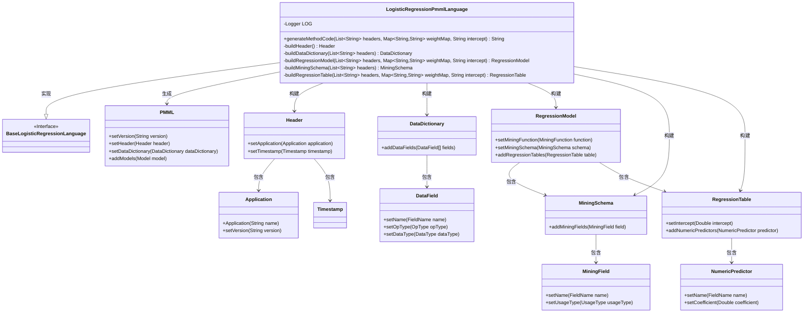
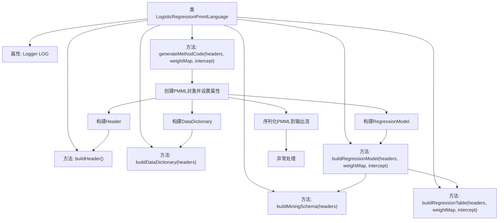
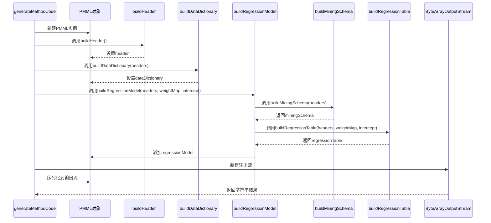

# 基础信息

|      |      |
|------|------|
| 名称 | LogisticRegressionPmmlLanguage |
| 编码语言 | .java |
| 代码路径 | WeFe/board/board-service/src/main/java/com/welab/wefe/board/service/service/modelexport/LogisticRegressionPmmlLanguage.java |
| 包名 | com.welab.wefe.board.service.service.modelexport |
| 依赖项 | ['org.apache.commons.lang3.math.NumberUtils', 'org.dmg.pmml', 'org.dmg.pmml.regression.NumericPredictor', 'org.dmg.pmml.regression.RegressionModel', 'org.dmg.pmml.regression.RegressionTable', 'org.jpmml.model.PMMLUtil', 'org.slf4j.Logger', 'org.slf4j.LoggerFactory', 'java.io.ByteArrayOutputStream', 'java.util.ArrayList', 'java.util.List', 'java.util.Map'] |
| 概述说明 | LogisticRegressionPmmlLanguage类继承BaseLogisticRegressionLanguage，生成PMML格式的逻辑回归模型代码，包含头信息、数据字典、回归模型、挖掘模式和回归表。 |

# 说明

该代码定义了一个名为LogisticRegressionPmmlLanguage的类，用于生成逻辑回归模型的PMML格式输出。类继承自BaseLogisticRegressionLanguage，包含生成PMML文档的核心方法generateMethodCode。该方法接收表头列表、权重映射和截距值作为输入，构建PMML文档结构，包括头部信息、数据字典、回归模型等组件。其中数据字典定义了输入参数和输出变量y的数据类型，回归模型设置了挖掘函数和模式，回归表则存储了各参数的系数和截距值。整个过程通过PMMLUtil将对象序列化为XML字符串输出，异常时记录错误日志。

# 类列表 Class Summary

| 名称   | 类型  | 说明 |
|-------|------|-------------|
| LogisticRegressionPmmlLanguage | class | LogisticRegressionPmmlLanguage类生成PMML格式的逻辑回归模型代码，包含数据字典、回归模型、挖掘模式和回归表构建，支持异常处理和日志记录。 |

## 类 LogisticRegressionPmmlLanguage

|      |      |
|------|------|
| 访问范围 | public |
| 类型 | class |
| 名称 | LogisticRegressionPmmlLanguage |
| 说明 | LogisticRegressionPmmlLanguage类生成PMML格式的逻辑回归模型代码，包含数据字典、回归模型、挖掘模式和回归表构建，支持异常处理和日志记录。 |

### UML类图

这段代码描述了一个用于生成PMML格式逻辑回归模型的类。LogisticRegressionPmmlLanguage继承自BaseLogisticRegressionLanguage接口，通过构建Header、DataDictionary、RegressionModel等组件，最终生成符合PMML 4.3标准的XML字符串。该类封装了从数据头信息、数据字典到回归模型的全套构建逻辑，支持设置特征权重和截距项，并能处理模型序列化过程中的异常情况。

### 内部方法调用关系图

这段代码是用于生成逻辑回归模型的PMML(预测模型标记语言)格式输出的实现。主要流程包括：创建PMML基础对象，构建Header头部信息，构建数据字典，构建回归模型(包含挖掘模式和回归表)，最后将整个模型序列化为XML字符串输出。代码通过多个构建方法分工协作，最终生成符合PMML 4.3标准的逻辑回归模型描述文件，可用于模型交换和部署。异常处理机制确保生成过程出现问题时能够记录日志并返回空字符串。

### 字段列表 Field List

| 名称  | 类型  | 说明 |
|-------|-------|------|
| LOG = LoggerFactory.getLogger(this.getClass()) | Logger | 类中定义了一个受保护的final日志对象LOG，使用当前类初始化。 |

### 方法列表

| 名称  | 类型  | 说明 |
|-------|-------|------|
| buildDataDictionary | DataDictionary | 构建数据字典方法：初始化y字段为连续双精度类型，遍历headers列表为每个参数创建相同类型的字段，最终返回包含所有字段的数据字典。 |
| buildHeader | Header | 构建Header对象，包含应用名"Logistic Regression Model"、版本"1.0"和时间戳。 |
| generateMethodCode | String | 该方法生成逻辑回归模型的PMML代码，包括版本、头信息、数据字典和回归模型，通过输出流转换为字符串，异常时记录错误并返回空字符串。 |
| buildRegressionModel | RegressionModel | 构建回归模型方法：设置回归函数、创建数据模式并添加回归表，返回回归模型实例。 |
| buildMiningSchema | MiningSchema | 构建MiningSchema方法：创建MiningSchema对象，添加目标字段"y"，遍历headers列表添加其他字段，最后返回MiningSchema。 |
| buildRegressionTable | RegressionTable | 构建回归表，设置截距项并遍历表头列表，为每个参数创建数值预测器，设置名称和系数后返回回归表对象。 |

