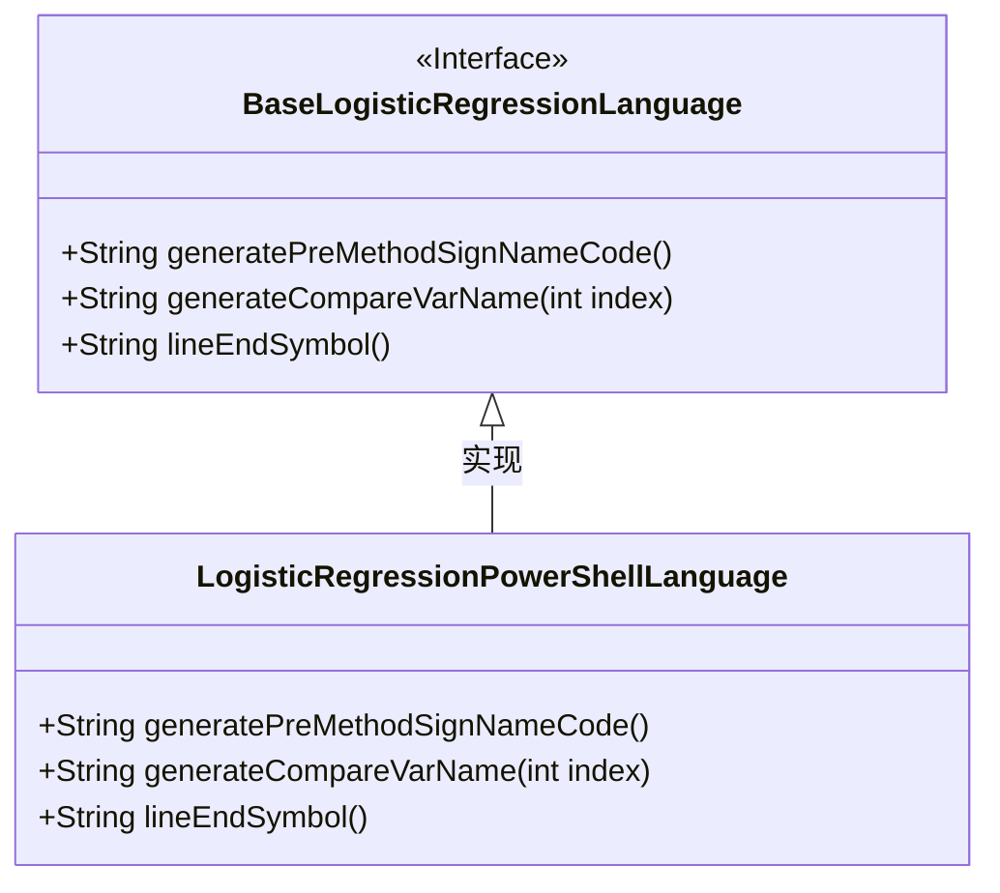
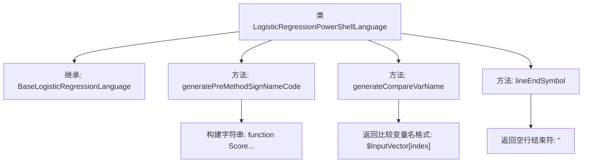

# 基础信息

|      |      |
|------|------|
| 名称 | LogisticRegressionPowerShellLanguage |
| 编码语言 | .java |
| 代码路径 | WeFe/board/board-service/src/main/java/com/welab/wefe/board/service/service/modelexport/LogisticRegressionPowerShellLanguage.java |
| 包名 | com.welab.wefe.board.service.service.modelexport |
| 依赖项 | [] |
| 概述说明 | LogisticRegressionPowerShellLanguage类继承BaseLogisticRegressionLanguage，重写生成PowerShell函数签名、变量名比较和行尾符号的方法。函数名为Score，参数为InputVector数组，变量比较使用索引访问。 |

# 说明

该内容描述了一个名为LogisticRegressionPowerShellLanguage的类，继承自BaseLogisticRegressionLanguage。该类重写了三个方法：generatePreMethodSignNameCode生成PowerShell函数签名代码，包含输入参数和方法体占位符；generateCompareVarName生成索引访问输入向量的PowerShell变量名；lineEndSymbol返回空字符串表示无需行结束符。整体实现了PowerShell语言特定的逻辑回归代码生成逻辑。

# 类列表 Class Summary

| 名称   | 类型  | 说明 |
|-------|------|-------------|
| LogisticRegressionPowerShellLanguage | class | LogisticRegressionPowerShellLanguage类继承BaseLogisticRegressionLanguage，重写生成PowerShell评分函数的方法，包括函数签名、输入向量比较变量名及行尾符号处理。 |

## 类 LogisticRegressionPowerShellLanguage

|      |      |
|------|------|
| 访问范围 | public |
| 类型 | class |
| 名称 | LogisticRegressionPowerShellLanguage |
| 说明 | LogisticRegressionPowerShellLanguage类继承BaseLogisticRegressionLanguage，重写生成PowerShell评分函数的方法，包括函数签名、输入向量比较变量名及行尾符号处理。 |

### UML类图

该代码展示了一个PowerShell语言实现的逻辑回归评分类，继承自基础逻辑回归语言接口。LogisticRegressionPowerShellLanguage类重写了三个关键方法：生成方法签名代码、生成比较变量名和行结束符号。类图清晰地显示了实现关系，其中基类被标记为接口，子类具体实现了所有抽象方法，用于生成PowerShell特定语法的代码片段。

### 内部方法调用关系图

该流程图展示了LogisticRegressionPowerShellLanguage类的结构，它继承自BaseLogisticRegressionLanguage，包含三个核心方法：generatePreMethodSignNameCode用于生成PowerShell函数签名模板，generateCompareVarName格式化输入向量索引的变量名，lineEndSymbol返回空字符串作为行结束符。每个方法的具体实现通过子节点展示，体现了对PowerShell语法的适配逻辑。

### 字段列表 Field List

| 名称  | 类型  | 说明 |
|-------|-------|------|

### 方法列表

| 名称  | 类型  | 说明 |
|-------|-------|------|
| generateCompareVarName | String | 生成比较变量名方法，返回格式为$InputVector[index]。 |
| generatePreMethodSignNameCode | String | 生成预定义方法签名代码，包含函数名、输入参数和占位符。 |
| lineEndSymbol | String | 方法重写，返回空字符串作为行结束符。 |

