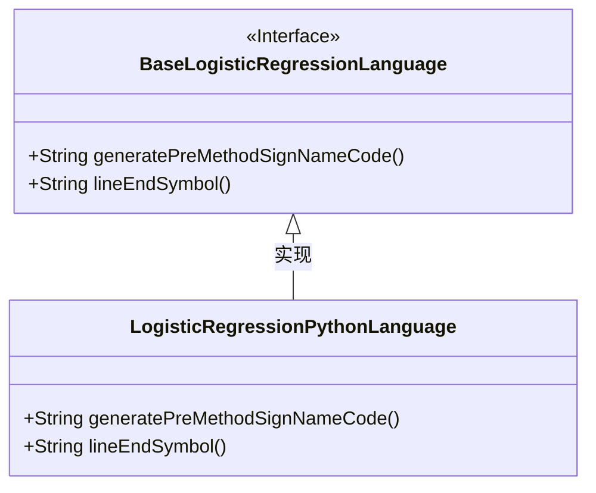
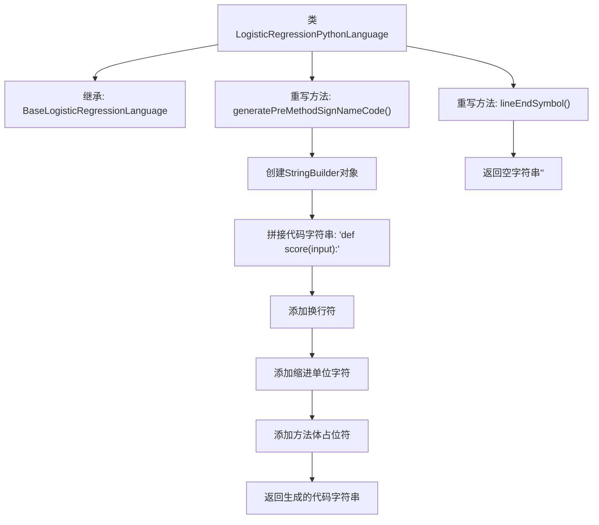

# 基础信息

|      |      |
|------|------|
| 名称 | LogisticRegressionPythonLanguage |
| 编码语言 | .java |
| 代码路径 | WeFe/board/board-service/src/main/java/com/welab/wefe/board/service/service/modelexport/LogisticRegressionPythonLanguage.java |
| 包名 | com.welab.wefe.board.service.service.modelexport |
| 依赖项 | [] |
| 概述说明 | LogisticRegressionPythonLanguage类继承BaseLogisticRegressionLanguage，重写生成Python评分方法签名和行尾符号方法，返回无行尾符。 |

# 说明

该代码定义了一个名为LogisticRegressionPythonLanguage的类，继承自BaseLogisticRegressionLanguage。它重写了两个方法：generatePreMethodSignNameCode方法生成Python函数定义模板，包含方法签名和占位符；lineEndSymbol方法返回空字符串表示Python不需要行结束符。类专注于为逻辑回归生成Python语言特定代码结构。

# 类列表 Class Summary

| 名称   | 类型  | 说明 |
|-------|------|-------------|
| LogisticRegressionPythonLanguage | class | Python逻辑回归语言类，继承基础类，重写生成方法签名和行尾符号方法，方法签名返回Python函数定义格式，行尾符号返回空字符串。 |

## 类 LogisticRegressionPythonLanguage

|      |      |
|------|------|
| 访问范围 | public |
| 类型 | class |
| 名称 | LogisticRegressionPythonLanguage |
| 说明 | Python逻辑回归语言类，继承基础类，重写生成方法签名和行尾符号方法，方法签名返回Python函数定义格式，行尾符号返回空字符串。 |

### UML类图

这段类图展示了LogisticRegressionPythonLanguage类继承自BaseLogisticRegressionLanguage接口的结构。BaseLogisticRegressionLanguage定义了两个抽象方法：generatePreMethodSignNameCode()用于生成Python方法签名代码，lineEndSymbol()返回行结束符（Python中为空字符串）。LogisticRegressionPythonLanguage实现了这两个方法，其中generatePreMethodSignNameCode()构建了Python函数定义模板，lineEndSymbol()返回空字符串符合Python语法要求。

### 内部方法调用关系图

该流程图展示了LogisticRegressionPythonLanguage类的结构和方法调用关系。该类继承自BaseLogisticRegressionLanguage，并重写了两个方法：generatePreMethodSignNameCode()用于生成Python方法签名代码，通过StringBuilder逐步构建包含方法定义、换行、缩进和占位符的字符串；lineEndSymbol()则返回空字符串表示Python不需要行结束符。流程清晰展现了代码生成和字符串拼接的步骤。

### 字段列表 Field List

| 名称  | 类型  | 说明 |
|-------|-------|------|

### 方法列表

| 名称  | 类型  | 说明 |
|-------|-------|------|
| generatePreMethodSignNameCode | String | 生成Python方法签名代码，包含"def score(input):"和方法体占位符。 |
| lineEndSymbol | String | Java方法重写，返回空字符串作为行结束符。 |

