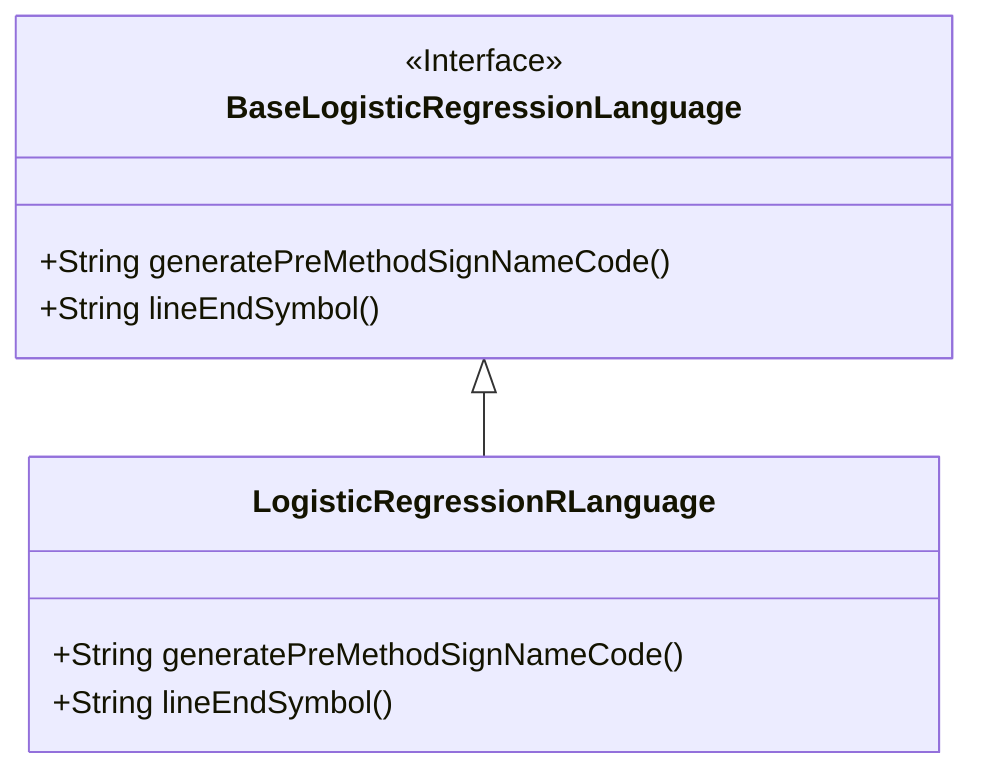
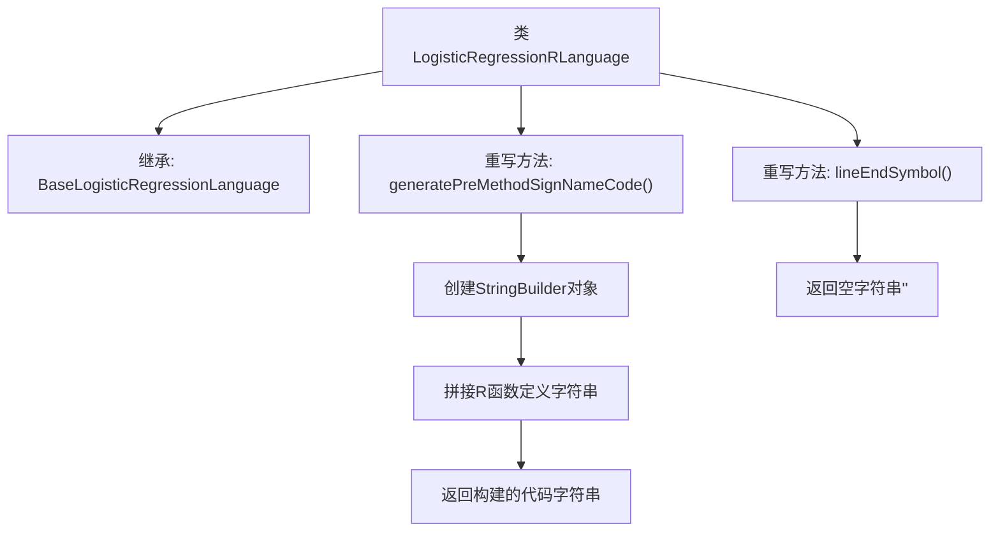

# 基础信息

|      |      |
|------|------|
| 名称 | LogisticRegressionRLanguage |
| 编码语言 | .java |
| 代码路径 | WeFe/board/board-service/src/main/java/com/welab/wefe/board/service/service/modelexport/LogisticRegressionRLanguage.java |
| 包名 | com.welab.wefe.board.service.service.modelexport |
| 依赖项 | [] |
| 概述说明 | LogisticRegressionRLanguage类继承BaseLogisticRegressionLanguage，重写生成R语言评分函数模板的方法，函数体占位符缩进，无行尾符号。 |

# 说明

该代码定义了一个名为LogisticRegressionRLanguage的类，继承自BaseLogisticRegressionLanguage。它重写了两个方法：generatePreMethodSignNameCode方法生成R语言评分函数的基本结构，包含函数定义和占位符；lineEndSymbol方法返回空字符串表示R语言不需要行结束符。类专注于为逻辑回归模型生成R语言代码模板。

# 类列表 Class Summary

| 名称   | 类型  | 说明 |
|-------|------|-------------|
| LogisticRegressionRLanguage | class | Java类LogisticRegressionRLanguage继承BaseLogisticRegressionLanguage，重写生成R语言评分函数模板的方法，返回包含占位符的代码字符串，行尾无符号。 |

## 类 LogisticRegressionRLanguage

|      |      |
|------|------|
| 访问范围 | public |
| 类型 | class |
| 名称 | LogisticRegressionRLanguage |
| 说明 | Java类LogisticRegressionRLanguage继承BaseLogisticRegressionLanguage，重写生成R语言评分函数模板的方法，返回包含占位符的代码字符串，行尾无符号。 |

### UML类图

这段类图展示了LogisticRegressionRLanguage类继承自BaseLogisticRegressionLanguage接口的结构。BaseLogisticRegressionLanguage是一个接口，定义了两个抽象方法：generatePreMethodSignNameCode()用于生成方法签名代码，lineEndSymbol()返回行结束符号。LogisticRegressionRLanguage作为实现类，重写了这两个方法，其中generatePreMethodSignNameCode()使用StringBuilder构建R语言格式的方法定义模板，lineEndSymbol()返回空字符串表示R语言不需要显式行结束符。

### 内部方法调用关系图

该流程图展示了LogisticRegressionRLanguage类的结构，重点描述了两个重写方法的执行流程。generatePreMethodSignNameCode()方法负责构建R语言的函数定义模板，通过StringBuilder逐步拼接代码字符串；lineEndSymbol()方法则返回空字符串表示R语言不需要行结束符。整个流程体现了R语言代码生成器的核心逻辑，通过方法重写实现特定语言的语法规则适配。

### 字段列表 Field List

| 名称  | 类型  | 说明 |
|-------|-------|------|

### 方法列表

| 名称  | 类型  | 说明 |
|-------|-------|------|
| lineEndSymbol | String | 方法重写，返回空字符串作为行结束符。 |
| generatePreMethodSignNameCode | String | 生成R语言评分函数框架，包含占位符和方法结构。 |

