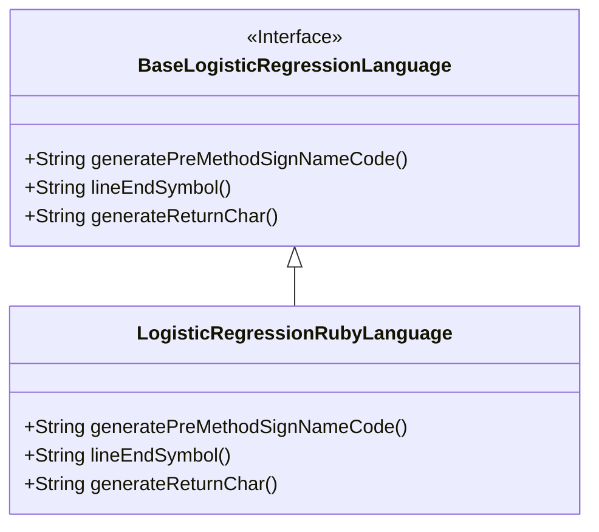
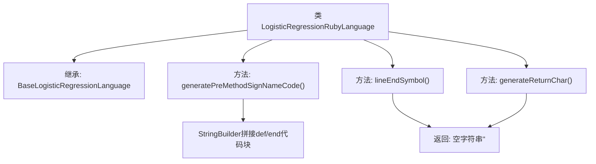

# 基础信息

|      |      |
|------|------|
| 名称 | LogisticRegressionRubyLanguage |
| 编码语言 | .java |
| 代码路径 | WeFe/board/board-service/src/main/java/com/welab/wefe/board/service/service/modelexport/LogisticRegressionRubyLanguage.java |
| 包名 | com.welab.wefe.board.service.service.modelexport |
| 依赖项 | [] |
| 概述说明 | LogisticRegressionRubyLanguage类继承BaseLogisticRegressionLanguage，重写生成Ruby方法签名代码，无行尾和返回符号。 |

# 说明

该代码定义了一个名为LogisticRegressionRubyLanguage的类，继承自BaseLogisticRegressionLanguage。它重写了三个方法：generatePreMethodSignNameCode生成Ruby语言的方法签名模板，包含def score(input)和end结构；lineEndSymbol返回空字符串表示Ruby不需要行结束符；generateReturnChar同样返回空字符串，说明Ruby方法默认返回最后一行表达式值。整体实现了为Ruby语言定制逻辑回归模型代码生成的功能。

# 类列表 Class Summary

| 名称   | 类型  | 说明 |
|-------|------|-------------|
| LogisticRegressionRubyLanguage | class | LogisticRegressionRubyLanguage类继承BaseLogisticRegressionLanguage，重写生成Ruby方法签名代码的方法，不添加行尾符号和返回字符。 |

## 类 LogisticRegressionRubyLanguage

|      |      |
|------|------|
| 访问范围 | public |
| 类型 | class |
| 名称 | LogisticRegressionRubyLanguage |
| 说明 | LogisticRegressionRubyLanguage类继承BaseLogisticRegressionLanguage，重写生成Ruby方法签名代码的方法，不添加行尾符号和返回字符。 |

### UML类图

这段代码展示了一个继承关系，其中`LogisticRegressionRubyLanguage`类实现了`BaseLogisticRegressionLanguage`接口。子类重写了三个方法：`generatePreMethodSignNameCode()`用于生成Ruby语言的方法签名代码，`lineEndSymbol()`返回空字符串表示Ruby不需要行结束符，`generateReturnChar()`同样返回空字符串表示Ruby的隐式返回值特性。类图清晰地展示了这种接口实现关系。

### 内部方法调用关系图

该流程图展示了LogisticRegressionRubyLanguage类的继承关系和方法结构。类继承自BaseLogisticRegressionLanguage，主要实现三个方法：generatePreMethodSignNameCode()用于生成Ruby语言的方法签名模板，lineEndSymbol()和generateReturnChar()均返回空字符串。核心方法通过StringBuilder构建包含占位符的Ruby方法定义代码块，体现对Ruby语法特性的适配。

### 字段列表 Field List

| 名称  | 类型  | 说明 |
|-------|-------|------|

### 方法列表

| 名称  | 类型  | 说明 |
|-------|-------|------|
| lineEndSymbol | String | 该方法重写父类方法，返回空字符串作为行结束符号。 |
| generatePreMethodSignNameCode | String | 生成Python方法框架代码，包含方法定义、占位符和方法结束标记。 |
| generateReturnChar | String | 重写方法generateReturnChar，返回空字符串。 |

