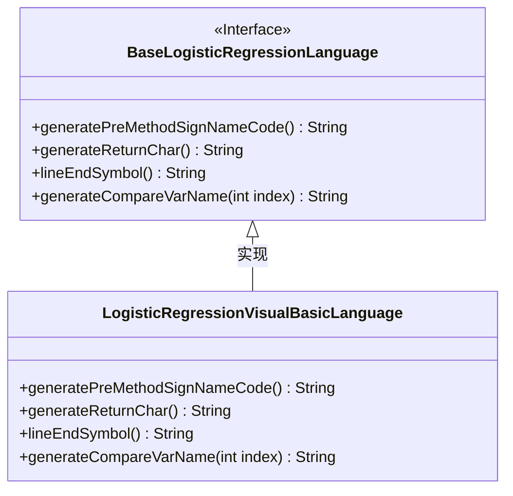
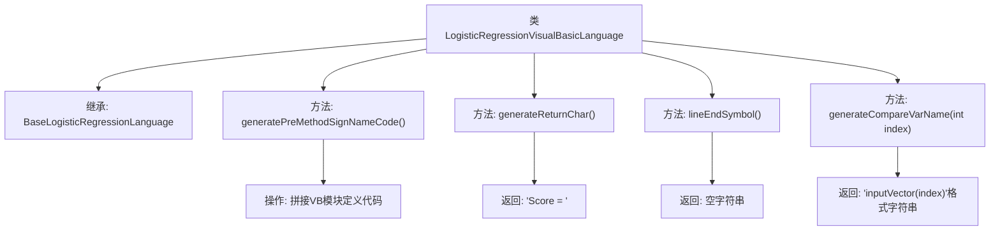

# 基础信息

|      |      |
|------|------|
| 名称 | LogisticRegressionVisualBasicLanguage |
| 编码语言 | .java |
| 代码路径 | WeFe/board/board-service/src/main/java/com/welab/wefe/board/service/service/modelexport/LogisticRegressionVisualBasicLanguage.java |
| 包名 | com.welab.wefe.board.service.service.modelexport |
| 依赖项 | [] |
| 概述说明 | LogisticRegressionVisualBasicLanguage类继承BaseLogisticRegressionLanguage，重写生成VB代码方法，包括方法签名、返回语句和变量比较格式。 |

# 说明

该代码定义了一个继承自BaseLogisticRegressionLanguage的LogisticRegressionVisualBasicLanguage类，用于生成Visual Basic语言格式的逻辑回归模型代码。它重写了多个父类方法：generatePreMethodSignNameCode方法构建了VB模块和函数签名框架；generateReturnChar方法返回VB特有的赋值语句前缀；lineEndSymbol方法返回空字符串表示VB不需要行结束符；generateCompareVarName方法生成VB风格的数组索引访问语法。这些方法共同实现了将逻辑回归模型转换为VB代码的功能。

# 类列表 Class Summary

| 名称   | 类型  | 说明 |
|-------|------|-------------|
| LogisticRegressionVisualBasicLanguage | class | LogisticRegressionVisualBasicLanguage类继承BaseLogisticRegressionLanguage，用于生成VB代码，包括模块定义、函数签名、返回语句和变量比较格式。 |

## 类 LogisticRegressionVisualBasicLanguage

|      |      |
|------|------|
| 访问范围 | public |
| 类型 | class |
| 名称 | LogisticRegressionVisualBasicLanguage |
| 说明 | LogisticRegressionVisualBasicLanguage类继承BaseLogisticRegressionLanguage，用于生成VB代码，包括模块定义、函数签名、返回语句和变量比较格式。 |

### UML类图

该代码展示了一个继承自基类BaseLogisticRegressionLanguage的LogisticRegressionVisualBasicLanguage类，主要用于生成Visual Basic语言格式的逻辑回归模型代码。类图中清晰地体现了接口与实现类的关系，其中BaseLogisticRegressionLanguage作为接口定义了四个抽象方法，而LogisticRegressionVisualBasicLanguage则具体实现了这些方法，用于处理VB语法特有的代码生成逻辑，如方法签名、返回值格式和变量命名等。

### 内部方法调用关系图

该流程图展示了Visual Basic语言逻辑回归代码生成器的核心结构。类继承自BaseLogisticRegressionLanguage，主要实现四个关键方法：generatePreMethodSignNameCode()生成VB模块定义模板，generateReturnChar()返回VB特有的赋值语法，lineEndSymbol()返回空行结束符，generateCompareVarName()生成带索引的数组访问语法。每个方法都精确对应VB语言的特定语法规则，共同完成从通用逻辑回归模型到VB代码的转换。

### 字段列表 Field List

| 名称  | 类型  | 说明 |
|-------|-------|------|

### 方法列表

| 名称  | 类型  | 说明 |
|-------|-------|------|
| generateReturnChar | String | 该方法重写父类方法，返回字符串"Score = "。 |
| generatePreMethodSignNameCode | String | 生成预定义方法签名代码，包含模块声明、函数定义及占位符，返回完整字符串。 |
| lineEndSymbol | String | 方法重写，返回空字符串作为行结束符。 |
| generateCompareVarName | String | 生成比较变量名方法，返回格式为"inputVector(索引)"。 |

