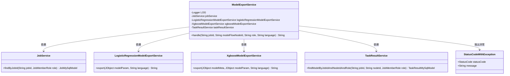
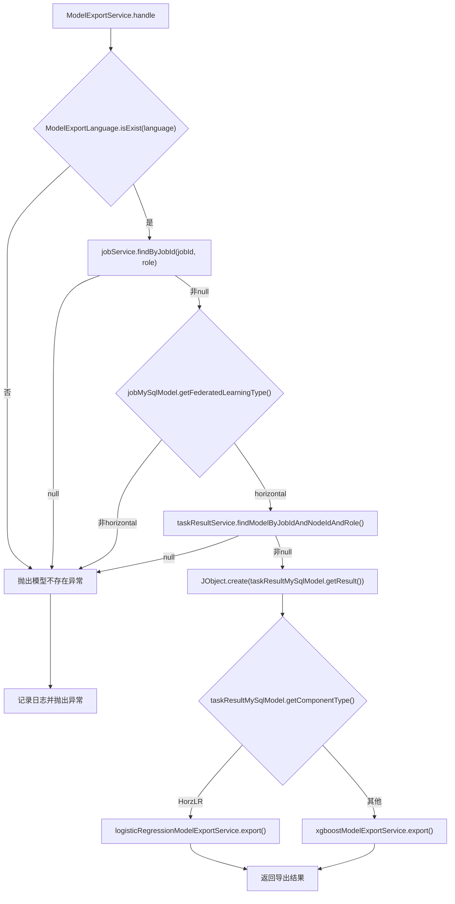

# 基础信息

|      |      |
|------|------|
| 名称 | ModelExportService |
| 编码语言 | .java |
| 代码路径 | WeFe/board/board-service/src/main/java/com/welab/wefe/board/service/service/modelexport/ModelExportService.java |
| 包名 | com.welab.wefe.board.service.service.modelexport |
| 依赖项 | ['com.welab.wefe.board.service.database.entity.job.JobMySqlModel', 'com.welab.wefe.board.service.database.entity.job.TaskResultMySqlModel', 'com.welab.wefe.board.service.service.JobService', 'com.welab.wefe.board.service.service.TaskResultService', 'com.welab.wefe.common.StatusCode', 'com.welab.wefe.common.exception.StatusCodeWithException', 'com.welab.wefe.common.util.JObject', 'com.welab.wefe.common.wefe.enums.ComponentType', 'com.welab.wefe.common.wefe.enums.FederatedLearningType', 'com.welab.wefe.common.wefe.enums.JobMemberRole', 'com.welab.wefe.common.wefe.enums.ModelExportLanguage', 'org.slf4j.Logger', 'org.slf4j.LoggerFactory', 'org.springframework.beans.factory.annotation.Autowired', 'org.springframework.stereotype.Service'] |
| 概述说明 | ModelExportService处理模型导出，支持横向联邦学习，根据任务ID、节点ID和语言参数调用不同模型导出服务，异常时记录日志并抛出错误。 |

# 说明

ModelExportService是一个Spring服务类，负责处理模型导出请求。它依赖JobService、LogisticRegressionModelExportService、XgboostModelExportService和TaskResultService。主要方法handle接收任务ID、模型节点ID、角色和语言参数，验证参数合法性后，根据任务类型和组件类型调用相应的模型导出服务。处理过程中会检查任务是否存在、是否支持横向导出，并获取模型参数。若发生异常，会记录日志并抛出状态码异常。最终返回导出结果字符串。

# 类列表 Class Summary

| 名称   | 类型  | 说明 |
|-------|------|-------------|
| ModelExportService | class | ModelExportService处理模型导出，支持横向联邦学习，根据任务ID、节点ID和语言参数调用不同模型导出服务（逻辑回归或XGBoost），验证参数后返回结果。异常时记录日志并抛出错误。 |

## 类 ModelExportService

|      |      |
|------|------|
| 访问范围 | @Service;public |
| 类型 | class |
| 名称 | ModelExportService |
| 说明 | ModelExportService处理模型导出，支持横向联邦学习，根据任务ID、节点ID和语言参数调用不同模型导出服务（逻辑回归或XGBoost），验证参数后返回结果。异常时记录日志并抛出错误。 |

### UML类图

这段代码展示了一个模型导出服务`ModelExportService`，它通过依赖多个服务（`JobService`、`LogisticRegressionModelExportService`、`XgboostModelExportService`和`TaskResultService`）来处理不同类型的模型导出请求。主要方法`handle`负责验证参数、检查任务状态，并根据模型类型调用相应的导出服务。异常处理机制完善，能捕获并记录不同类型的错误。类图清晰地展示了服务间的依赖关系和异常处理路径。

### 内部方法调用关系图

该流程图描述了ModelExportService处理模型导出的完整流程。首先验证语言参数有效性，然后获取任务信息并检查联邦学习类型是否为横向。接着查询模型结果数据，根据组件类型分发到不同的模型导出服务（逻辑回归或XGBoost）。整个过程包含多层校验和异常处理，确保导出操作的可靠性和安全性。流程图清晰展示了主流程与异常分支的关系，以及各服务间的调用顺序。

### 字段列表 Field List

| 名称  | 类型  | 说明 |
|-------|-------|------|
| jobService | JobService | 使用@Autowired自动注入JobService实例。 |
| logisticRegressionModelExportService | LogisticRegressionModelExportService | 使用@Autowired自动注入逻辑回归模型导出服务实例。 |
| LOG = LoggerFactory.getLogger(this.getClass()) | Logger | 类中定义了一个受保护的final日志对象LOG，用于记录当前类的日志信息。 |
| taskResultService | TaskResultService | 自动注入TaskResultService服务实例。 |
| xgboostModelExportService | XgboostModelExportService | 自动注入Xgboost模型导出服务实例。 |

### 方法列表

| 名称  | 类型  | 说明 |
|-------|-------|------|
| handle | String | 该方法处理模型导出请求，验证参数、任务和模型信息，支持横向联邦学习，根据组件类型调用不同导出服务，捕获异常并记录日志。 |

