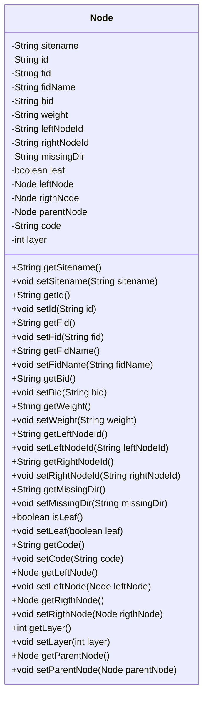

# 基础信息

|      |      |
|------|------|
| 名称 | Node |
| 编码语言 | .java |
| 代码路径 | WeFe/board/board-service/src/main/java/com/welab/wefe/board/service/service/modelexport/Node.java |
| 包名 | com.welab.wefe.board.service.service.modelexport |
| 依赖项 | [] |
| 概述说明 | Node类表示树节点，包含站点名、ID、父子节点ID、权重、左右子节点、父节点、层级、代码等属性，提供getter和setter方法。 |

# 说明

Node类是一个表示树节点的数据结构，包含多个属性用于描述节点信息。主要属性包括站点名称sitename、节点标识id、父节点标识fid、父节点名称fidName、分支标识bid、权重weight、左右子节点标识leftNodeId和rightNodeId、缺失方向missingDir、是否为叶子节点leaf。类中还包含左右子节点leftNode和rigthNode、父节点parentNode的引用。其他属性包括代码code和层级layer。每个属性都有对应的getter和setter方法用于访问和修改。

# 类列表 Class Summary

| 名称   | 类型  | 说明 |
|-------|------|-------------|
| Node | class | Node类表示树节点，包含站点名、ID、父子节点信息、权重、层级等属性，提供getter和setter方法。 |

## 类 Node

|      |      |
|------|------|
| 访问范围 | public |
| 类型 | class |
| 名称 | Node |
| 说明 | Node类表示树节点，包含站点名、ID、父子节点信息、权重、层级等属性，提供getter和setter方法。 |

### UML类图

这段代码定义了一个名为`Node`的类，用于表示树形结构中的节点。该类包含多个私有属性，如节点ID、父节点ID、左右子节点ID、权重、层级等，并提供了相应的getter和setter方法。值得注意的是，该类通过`leftNode`、`rigthNode`和`parentNode`属性实现了自引用，表明节点之间可以形成树形结构。此外，`leaf`属性用于标识当前节点是否为叶子节点，`code`和`layer`属性可能用于存储节点的编码和层级信息。整体设计适用于构建和管理树形数据结构。

### 内部方法调用关系图

该流程图展示了Node类的完整结构，包含15个私有属性和28个getter/setter方法。属性涵盖节点标识信息（id/fid/bid）、树结构关系（leftNode/rightNode/parentNode）、业务字段（weight/code/layer）等。所有方法均按标准JavaBean规范实现，用于封装属性的访问和修改。图中清晰呈现了类成员与方法的从属关系，未包含任何业务逻辑处理流程。

### 字段列表 Field List

| 名称  | 类型  | 说明 |
|-------|-------|------|
| rigthNode | Node | 私有节点类型变量rightNode。 |
| bid | String | 私有字符串类型变量bid。 |
| id | String | 私有字符串类型变量id |
| code | String | 私有字符串变量code。 |
| missingDir | String | 私有字符串变量missingDir，用于存储缺失目录信息。 |
| rightNodeId | String | 私有字符串变量rightNodeId，用于存储右节点ID。 |
| leftNodeId | String | 私有字符串类型变量leftNodeId，用于存储左节点ID。 |
| layer | int | 私有整型变量layer。 |
| sitename | String | 私有字符串变量sitename，用于存储站点名称。 |
| weight | String | 声明了一个私有字符串变量weight。 |
| fid | String | 私有字符串类型变量fid。 |
| leaf | boolean | 布尔变量leaf表示是否为叶子节点。 |
| fidName | String | 私有字符串类型变量，名为fidName。 |
| leftNode | Node | 私有左节点变量。 |
| parentNode | Node | 私有父节点变量。 |

### 方法列表

| 名称  | 类型  | 说明 |
|-------|-------|------|
| getFidName | String | 这是一个Java方法，返回字符串类型的成员变量fidName的值。 |
| getRigthNode | Node | 获取右节点的方法，返回右节点对象。 |
| getMissingDir | String | 获取缺失目录路径的方法，返回字符串类型变量missingDir。 |
| getFid | String | 这是一个Java方法，返回字符串类型的成员变量fid的值。 |
| setSitename | void | 设置站点名称的方法，将参数sitename赋值给类成员变量sitename。 |
| getBid | String | 获取bid字符串值的方法。 |
| setFid | void | 设置对象fid属性的方法，参数为字符串fid。 |
| setLayer | void | 设置图层层级的方法，将输入参数赋值给对象的layer属性。 |
| setWeight | void | 这是一个Java方法，用于设置对象的weight属性，接受一个字符串参数weight并将其赋值给当前对象的weight字段。 |
| getLayer | int | 获取当前层级值的方法，返回整数类型变量layer。 |
| setParentNode | void | 设置当前节点的父节点为指定节点。 |
| setFidName | void | 设置成员变量fidName的值。 |
| getLeftNodeId | String | 获取左节点ID的方法，返回值为leftNodeId。 |
| setRigthNode | void | 设置当前节点的右子节点为指定节点。 |
| isLeaf | boolean | 这是一个判断节点是否为叶子节点的方法，返回布尔值leaf。 |
| getParentNode | Node | 获取当前节点的父节点。 |
| getCode | String | 这是一个Java方法，返回字符串类型的code变量值。 |
| setBid | void | 这是一个Java方法，用于设置对象的bid属性值。方法接收一个字符串参数bid，并将其赋值给对象的bid成员变量。 |
| setCode | void | 这是一个Java方法，用于设置类中的code属性值。方法接收一个字符串参数code，并将其赋值给类的成员变量this.code。 |
| getLeftNode | Node | 获取左节点的方法，返回leftNode对象。 |
| getSitename | String | 这是一个Java方法，返回字符串类型的sitename属性值。 |
| setMissingDir | void | 设置缺失目录路径的方法，将输入参数赋值给类变量missingDir。 |
| setRightNodeId | void | 设置右节点ID的方法，参数为rightNodeId，将其赋值给类的同名成员变量。 |
| setLeftNodeId | void | 设置左节点ID的方法，参数为字符串leftNodeId。 |
| setId | void | 设置对象ID的方法，将传入的字符串参数赋值给对象的id属性。 |
| setLeaf | void | 设置节点是否为叶子节点的方法。 |
| getWeight | String | 获取weight值的公共方法。 |
| setLeftNode | void | 设置左节点的方法，将参数leftNode赋值给当前对象的leftNode属性。 |
| getRightNodeId | String | 获取右节点ID的方法，返回rightNodeId字符串。 |
| getId | String | 方法getId返回字符串类型的id值。 |

