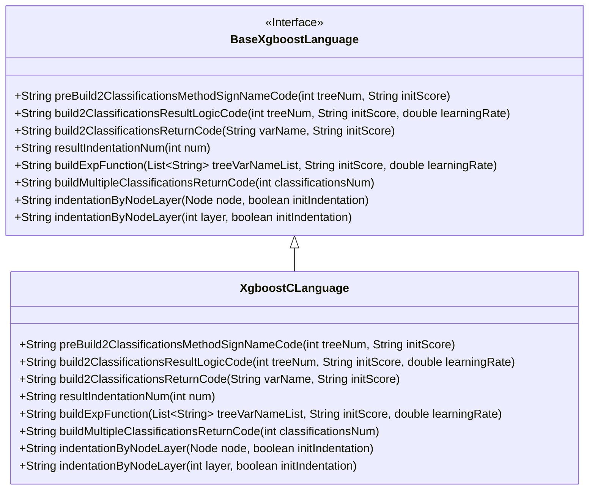
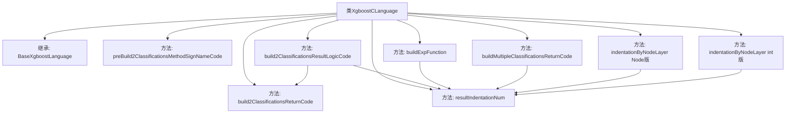

# 基础信息

|      |      |
|------|------|
| 名称 | XgboostCLanguage |
| 编码语言 | .java |
| 代码路径 | WeFe/board/board-service/src/main/java/com/welab/wefe/board/service/service/modelexport/XgboostCLanguage.java |
| 包名 | com.welab.wefe.board.service.service.modelexport |
| 依赖项 | ['java.util.List'] |
| 概述说明 | XgboostCLanguage类继承BaseXgboostLanguage，实现C语言代码生成，包括分类方法签名、结果逻辑和返回代码，支持二分类和多分类。 |

# 说明

该代码定义了一个名为XgboostCLanguage的类，继承自BaseXgboostLanguage。主要功能是生成用于XGBoost模型预测的C语言代码。类中包含多个方法用于构建不同部分的C代码：preBuild2ClassificationsMethodSignNameCode生成方法签名和头文件引入；build2ClassificationsResultLogicCode构建二分类逻辑计算代码；build2ClassificationsReturnCode生成二分类结果返回代码；buildExpFunction构造指数计算表达式；buildMultipleClassificationsReturnCode处理多分类结果返回。所有方法都通过字符串拼接方式生成符合C语言语法的代码片段，并处理了代码缩进等格式问题。

# 类列表 Class Summary

| 名称   | 类型  | 说明 |
|-------|------|-------------|
| XgboostCLanguage | class | XgboostCLanguage类继承BaseXgboostLanguage，实现C语言代码生成，包括二分类和多分类逻辑，涉及预处理、结果计算和返回代码构建。 |

## 类 XgboostCLanguage

|      |      |
|------|------|
| 访问范围 | public |
| 类型 | class |
| 名称 | XgboostCLanguage |
| 说明 | XgboostCLanguage类继承BaseXgboostLanguage，实现C语言代码生成，包括二分类和多分类逻辑，涉及预处理、结果计算和返回代码构建。 |

### UML类图

该代码展示了一个XgboostCLanguage类继承自BaseXgboostLanguage接口，主要用于生成XGBoost模型的C语言预测代码。XgboostCLanguage实现了多个关键方法，包括构建分类方法签名、结果逻辑代码、返回代码等，特别关注二分类场景，通过字符串拼接生成C语言代码片段，其中包含数学计算、内存拷贝等操作，最终输出概率预测结果。类图清晰地展示了这种继承关系和接口实现。

### 内部方法调用关系图

这段代码是XGBoost模型在C语言环境下的实现类，主要处理二分类和多分类问题的代码生成逻辑。类继承自BaseXgboostLanguage，核心功能包括生成C语言的方法签名、构建分类结果计算逻辑、返回结果代码等。方法间存在多层调用关系，如build2ClassificationsResultLogicCode会调用build2ClassificationsReturnCode和resultIndentationNum，体现了代码生成器的模块化设计思想。

### 字段列表 Field List

| 名称  | 类型  | 说明 |
|-------|-------|------|

### 方法列表

| 名称  | 类型  | 说明 |
|-------|-------|------|
| buildMultipleClassificationsReturnCode | String | Java方法生成多分类返回代码，使用memcpy复制双精度数组到输出，数组大小由classificationsNum决定。 |
| build2ClassificationsResultLogicCode | String | 生成二分类逻辑代码，计算s1变量为sigmoid函数结果，包含树模型求和及返回逻辑。 |
| build2ClassificationsReturnCode | String | 方法生成代码片段，将变量varName和1-varName拷贝到输出数组，长度为2个double类型大小。 |
| preBuild2ClassificationsMethodSignNameCode | String | 该方法生成一个C语言函数框架，包含数学和字符串库的头文件，定义了一个名为score的函数，接收输入和输出数组，函数体由占位符METHOD_BODY_PLACEHOLDER表示。 |
| buildExpFunction | String | 该方法生成指数函数表达式，计算0减去树变量列表求和后的负指数值，包含初始分数和学习率参数。 |
| resultIndentationNum | String | 重写方法，固定缩进数为1，调用父类实现。 |
| indentationByNodeLayer | String | 重写方法，调用父类方法处理节点层级缩进，忽略初始缩入参数。 |
| indentationByNodeLayer | String | 重写方法，调用父类方法生成缩进字符串，忽略initIndentation参数，始终传入false。 |

