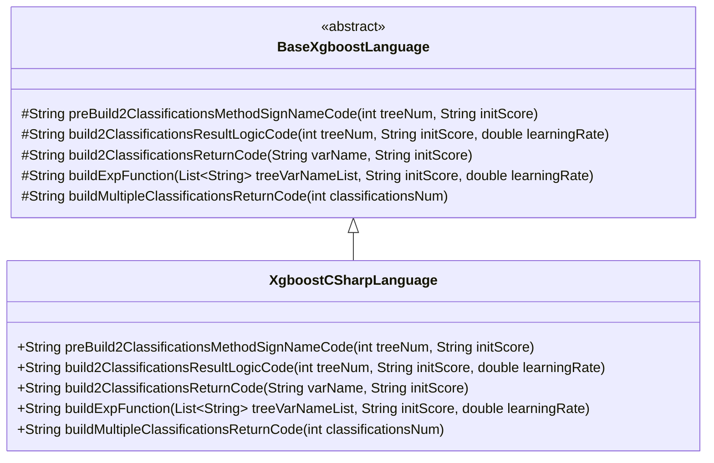
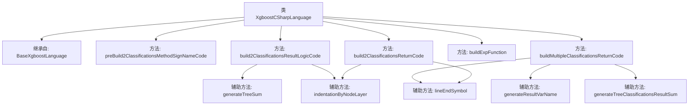

# 基础信息

|      |      |
|------|------|
| 名称 | XgboostCSharpLanguage |
| 编码语言 | .java |
| 代码路径 | WeFe/board/board-service/src/main/java/com/welab/wefe/board/service/service/modelexport/XgboostCSharpLanguage.java |
| 包名 | com.welab.wefe.board.service.service.modelexport |
| 依赖项 | ['java.util.List'] |
| 概述说明 | XgboostCSharpLanguage类继承BaseXgboostLanguage，实现C#代码生成逻辑，包括二分类和多分类的评分方法构建、结果计算与返回逻辑。 |

# 说明

该内容描述了一个名为XgboostCSharpLanguage的类，继承自BaseXgboostLanguage，主要用于生成C#代码以实现XGBoost模型的分类功能。类中包含多个方法，用于构建分类方法签名、结果逻辑、返回代码以及指数函数。这些方法通过拼接字符串生成C#代码，包括命名空间、类定义、方法实现和数学计算逻辑。特别关注二分类和多分类场景，涉及变量定义、树求和、概率计算及结果返回等细节。所有方法均返回拼接好的代码字符串，不包含实际执行逻辑。

# 类列表 Class Summary

| 名称   | 类型  | 说明 |
|-------|------|-------------|
| XgboostCSharpLanguage | class | XgboostCSharpLanguage类继承BaseXgboostLanguage，实现C#代码生成逻辑，包括构建分类方法签名、结果计算逻辑和返回代码，支持二分类和多分类场景。 |

## 类 XgboostCSharpLanguage

|      |      |
|------|------|
| 访问范围 | public |
| 类型 | class |
| 名称 | XgboostCSharpLanguage |
| 说明 | XgboostCSharpLanguage类继承BaseXgboostLanguage，实现C#代码生成逻辑，包括构建分类方法签名、结果计算逻辑和返回代码，支持二分类和多分类场景。 |

### UML类图

类图描述：
该图展示了XgboostCSharpLanguage类继承自抽象基类BaseXgboostLanguage的层级关系。基类定义了5个受保护的抽象方法，涉及XGBoost模型在二分类和多分类场景下的代码生成逻辑。派生类XgboostCSharpLanguage具体实现了这些方法，专门用于生成C#语言的XGBoost预测代码，包括方法签名构建、分类结果计算逻辑、返回语句生成以及指数函数构造等功能。箭头方向表明子类对父类的继承关系。

### 内部方法调用关系图

该流程图展示了XgboostCSharpLanguage类的结构及其方法调用关系。该类继承自BaseXgboostLanguage，主要包含5个核心方法：preBuild2ClassificationsMethodSignNameCode用于生成方法签名模板，build2ClassificationsResultLogicCode构建二分类逻辑，build2ClassificationsReturnCode生成返回代码，buildExpFunction构造指数计算表达式，buildMultipleClassificationsReturnCode处理多分类返回结果。方法间通过辅助函数如generateTreeSum和indentationByNodeLayer实现代码复用，整体构成一个完整的XGBoost模型代码生成器。

### 字段列表 Field List

| 名称  | 类型  | 说明 |
|-------|-------|------|

### 方法列表

| 名称  | 类型  | 说明 |
|-------|-------|------|
| preBuild2ClassificationsMethodSignNameCode | String | 生成C#代码模板，包含命名空间ML、静态类Model及Score方法框架，预留方法体占位符。 |
| buildMultipleClassificationsReturnCode | String | 该方法生成返回多分类结果的代码字符串，包含分类数、变量名和归一化计算，用逗号分隔各结果。 |
| build2ClassificationsReturnCode | String | 该方法生成返回双精度数组的代码字符串，数组包含1减变量值和变量值，用于二分类结果。 |
| build2ClassificationsResultLogicCode | String | 该方法生成二分类逻辑回归代码，计算概率值并返回结果。使用s1变量存储sigmoid函数输出，通过树模型求和计算输入值。 |
| buildExpFunction | String | 该方法生成一个指数函数表达式，用于计算树变量的加权和并取负指数。输入为变量名列表、初始分数和学习率，输出形如"Exp(0 - (求和结果))"的字符串。 |

