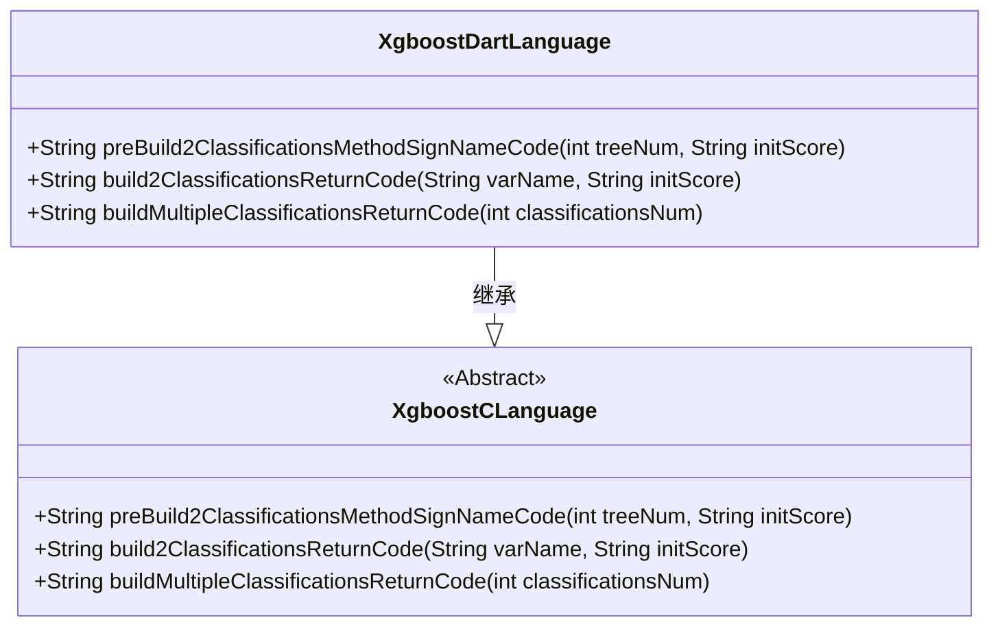
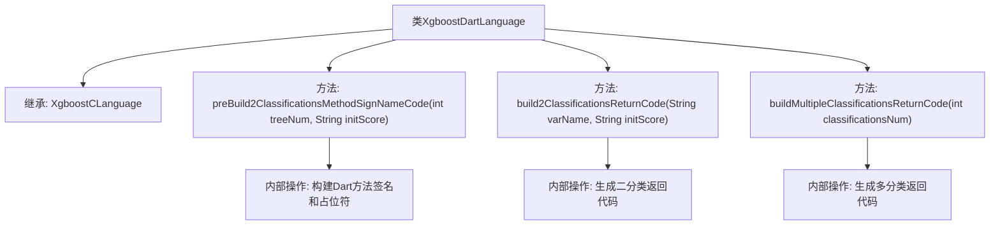

# 基础信息

|      |      |
|------|------|
| 名称 | XgboostDartLanguage |
| 编码语言 | .java |
| 代码路径 | WeFe/board/board-service/src/main/java/com/welab/wefe/board/service/service/modelexport/XgboostDartLanguage.java |
| 包名 | com.welab.wefe.board.service.service.modelexport |
| 依赖项 | [] |
| 概述说明 | XgboostDartLanguage继承XgboostCLanguage，重写三个方法：生成Dart评分方法签名、二分类返回代码及多分类返回代码。 |

# 说明

该代码定义了一个名为XgboostDartLanguage的类，继承自XgboostCLanguage。它重写了三个方法用于生成Dart语言代码：preBuild2ClassificationsMethodSignNameCode方法构建评分函数框架，包含导入语句和方法签名；build2ClassificationsReturnCode方法生成二分类结果的返回代码；buildMultipleClassificationsReturnCode方法构建多分类结果的返回代码。这些方法通过字符串拼接生成特定格式的Dart代码，用于机器学习模型预测结果的输出处理。

# 类列表 Class Summary

| 名称   | 类型  | 说明 |
|-------|------|-------------|
| XgboostDartLanguage | class | XgboostDartLanguage继承XgboostCLanguage，重写三个方法：生成Dart分类评分方法签名、二分类返回代码及多分类返回代码。 |

## 类 XgboostDartLanguage

|      |      |
|------|------|
| 访问范围 | public |
| 类型 | class |
| 名称 | XgboostDartLanguage |
| 说明 | XgboostDartLanguage继承XgboostCLanguage，重写三个方法：生成Dart分类评分方法签名、二分类返回代码及多分类返回代码。 |

### UML类图

这段类图展示了XgboostDartLanguage继承自抽象类XgboostCLanguage的关系。XgboostDartLanguage实现了三个核心方法：preBuild2ClassificationsMethodSignNameCode用于生成Dart语言的方法签名和初始化代码，build2ClassificationsReturnCode构建二分类返回语句，buildMultipleClassificationsReturnCode处理多分类输出。所有方法都涉及字符串拼接和格式化，专为生成Dart语言的XGBoost预测代码而设计。

### 内部方法调用关系图

该流程图展示了XgboostDartLanguage类的继承关系和方法结构。该类继承自XgboostCLanguage，包含三个核心方法：preBuild2ClassificationsMethodSignNameCode用于构建Dart方法签名和占位符，build2ClassificationsReturnCode生成二分类概率返回代码，buildMultipleClassificationsReturnCode处理多分类场景。每个方法内部都有特定的字符串构建逻辑，最终生成符合Dart语言规范的XGBoost模型推理代码。

### 字段列表 Field List

| 名称  | 类型  | 说明 |
|-------|-------|------|

### 方法列表

| 名称  | 类型  | 说明 |
|-------|-------|------|
| preBuild2ClassificationsMethodSignNameCode | String | 生成Dart方法代码框架，包含导入math库和score方法定义，预留方法体占位符。 |
| build2ClassificationsReturnCode | String | 方法生成返回两个分类的代码，格式为"[1 - 变量名, 变量名]"。 |
| buildMultipleClassificationsReturnCode | String | 该方法生成多分类返回代码，通过参数指定分类数量，拼接返回数组格式的字符串，包含缩进和换行符。 |

