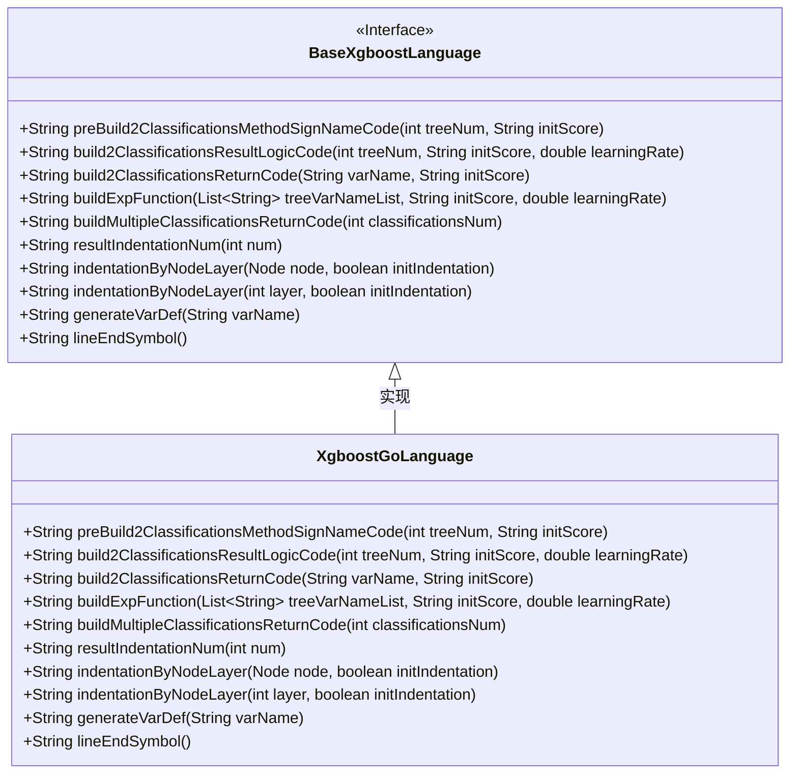
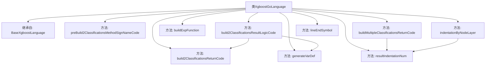

# 基础信息

|      |      |
|------|------|
| 名称 | XgboostGoLanguage |
| 编码语言 | .java |
| 代码路径 | WeFe/board/board-service/src/main/java/com/welab/wefe/board/service/service/modelexport/XgboostGoLanguage.java |
| 包名 | com.welab.wefe.board.service.service.modelexport |
| 依赖项 | ['java.util.List'] |
| 概述说明 | XgboostGoLanguage类继承BaseXgboostLanguage，实现Go语言XGBoost模型代码生成，包括二分类和多分类逻辑、数学计算、变量定义及格式化输出。 |

# 说明

该代码定义了一个名为XgboostGoLanguage的类，继承自BaseXgboostLanguage，主要用于生成Go语言的XGBoost模型评分代码。它包含多个方法用于构建分类逻辑，包括预处理方法签名、二分类结果计算逻辑、返回代码生成、指数函数构建以及多分类返回代码生成。此外还提供了变量定义、行尾符号和缩进控制等辅助方法。所有方法都专注于生成Go语言格式的代码字符串，不包含实际计算逻辑。

# 类列表 Class Summary

| 名称   | 类型  | 说明 |
|-------|------|-------------|
| XgboostGoLanguage | class | XgboostGoLanguage类继承BaseXgboostLanguage，实现Go语言XGBoost模型代码生成，包括分类方法签名、结果逻辑、返回代码和数学函数构建。 |

## 类 XgboostGoLanguage

|      |      |
|------|------|
| 访问范围 | public |
| 类型 | class |
| 名称 | XgboostGoLanguage |
| 说明 | XgboostGoLanguage类继承BaseXgboostLanguage，实现Go语言XGBoost模型代码生成，包括分类方法签名、结果逻辑、返回代码和数学函数构建。 |

### UML类图

这段代码描述了一个XgboostGoLanguage类，它继承自BaseXgboostLanguage接口，主要用于生成XGBoost模型在Go语言中的预测代码。该类实现了多个方法，包括构建二分类和多分类预测逻辑、生成变量定义、处理代码缩进等。特别关注于生成Go语言特有的语法结构，如数学函数调用、切片返回等，同时通过方法重写提供了Go语言特定的实现细节。

### 内部方法调用关系图

这段代码展示了一个XgboostGoLanguage类，继承自BaseXgboostLanguage，主要用于生成Go语言实现的XGBoost分类模型代码。类中包含多个方法，如preBuild2ClassificationsMethodSignNameCode用于生成方法签名，build2ClassificationsResultLogicCode构建分类逻辑代码，buildExpFunction生成数学表达式等。方法之间存在调用关系，如build2ClassificationsResultLogicCode会调用build2ClassificationsReturnCode和generateVarDef。整体结构清晰，专注于Go语言特定实现的代码生成。

### 字段列表 Field List

| 名称  | 类型  | 说明 |
|-------|-------|------|

### 方法列表

| 名称  | 类型  | 说明 |
|-------|-------|------|
| build2ClassificationsReturnCode | String | 该方法生成返回两个分类的代码字符串，将输入变量转换为1减变量和变量本身的数组。 |
| lineEndSymbol | String | Java方法重写，返回空字符串作为行结束符。 |
| buildMultipleClassificationsReturnCode | String | 该方法生成多分类返回代码，拼接返回数组格式，包含指定数量的分类结果。 |
| resultIndentationNum | String | 重写方法，固定缩进数为1，调用父类实现。 |
| buildExpFunction | String | 该方法生成数学表达式字符串，计算以自然对数e为底的指数函数值，参数为负的树变量列表求和结果。 |
| build2ClassificationsResultLogicCode | String | 该方法生成二分类结果逻辑代码，计算s1变量为1/(1+e^(-(树求和结果)))，并返回分类结果。 |
| preBuild2ClassificationsMethodSignNameCode | String | 该方法生成一个Go函数框架，包含导入math库和函数定义，预留方法体占位符，用于构建分类模型评分函数。 |
| indentationByNodeLayer | String | 重写方法，调用父类方法处理节点层级缩进，忽略初始缩入参数。 |
| indentationByNodeLayer | String | 重写方法，调用父类方法生成缩进字符串，忽略initIndentation参数，固定传false。 |
| generateVarDef | String | 这是一个Java方法重写，用于生成Go语言变量定义字符串，格式为"var 变量名 float64"。 |

