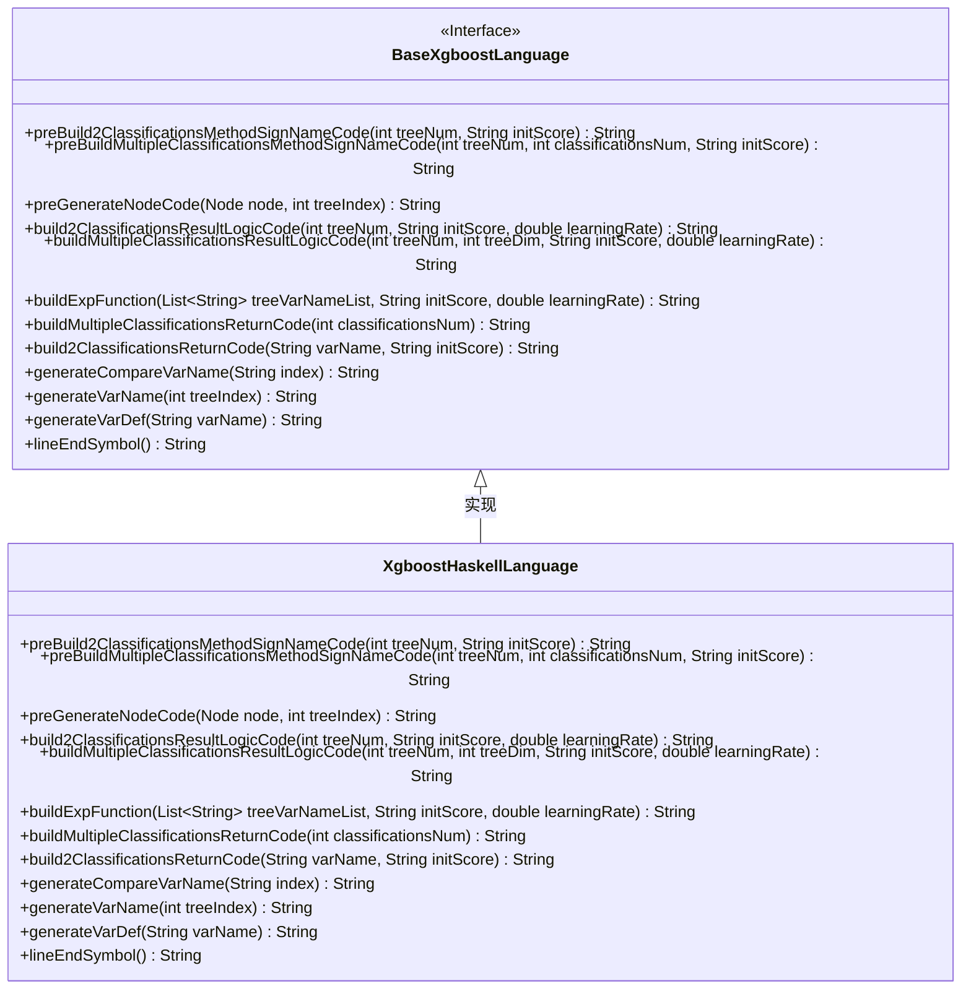

# 基础信息

|      |      |
|------|------|
| 名称 | XgboostHaskellLanguage |
| 编码语言 | .java |
| 代码路径 | WeFe/board/board-service/src/main/java/com/welab/wefe/board/service/service/modelexport/XgboostHaskellLanguage.java |
| 包名 | com.welab.wefe.board.service.service.modelexport |
| 依赖项 | ['java.util.List', 'java.util.Map'] |
| 概述说明 | XgboostHaskellLanguage类继承BaseXgboostLanguage，实现Haskell代码生成逻辑，包括分类方法签名、节点代码生成和结果计算逻辑。 |

# 说明

该代码定义了一个名为XgboostHaskellLanguage的类，继承自BaseXgboostLanguage，用于生成Haskell语言的XGBoost模型代码。主要功能包括构建二分类和多分类模型的方法签名、节点代码生成、结果逻辑计算等。代码通过字符串拼接生成Haskell模块，包含score函数定义、条件判断逻辑、变量计算和返回结果处理。支持树结构的递归生成、变量命名、缩进控制以及数学表达式构建，如sigmoid函数和指数运算。整体实现了从XGBoost模型到Haskell代码的转换逻辑。

# 类列表 Class Summary

| 名称   | 类型  | 说明 |
|-------|------|-------------|
| XgboostHaskellLanguage | class | XgboostHaskellLanguage类继承BaseXgboostLanguage，实现Haskell代码生成逻辑，包括二分类和多分类方法签名、节点代码生成、结果计算逻辑及辅助函数。 |

## 类 XgboostHaskellLanguage

|      |      |
|------|------|
| 访问范围 | public |
| 类型 | class |
| 名称 | XgboostHaskellLanguage |
| 说明 | XgboostHaskellLanguage类继承BaseXgboostLanguage，实现Haskell代码生成逻辑，包括二分类和多分类方法签名、节点代码生成、结果计算逻辑及辅助函数。 |

### UML类图

这段代码展示了一个XgboostHaskellLanguage类，它继承自BaseXgboostLanguage接口，主要用于生成Haskell语言的XGBoost模型代码。类中实现了多个方法，包括构建二分类和多分类模型的方法签名、节点代码生成、结果逻辑计算以及返回代码生成等。这些方法通过字符串拼接的方式构建Haskell代码，支持树模型的生成和预测逻辑的实现。类图清晰地展示了继承关系和所有公有方法，体现了该类的核心功能是为XGBoost模型生成Haskell语言实现。

### 内部方法调用关系图

```mermaid
graph TD
    A["类XgboostHaskellLanguage"]
    B["继承自: BaseXgboostLanguage"]
    C["方法: preBuild2ClassificationsMethodSignNameCode"]
    D["方法: preBuildMultipleClassificationsMethodSignNameCode"]
    E["方法: preGenerateNodeCode"]
    F["方法: build2ClassificationsResultLogicCode"]
    G["方法: buildMultipleClassificationsResultLogicCode"]
    H["方法: buildExpFunction"]
    I["方法: buildMultipleClassificationsReturnCode"]
    J["方法: build2ClassificationsReturnCode"]
    K["方法: generateCompareVarName"]
    L["方法: generateVarName"]
    M["方法: generateVarDef"]
    N["方法: lineEndSymbol"]

    A --> B
    A --> C
    A --> D
    A --> E
    A --> F
    A --> G
    A --> H
    A --> I
    A --> J
    A --> K
    A --> L
    A --> M
    A --> N
```

这段代码是XGBoost模型在Haskell语言中的实现类，继承自基础XGBoost语言类。主要功能包括构建二分类和多分类模型的方法签名代码、生成节点代码、构建结果逻辑代码以及各种辅助方法。类中实现了多种字符串拼接和格式化方法，用于生成符合Haskell语法的模型代码，包括条件判断、变量定义、数学运算等核心功能。所有方法都围绕XGBoost模型转换这一核心目标，通过字符串拼接构建完整的Haskell模型代码。

### 字段列表 Field List

| 名称  | 类型  | 说明 |
|-------|-------|------|

### 方法列表

| 名称  | 类型  | 说明 |
|-------|-------|------|
| preGenerateNodeCode | String | 该方法根据节点类型生成代码：叶子节点返回权重，非叶子节点生成条件判断代码，包含比较变量、阈值和分支占位符，并处理缩进格式。 |
| buildExpFunction | String | Java方法：生成指数函数表达式，参数为变量列表、初始分数和学习率，返回形如"exp(0 - (计算式))"的字符串。 |
| build2ClassificationsReturnCode | String | 方法build2ClassificationsReturnCode重写父类逻辑，接收变量名和初始分数参数，返回空字符串。 |
| build2ClassificationsResultLogicCode | String | 生成二分类逻辑回归预测代码，包含变量定义、sigmoid函数计算及结果返回逻辑。 |
| preBuild2ClassificationsMethodSignNameCode | String | 该方法生成Haskell模块代码，定义score函数接收Double列表并返回Double列表。函数体包含占位符和默认计算式[(1)-(s1),s1]。 |
| buildMultipleClassificationsResultLogicCode | String | 该方法为多分类逻辑构建代码，遍历分类树生成变量定义和计算逻辑，使用Sigmoid函数处理结果，最后返回各分类结果。 |
| buildMultipleClassificationsReturnCode | String | 该方法生成多分类返回代码，循环添加分类结果变量和计算表达式，格式化为字符串返回。 |
| preBuildMultipleClassificationsMethodSignNameCode | String | 生成Haskell模型代码框架，定义score函数，输入输出为Double列表，预留方法体占位符。 |
| generateCompareVarName | String | 生成比较变量名的方法，返回格式为"(input) !! (index)"。 |
| generateVarName | String | 该方法为指定树索引生成变量名，格式为"func"加索引值。 |
| generateVarDef | String | 该方法重写生成变量定义，返回变量名加等号。 |
| lineEndSymbol | String | 方法重写，返回空字符串作为行结束符。 |

