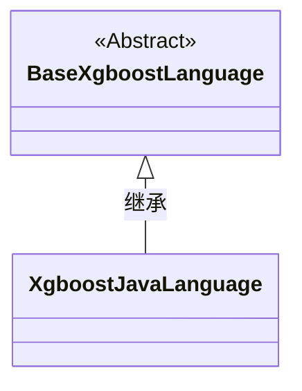
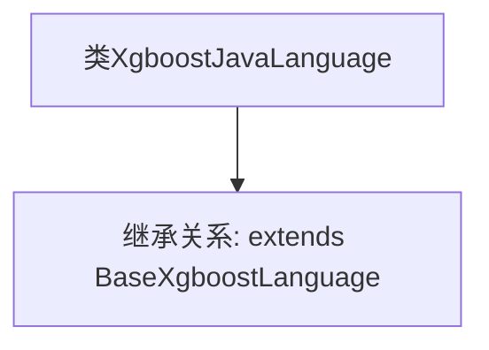

# 基础信息

|      |      |
|------|------|
| 名称 | XgboostJavaLanguage |
| 编码语言 | .java |
| 代码路径 | WeFe/board/board-service/src/main/java/com/welab/wefe/board/service/service/modelexport/XgboostJavaLanguage.java |
| 包名 | com.welab.wefe.board.service.service.modelexport |
| 依赖项 | [] |
| 概述说明 | XgboostJavaLanguage类继承自BaseXgboostLanguage，用于Java语言实现XGBoost功能。 |

# 说明

XgboostJavaLanguage是一个继承自BaseXgboostLanguage的Java类，用于实现XGBoost算法在Java语言中的功能扩展。该类未包含具体实现细节，仅作为基础框架的扩展点。

# 类列表 Class Summary

| 名称   | 类型  | 说明 |
|-------|------|-------------|
| XgboostJavaLanguage | class | XgboostJavaLanguage类继承自BaseXgboostLanguage，用于Java语言实现XGBoost功能。 |

## 类 XgboostJavaLanguage

|      |      |
|------|------|
| 访问范围 | public |
| 类型 | class |
| 名称 | XgboostJavaLanguage |
| 说明 | XgboostJavaLanguage类继承自BaseXgboostLanguage，用于Java语言实现XGBoost功能。 |

### UML类图

这段类图展示了XgboostJavaLanguage继承自抽象基类BaseXgboostLanguage的简单层级关系。BaseXgboostLanguage被标记为抽象类（<<Abstract>>），表明它包含需要子类实现的抽象方法或作为通用基类使用。XgboostJavaLanguage作为具体实现类，继承了基类的所有属性和方法，但当前代码中尚未添加任何特有成员。这种结构常用于实现不同编程语言的XGBoost接口统一框架。

### 内部方法调用关系图

这段流程图展示了XgboostJavaLanguage类的结构，它是一个继承自BaseXgboostLanguage的空类。图中清晰地呈现了类之间的继承关系，XgboostJavaLanguage作为子类通过extends关键字继承了父类BaseXgboostLanguage的所有属性和方法。由于当前类体为空，没有展示任何新增方法或属性，仅保留了继承关系的核心信息。这种简洁的表示方式突出了面向对象编程中继承机制的基本特征。

### 字段列表 Field List

| 名称  | 类型  | 说明 |
|-------|-------|------|

### 方法列表

| 名称  | 类型  | 说明 |
|-------|-------|------|

