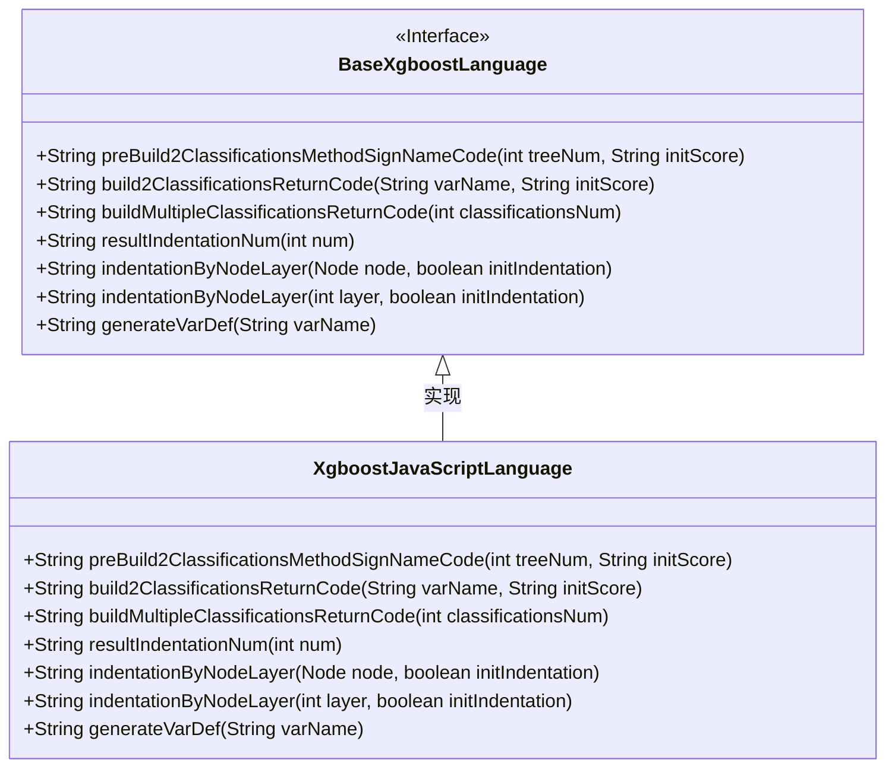
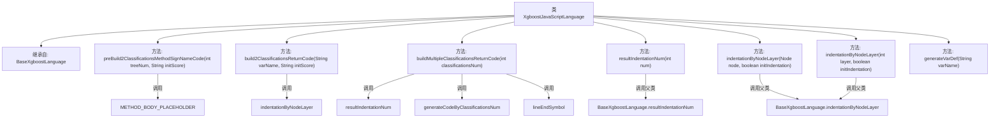

# 基础信息

|      |      |
|------|------|
| 名称 | XgboostJavaScriptLanguage |
| 编码语言 | .java |
| 代码路径 | WeFe/board/board-service/src/main/java/com/welab/wefe/board/service/service/modelexport/XgboostJavaScriptLanguage.java |
| 包名 | com.welab.wefe.board.service.service.modelexport |
| 依赖项 | [] |
| 概述说明 | XgboostJavaScriptLanguage类继承BaseXgboostLanguage，实现JavaScript代码生成，包括构建分类方法签名、返回代码及变量定义等功能。 |

# 说明

该代码定义了一个名为XgboostJavaScriptLanguage的类，继承自BaseXgboostLanguage。主要功能包括构建JavaScript评分函数，处理二分类和多分类返回结果。关键方法有preBuild2ClassificationsMethodSignNameCode用于生成函数框架，build2ClassificationsReturnCode构建二分类返回数组，buildMultipleClassificationsReturnCode处理多分类返回数组。还包含辅助方法如缩进控制indentationByNodeLayer和变量定义generateVarDef。所有方法均重写父类实现，专注于JavaScript代码生成。

# 类列表 Class Summary

| 名称   | 类型  | 说明 |
|-------|------|-------------|
| XgboostJavaScriptLanguage | class | XgboostJavaScriptLanguage类继承BaseXgboostLanguage，重写多个方法生成JavaScript代码，包括分类方法签名、返回代码和变量定义等。 |

## 类 XgboostJavaScriptLanguage

|      |      |
|------|------|
| 访问范围 | public |
| 类型 | class |
| 名称 | XgboostJavaScriptLanguage |
| 说明 | XgboostJavaScriptLanguage类继承BaseXgboostLanguage，重写多个方法生成JavaScript代码，包括分类方法签名、返回代码和变量定义等。 |

### UML类图

这段代码展示了一个XgboostJavaScriptLanguage类继承自BaseXgboostLanguage接口，主要用于生成XGBoost模型的JavaScript代码实现。类中重写了多个方法，包括构建二分类和多分类返回代码、生成变量定义以及处理代码缩进等。这些方法通过StringBuilder构建JavaScript代码字符串，其中preBuild2ClassificationsMethodSignNameCode创建函数签名，build2ClassificationsReturnCode生成二分类概率数组，buildMultipleClassificationsReturnCode处理多分类输出。类图清晰地展示了接口与实现类的关系，以及所有公开方法的签名。

### 内部方法调用关系图

这段代码流程图展示了XgboostJavaScriptLanguage类的结构及其方法调用关系。该类继承自BaseXgboostLanguage，主要实现JavaScript语言相关的XGBoost模型代码生成功能，包含多个核心方法用于构建分类方法的签名、返回代码和变量定义等。方法间存在层级调用关系，部分方法直接调用父类实现，体现了面向对象继承和多态的特性。

### 字段列表 Field List

| 名称  | 类型  | 说明 |
|-------|-------|------|

### 方法列表

| 名称  | 类型  | 说明 |
|-------|-------|------|
| indentationByNodeLayer | String | 重写父类方法，根据节点层级返回缩进字符串，初始缩进参数被固定为false。 |
| preBuild2ClassificationsMethodSignNameCode | String | 该方法生成一个评分函数框架，包含输入参数和占位符，用于后续填充具体逻辑。返回字符串格式为JavaScript函数。 |
| build2ClassificationsReturnCode | String | 方法生成返回二元分类代码，格式为"[1 - 变量名, 变量名]"。 |
| resultIndentationNum | String | 重写方法，固定返回父类调用结果，缩进数为1。 |
| buildMultipleClassificationsReturnCode | String | 该方法生成多分类返回代码，拼接缩进、分类数量代码及结束符号，返回字符串结果。 |
| indentationByNodeLayer | String | 重写方法indentationByNodeLayer，调用父类方法并固定initIndentation参数为false。 |
| generateVarDef | String | 这是一个Java方法，用于生成变量定义字符串，格式为"var 变量名;"。 |

