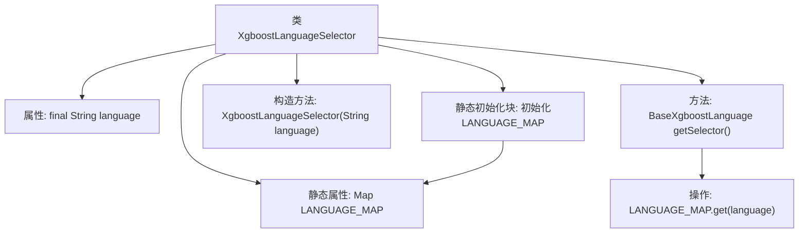

# 基础信息

|      |      |
|------|------|
| 名称 | XgboostLanguageSelector |
| 编码语言 | .java |
| 代码路径 | WeFe/board/board-service/src/main/java/com/welab/wefe/board/service/service/modelexport/XgboostLanguageSelector.java |
| 包名 | com.welab.wefe.board.service.service.modelexport |
| 依赖项 | ['com.welab.wefe.common.wefe.enums.ModelExportLanguage', 'java.util.HashMap', 'java.util.Map'] |
| 概述说明 | XgboostLanguageSelector类通过静态映射存储不同语言的Xgboost实现，根据输入语言返回对应的实例。支持C、C#、Dart等14种语言。 |

# 说明

XgboostLanguageSelector是一个用于选择不同编程语言实现的Xgboost模型的类。它包含一个静态映射LANGUAGE_MAP，存储了14种语言对应的Xgboost实现类，包括C、C#、Dart、Go、Haskell、Java、JavaScript、PHP、PowerShell、Python、R、Ruby、VisualBasic和PMML。构造函数接收语言参数，getSelector方法根据参数返回对应的语言实现类实例。

# 类列表 Class Summary

| 名称   | 类型  | 说明 |
|-------|------|-------------|
| XgboostLanguageSelector | class | XgboostLanguageSelector类通过静态映射存储不同语言的Xgboost实现，根据输入语言返回对应实例。 |


## 类 XgboostLanguageSelector

|      |      |
|------|------|
| 访问范围 | public |
| 类型 | class |
| 名称 | XgboostLanguageSelector |
| 说明 | XgboostLanguageSelector类通过静态映射存储不同语言的Xgboost实现，根据输入语言返回对应实例。 |


### UML类图

```mermaid
classDiagram
    class XgboostLanguageSelector {
        -String language
        -static Map~String, BaseXgboostLanguage~ LANGUAGE_MAP
        +XgboostLanguageSelector(String language)
        +BaseXgboostLanguage getSelector()
    }

    class BaseXgboostLanguage {
        <<Interface>>
    }

    class XgboostCLanguage {
        +...()
    }
    // 其他具体语言实现类省略结构，仅展示继承关系
    class XgboostCSharpLanguage
    class XgboostDartLanguage
    class XgboostGoLanguage
    class XgboostHaskellLanguage
    class XgboostJavaLanguage
    class XgboostJavaScriptLanguage
    class XgboostPhpLanguage
    class XgboostPowerShellLanguage
    class XgboostPythonLanguage
    class XgboostRLanguage
    class XgboostRubyLanguage
    class XgboostVisualBasicLanguage
    class XgboostPmmlLanguage

    BaseXgboostLanguage <|-- XgboostCLanguage
    BaseXgboostLanguage <|-- XgboostCSharpLanguage
    BaseXgboostLanguage <|-- XgboostDartLanguage
    BaseXgboostLanguage <|-- XgboostGoLanguage
    BaseXgboostLanguage <|-- XgboostHaskellLanguage
    BaseXgboostLanguage <|-- XgboostJavaLanguage
    BaseXgboostLanguage <|-- XgboostJavaScriptLanguage
    BaseXgboostLanguage <|-- XgboostPhpLanguage
    BaseXgboostLanguage <|-- XgboostPowerShellLanguage
    BaseXgboostLanguage <|-- XgboostPythonLanguage
    BaseXgboostLanguage <|-- XgboostRLanguage
    BaseXgboostLanguage <|-- XgboostRubyLanguage
    BaseXgboostLanguage <|-- XgboostVisualBasicLanguage
    BaseXgboostLanguage <|-- XgboostPmmlLanguage

    XgboostLanguageSelector --> BaseXgboostLanguage : 通过Map依赖
```

类图描述：XgboostLanguageSelector 是一个工厂类，通过静态Map缓存了14种不同语言的Xgboost实现（如XgboostCLanguage等），所有实现类继承自BaseXgboostLanguage接口。其核心功能是通过getSelector()方法根据输入的语言标识返回对应的实现类实例，实现了多语言支持的解耦和动态选择。


### 内部方法调用关系图



这段代码描述了一个Xgboost语言选择器类，通过静态初始化块预先加载了14种不同编程语言的Xgboost实现类到映射表中。类包含一个final语言标识字段，通过构造方法注入目标语言，getSelector()方法根据语言标识从映射表中获取对应的语言实现类。该设计实现了多语言支持的快速查找和扩展能力，静态初始化确保映射表在类加载时就完成构建。

### 字段列表 Field List

| 名称  | 类型  | 说明 |
|-------|-------|------|
| language | String | 私有不可变字符串变量language。 |
| LANGUAGE_MAP = new HashMap<>(16) | Map<String, BaseXgboostLanguage> | 定义静态常量LANGUAGE_MAP，类型为Map<String, BaseXgboostLanguage>，初始容量16。 |

### 方法列表

| 名称  | 类型  | 说明 |
|-------|-------|------|
| getSelector | BaseXgboostLanguage | 获取指定语言的BaseXgboostLanguage实例。 |


