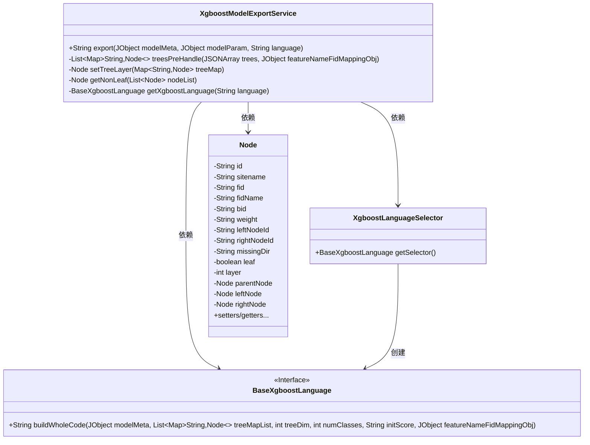
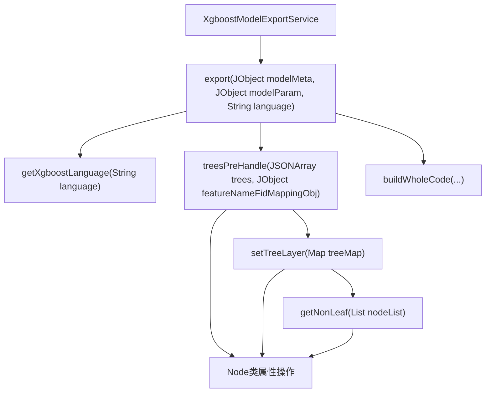
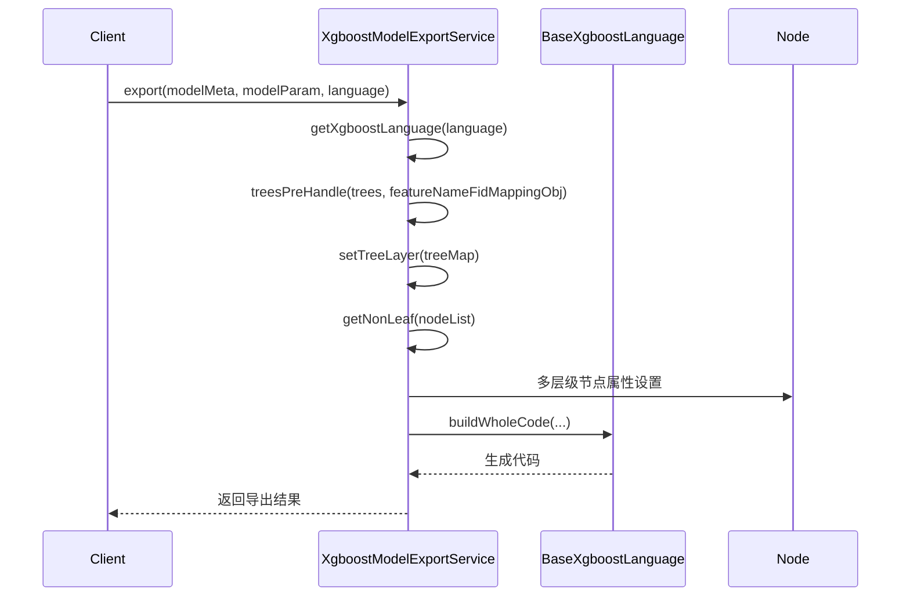

# 基础信息

|      |      |
|------|------|
| 名称 | XgboostModelExportService |
| 编码语言 | .java |
| 代码路径 | WeFe/board/board-service/src/main/java/com/welab/wefe/board/service/service/modelexport/XgboostModelExportService.java |
| 包名 | com.welab.wefe.board.service.service.modelexport |
| 依赖项 | ['com.alibaba.fastjson.JSONArray', 'com.welab.wefe.common.util.JObject', 'com.welab.wefe.common.util.StringUtil', 'org.springframework.stereotype.Service', 'java.util.ArrayList', 'java.util.HashMap', 'java.util.List', 'java.util.Map'] |
| 概述说明 | XgboostModelExportService导出XGBoost模型，处理树结构数据并生成目标语言代码。包含特征名映射、树预处理、节点分层及语言选择器功能。 |

# 说明

XgboostModelExportService是一个服务类，用于导出XGBoost模型。主要功能包括根据指定语言生成模型代码，处理模型参数如特征名称映射、树数据预处理、树维度、类别数和初始分数。treesPreHandle方法预处理树数据，构建节点映射并设置节点层级。setTreeLayer方法设置节点高度，从根节点开始逐层计算。getNonLeaf方法获取非叶子节点。getXgboostLanguage方法根据语言选择对应的解释器。最终通过buildWholeCode方法生成完整代码。

# 类列表 Class Summary

| 名称   | 类型  | 说明 |
|-------|------|-------------|
| XgboostModelExportService | class | XgboostModelExportService提供模型导出功能，处理树结构数据并生成目标语言代码。主要步骤包括特征名映射、树数据预处理（节点信息提取、层级设置）、初始化分数处理，最终调用语言解释器生成完整代码。支持多语言输出。 |

## 类 XgboostModelExportService

|      |      |
|------|------|
| 访问范围 | @Service;public |
| 类型 | class |
| 名称 | XgboostModelExportService |
| 说明 | XgboostModelExportService提供模型导出功能，处理树结构数据并生成目标语言代码。主要步骤包括特征名映射、树数据预处理（节点信息提取、层级设置）、初始化分数处理，最终调用语言解释器生成完整代码。支持多语言输出。 |

### UML类图

类图描述：该图展示了XGBoost模型导出服务的核心结构。XgboostModelExportService作为主服务类，通过XgboostLanguageSelector获取不同语言的解释器（BaseXgboostLanguage接口），并处理模型树结构（Node类）。服务包含四个关键方法：export处理整体导出逻辑，treesPreHandle预处理树数据，setTreeLayer设置节点层级，getNonLeaf获取非叶节点。Node类完整封装了树节点的属性和关系，包括父子节点指针和层级信息。

### 内部方法调用关系图

该流程图展示了Xgboost模型导出服务的核心处理逻辑。首先通过export方法入口，依次执行语言解释器获取、树数据预处理（包括节点映射和层级设置），最后调用具体语言生成器构建完整代码。时序图详细描述了各组件间调用顺序，特别是节点树的递归处理过程，最终将处理结果返回客户端。整个流程涉及复杂的树形结构操作和跨语言代码生成能力。

### 字段列表 Field List

| 名称  | 类型  | 说明 |
|-------|-------|------|

### 方法列表

| 名称  | 类型  | 说明 |
|-------|-------|------|
| treesPreHandle | List<Map<String, Node>> | 该方法处理JSON树数据，将每棵树转换为节点映射表，设置节点属性并计算树高，最终返回树列表。 |
| getXgboostLanguage | BaseXgboostLanguage | 方法根据输入语言参数创建并返回对应的Xgboost语言选择器实例。 |
| export | String | 该方法根据输入参数导出XGBoost模型代码。首先获取指定语言的解释器，处理特征名映射和树数据，提取树维度、类别数和初始分数，最后调用解释器生成完整代码。 |
| getNonLeaf | Node | 遍历节点列表，返回首个非叶子节点且左右子节点均为空的节点，若无则返回null。 |
| setTreeLayer | Node | 方法递归设置树节点层级，从根节点开始，逐层为左右子节点设置层级和父子关系，直到所有非叶子节点处理完毕。 |

