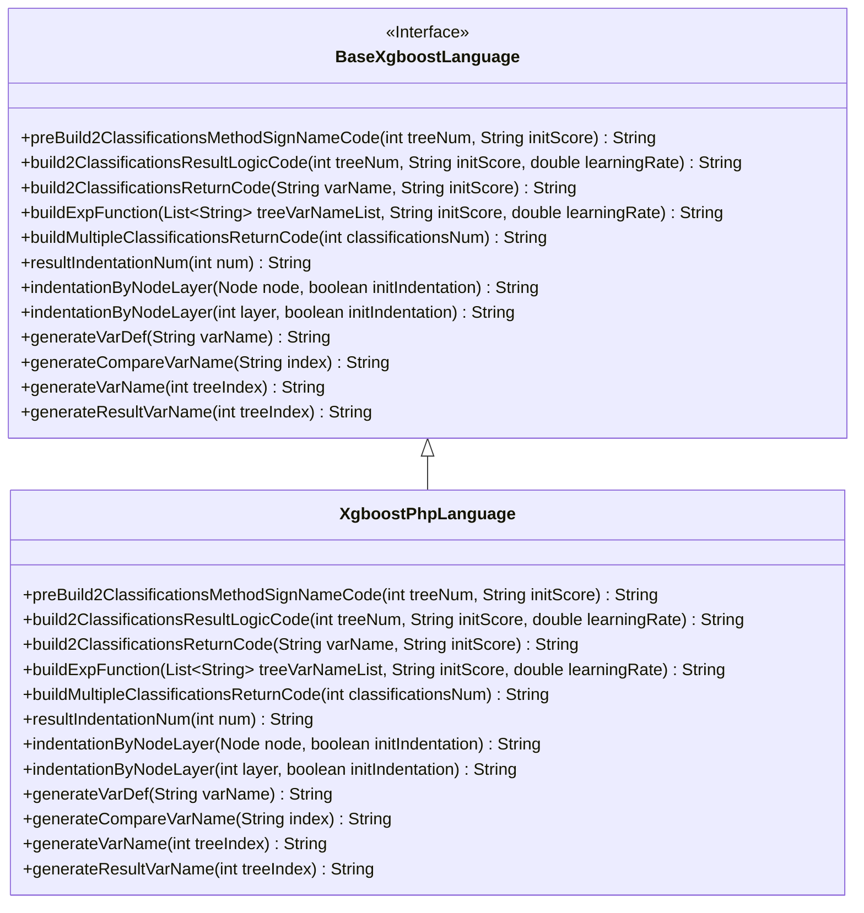

# 基础信息

|      |      |
|------|------|
| 名称 | XgboostPhpLanguage |
| 编码语言 | .java |
| 代码路径 | WeFe/board/board-service/src/main/java/com/welab/wefe/board/service/service/modelexport/XgboostPhpLanguage.java |
| 包名 | com.welab.wefe.board.service.service.modelexport |
| 依赖项 | ['java.util.List'] |
| 概述说明 | XgboostPhpLanguage类继承BaseXgboostLanguage，实现PHP代码生成逻辑，包括二分类和多分类模型评分函数构建、变量命名、缩进控制等核心功能。 |

# 说明

该代码定义了一个名为XgboostPhpLanguage的类，继承自BaseXgboostLanguage，专门用于生成PHP语言的XGBoost模型评分代码。主要功能包括构建二分类和多分类模型的评分逻辑，其中包含预处理方法签名、结果计算逻辑、返回语句生成等核心方法。代码通过字符串拼接方式动态生成PHP函数，处理输入数据、计算概率分数并返回分类结果。类中实现了变量命名、比较表达式生成、缩进控制等辅助方法，支持通过树索引和初始化分数等参数定制化生成代码逻辑。所有方法均遵循PHP语法规范，最终输出符合XGBoost评分要求的PHP代码片段。

# 类列表 Class Summary

| 名称   | 类型  | 说明 |
|-------|------|-------------|
| XgboostPhpLanguage | class | XgboostPhpLanguage类继承BaseXgboostLanguage，实现PHP代码生成逻辑，包括构建分类方法、结果计算、返回逻辑及变量命名等功能。 |

## 类 XgboostPhpLanguage

|      |      |
|------|------|
| 访问范围 | public |
| 类型 | class |
| 名称 | XgboostPhpLanguage |
| 说明 | XgboostPhpLanguage类继承BaseXgboostLanguage，实现PHP代码生成逻辑，包括构建分类方法、结果计算、返回逻辑及变量命名等功能。 |

### UML类图

这段代码展示了一个XgboostPhpLanguage类，它继承自BaseXgboostLanguage接口。该类主要用于生成PHP格式的XGBoost模型评分代码，包含构建分类方法签名、结果逻辑代码、返回代码以及辅助函数如变量生成和缩进处理等。通过重写父类方法，实现了PHP语言特定的代码生成逻辑，包括处理二分类和多分类场景的返回结果构造，以及变量命名和比较逻辑的定制化实现。

### 内部方法调用关系图

```mermaid
graph TD
    A["类XgboostPhpLanguage"]
    B["继承: BaseXgboostLanguage"]
    C["方法: preBuild2ClassificationsMethodSignNameCode"]
    D["方法: build2ClassificationsResultLogicCode"]
    E["方法: build2ClassificationsReturnCode"]
    F["方法: buildExpFunction"]
    G["方法: buildMultipleClassificationsReturnCode"]
    H["方法: resultIndentationNum"]
    I["方法: indentationByNodeLayer"]
    J["方法: generateVarDef"]
    K["方法: generateCompareVarName"]
    L["方法: generateVarName"]
    M["方法: generateResultVarName"]

    A --> B
    A --> C
    A --> D
    A --> E
    A --> F
    A --> G
    A --> H
    A --> I
    A --> J
    A --> K
    A --> L
    A --> M
```

这段代码定义了一个名为XgboostPhpLanguage的类，继承自BaseXgboostLanguage，主要用于生成PHP格式的XGBoost模型评分代码。类中包含多个方法，用于构建PHP函数签名、结果计算逻辑、返回语句以及变量命名等。这些方法协同工作，最终生成可执行的PHP代码，用于对输入数据进行分类预测。代码结构清晰，方法分工明确，体现了良好的面向对象设计原则。

### 字段列表 Field List

| 名称  | 类型  | 说明 |
|-------|-------|------|

### 方法列表

| 名称  | 类型  | 说明 |
|-------|-------|------|
| preBuild2ClassificationsMethodSignNameCode | String | 生成PHP函数框架，包含输入参数和占位符方法体，返回字符串格式代码模板。 |
| generateVarDef | String | 方法重写，生成变量定义语句，格式为"变量名 = null;"。 |
| resultIndentationNum | String | 重写方法resultIndentationNum，固定返回父类方法调用结果，参数num被忽略，始终传入1。 |
| build2ClassificationsReturnCode | String | 方法生成返回两类分类的PHP数组代码，格式为"return array(1 - $变量名, $变量名)"。 |
| buildExpFunction | String | Java方法：生成指数函数表达式，参数为变量列表、初始分数和学习率，返回形如"exp(0 - (求和结果))"的字符串。 |
| build2ClassificationsResultLogicCode | String | 该方法生成二分类逻辑代码，计算s1变量为1/(1+exp(-(树求和结果)))，并返回分类结果。核心步骤包括变量定义、sigmoid计算和返回处理。 |
| generateCompareVarName | String | 该方法生成比较变量名，格式为"$input[index]"，其中index为传入参数。 |
| generateVarName | String | 生成变量名方法：根据树索引返回"$var"加索引值的字符串。 |
| generateResultVarName | String | 该方法生成结果变量名，格式为"$s"加树索引值。 |
| buildMultipleClassificationsReturnCode | String | 方法生成多分类返回代码，拼接数组格式结果，包含指定数量的分类代码。 |
| indentationByNodeLayer | String | 重写方法indentationByNodeLayer，调用父类方法并固定initIndentation参数为false。 |
| indentationByNodeLayer | String | 重写方法，调用父类方法处理节点层级缩进，忽略初始缩入参数。 |

