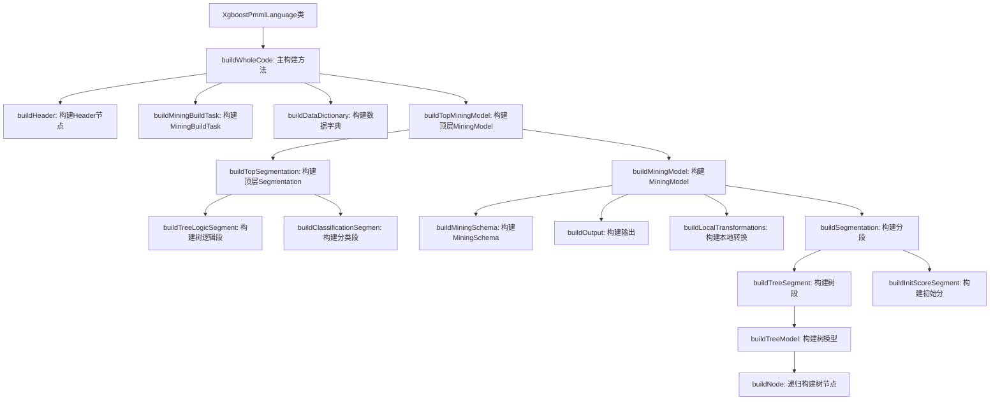

# 基础信息

|      |      |
|------|------|
| 名称 | XgboostPmmlLanguage |
| 编码语言 | .java |
| 代码路径 | WeFe/board/board-service/src/main/java/com/welab/wefe/board/service/service/modelexport/XgboostPmmlLanguage.java |
| 包名 | com.welab.wefe.board.service.service.modelexport |
| 依赖项 | ['com.welab.wefe.common.util.JObject', 'org.dmg.pmml', 'org.dmg.pmml.mining.MiningModel', 'org.dmg.pmml.mining.Segment', 'org.dmg.pmml.mining.Segmentation', 'org.dmg.pmml.regression.NumericPredictor', 'org.dmg.pmml.regression.RegressionModel', 'org.dmg.pmml.regression.RegressionTable', 'org.dmg.pmml.tree.TreeModel', 'org.jpmml.model.PMMLUtil', 'org.slf4j.Logger', 'org.slf4j.LoggerFactory', 'java.io.ByteArrayOutputStream', 'java.util.HashSet', 'java.util.List', 'java.util.Map', 'java.util.Set'] |
| 概述说明 | XgboostPmmlLanguage类继承BaseXgboostLanguage，实现将XGBoost模型转换为PMML格式的功能，包括构建头信息、数据字典、挖掘模型和分段结构，支持分类和回归任务，最终输出PMML字符串。 |

# 说明

该代码定义了一个名为XgboostPmmlLanguage的类，用于将XGBoost模型转换为PMML格式。主要功能包括构建PMML文档结构、处理特征映射、生成树模型逻辑以及分类输出。类中包含多个私有方法，分别负责构建PMML头部信息、数据字典、挖掘模型、分段结构等组件。通过递归方式处理树节点，最终生成符合PMML 4.3标准的XML格式输出。异常处理机制确保转换过程出错时记录日志并返回空字符串。

# 类列表 Class Summary

| 名称   | 类型  | 说明 |
|-------|------|-------------|
| XgboostPmmlLanguage | class | XgboostPmmlLanguage类实现XGBoost模型转PMML格式功能，包含构建头信息、数据字典、树模型结构及分类逻辑，支持回归和分类任务，处理特征映射和初始化分数。 |

## 类 XgboostPmmlLanguage

|      |      |
|------|------|
| 访问范围 | public |
| 类型 | class |
| 名称 | XgboostPmmlLanguage |
| 说明 | XgboostPmmlLanguage类实现XGBoost模型转PMML格式功能，包含构建头信息、数据字典、树模型结构及分类逻辑，支持回归和分类任务，处理特征映射和初始化分数。 |

### UML类图

```mermaid
classDiagram
    class XgboostPmmlLanguage {
        -Logger LOG
        +String buildWholeCode(JObject modelMeta, List~Map~String,Node~~ treeMapList, int treeDim, int numClasses, String initScore, JObject featureNameFidMappingObj)
        -Header buildHeader()
        -MiningBuildTask buildMiningBuildTask()
        -DataDictionary buildDataDictionary(JObject featureNameFidMappingObj)
        -MiningModel buildTopMiningModel(List~Map~String,Node~~ treeMapList, JObject featureNameFidMappingObj, String initScore, double learningRate)
        -Segmentation buildTopSegmentation(List~Map~String,Node~~ treeMapList, JObject featureNameFidMappingObj, String initScore, double learningRate)
        -Segment buildTreeLogicSegment(List~Map~String,Node~~ treeMapList, JObject featureNameFidMappingObj, String initScore, double learningRate)
        -Segment buildClassificationSegmen()
        -MiningModel buildMiningModel(List~Map~String,Node~~ treeMapList, JObject featureNameFidMappingObj, String initScore, double learningRate)
        -MiningSchema buildMiningSchema(JObject featureNameFidMappingObj)
        -Output buildOutput()
        -LocalTransformations buildLocalTransformations(JObject featureNameFidMappingObj)
        -Segmentation buildSegmentation(List~Map~String,Node~~ treeMapList, String initScore, double learningRate)
        -Segment buildTreeSegment(Map~String,Node~ treeMap, int treeIndex, double learningRate)
        -Segment buildInitScoreSegment(String initScore)
        -TreeModel buildTreeModel(Map~String,Node~ treeMap, double learningRate)
        -MiningSchema buildTreeModelMiningSchema(Map~String,Node~ treeMap)
        -void buildNode(Node treeNode, org.dmg.pmml.tree.Node parentPmmlNode, double learningRate)
    }

    class BaseXgboostLanguage {
        <<Abstract>>
    }

    class PMML {
        +setVersion(String version)
        +setHeader(Header header)
        +setMiningBuildTask(MiningBuildTask miningBuildTask)
        +setDataDictionary(DataDictionary dataDictionary)
        +addModels(Model model)
    }

    class Header {
        +setApplication(Application application)
        +setTimestamp(Timestamp timestamp)
    }

    class MiningBuildTask {
        // Empty implementation
    }

    class DataDictionary {
        +addDataFields(DataField dataField)
    }

    class MiningModel {
        +setMiningFunction(MiningFunction miningFunction)
        +setAlgorithmName(String algorithmName)
        +setMathContext(MathContext mathContext)
        +setMiningSchema(MiningSchema miningSchema)
        +setSegmentation(Segmentation segmentation)
        +setOutput(Output output)
        +setLocalTransformations(LocalTransformations localTransformations)
    }

    class Segmentation {
        +setMultipleModelMethod(MultipleModelMethod method)
        +addSegments(Segment segment)
    }

    class Segment {
        +setId(String id)
        +setPredicate(Predicate predicate)
        +setModel(Model model)
    }

    class RegressionModel {
        +setMiningFunction(MiningFunction miningFunction)
        +setNormalizationMethod(NormalizationMethod method)
        +setMathContext(MathContext mathContext)
        +setMiningSchema(MiningSchema miningSchema)
        +setOutput(Output output)
        +addRegressionTables(RegressionTable regressionTable)
    }

    XgboostPmmlLanguage --|> BaseXgboostLanguage : 继承
    XgboostPmmlLanguage --> PMML : 生成
    XgboostPmmlLanguage --> Header : 构建
    XgboostPmmlLanguage --> MiningBuildTask : 构建
    XgboostPmmlLanguage --> DataDictionary : 构建
    XgboostPmmlLanguage --> MiningModel : 构建
    XgboostPmmlLanguage --> Segmentation : 构建
    XgboostPmmlLanguage --> Segment : 构建
    XgboostPmmlLanguage --> RegressionModel : 构建
```

该代码实现了一个XGBoost模型到PMML格式的转换器，主要功能包括构建PMML文档结构、数据字典、挖掘模型和分段逻辑。类图中展示了XgboostPmmlLanguage作为核心类，继承自BaseXgboostLanguage，并与多个PMML相关类（如Header、MiningModel等）交互，通过构建方法生成完整的PMML文档。整个设计采用分层结构，将不同PMML组件的构建逻辑分离，确保生成的PMML符合XGBoost模型的结构和特征要求。

### 内部方法调用关系图

这段代码是XGBoost模型转换为PMML格式的核心实现，主要流程从buildWholeCode方法开始，依次构建PMML文档的各个组件。首先创建PMML基础结构（Header、MiningBuildTask、DataDictionary），然后构建顶层MiningModel及其Segmentation结构，其中包含树逻辑段和分类段。对于每棵树，递归构建树模型节点结构，最终将所有组件组装成完整的PMML文档并通过marshal方法序列化为XML字符串。整个过程严格遵循PMML 4.3规范，支持分类任务的模型导出，包含特征映射、初始分数、学习率等XGBoost特有参数的转换处理。

### 字段列表 Field List

| 名称  | 类型  | 说明 |
|-------|-------|------|
| LOG = LoggerFactory.getLogger(this.getClass()) | Logger | 声明一个受保护的最终日志对象，用于当前类的日志记录。 |

### 方法列表

| 名称  | 类型  | 说明 |
|-------|-------|------|
| buildTopSegmentation | Segmentation | 构建分段模型，设置多模型链方法，添加树逻辑分段和分类分段，返回完整分段对象。 |
| buildSegmentation | Segmentation | 构建Segmentation对象，设置多模型方法为SUM，添加初始分数段，遍历treeMapList为每个元素构建树段并添加，最后返回segmentation。 |
| buildMiningSchema | MiningSchema | 该方法根据输入的JSON对象构建MiningSchema，遍历对象中的键值对，为每个值创建MiningField并添加到MiningSchema中，最后返回构建好的MiningSchema。 |
| buildTreeLogicSegment | Segment | 构建树逻辑段：创建Segment对象，设置ID为1，谓词为True，模型由buildMiningModel方法生成，参数包括树映射列表、特征名映射、初始分数和学习率。 |
| buildDataDictionary | DataDictionary | 构建数据字典方法：创建DataDictionary对象，添加名为flag的INTEGER类型分类字段（值0和1），遍历featureNameFidMappingObj添加CONTINUOUS类型DOUBLE字段。 |
| buildWholeCode | String | 该方法构建PMML格式代码，包括版本、头信息、数据字典和模型，处理异常并返回结果字符串。 |
| buildMiningModel | MiningModel | 构建回归挖掘模型，设置函数、数学上下文、模式、输出、本地转换和分段。 |
| buildClassificationSegmen | Segment | 构建分类模型段，设置逻辑回归模型，目标字段flag，预测字段xgbValue，输出概率0和1，包含回归表和截距。 |
| buildHeader | Header | 构建Header对象，包含应用名"Xgboost Regression Model"、版本"1.0"和当前时间戳。 |
| buildMiningBuildTask | MiningBuildTask | 创建并返回一个MiningBuildTask实例的私有方法。 |
| buildLocalTransformations | LocalTransformations | 构建本地转换对象，遍历特征名映射，为每个值创建连续双精度派生字段，引用原字段并添加到转换对象中返回。 |
| buildTopMiningModel | MiningModel | 构建XGBoost分类模型，设置目标字段flag和特征字段，包含树结构和学习率参数。 |
| buildOutput | Output | 该方法创建并配置一个Output对象，包含一个名为xgbValue的连续型双精度输出字段，标记为非最终结果。 |
| buildTreeSegment | Segment | 构建树段方法：创建Segment对象，设置谓词为True，ID为treeIndex字符串，模型由buildTreeModel生成，返回segment。 |
| buildInitScoreSegment | Segment | 构建初始化分数段，设置回归模型、默认策略和初始分数。 |
| buildTreeModel | TreeModel | 构建树模型方法：从treeMap获取根节点，创建PMML节点并设置初始分数和谓词，递归构建子节点，最终配置回归树模型参数并返回。 |
| buildTreeModelMiningSchema | MiningSchema | 构建树模型挖掘模式：遍历非叶子节点，收集特征名并创建对应挖掘字段，返回包含这些字段的挖掘模式。 |
| buildNode | void | 方法递归构建PMML树节点，处理叶节点和非叶节点。叶节点设置权重和学习率，非叶节点生成左右子节点及条件，并递归处理子节点。 |

