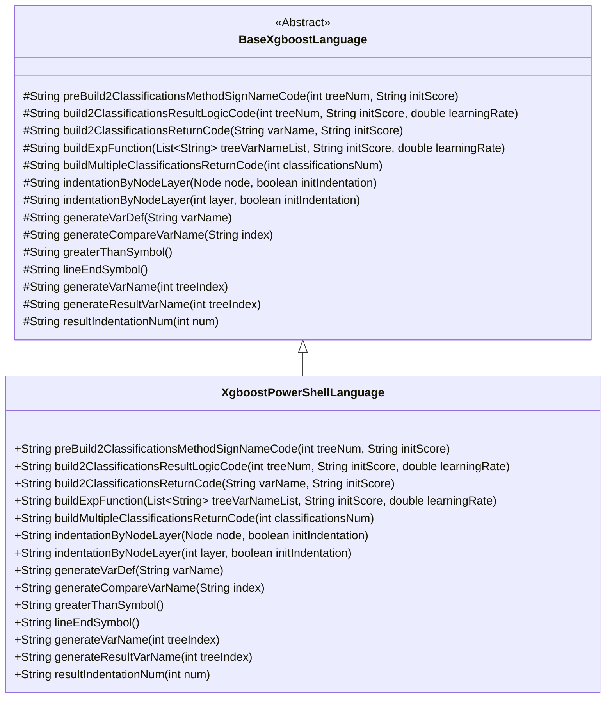

# 基础信息

|      |      |
|------|------|
| 名称 | XgboostPowerShellLanguage |
| 编码语言 | .java |
| 代码路径 | WeFe/board/board-service/src/main/java/com/welab/wefe/board/service/service/modelexport/XgboostPowerShellLanguage.java |
| 包名 | com.welab.wefe.board.service.service.modelexport |
| 依赖项 | ['java.util.List'] |
| 概述说明 | XgboostPowerShellLanguage类继承BaseXgboostLanguage，实现XGBoost模型在PowerShell中的代码生成逻辑，包括分类评分、结果计算和返回等核心功能。 |

# 说明

XgboostPowerShellLanguage类继承BaseXgboostLanguage，专为PowerShell语言实现XGBoost模型预测逻辑。主要功能包括生成二分类和多分类的评分函数代码结构，其中二分类通过Sigmoid函数转换树模型输出并返回概率值，多分类通过Softmax归一化处理。类中定义了PowerShell特有的语法元素，如变量定义格式、数组索引访问方式、比较运算符-gt以及行尾符号处理。同时提供了节点层级缩进控制、临时变量命名规则及结果返回格式等基础方法，确保生成的代码符合PowerShell语法规范。

# 类列表 Class Summary

| 名称   | 类型  | 说明 |
|-------|------|-------------|
| XgboostPowerShellLanguage | class | XgboostPowerShellLanguage类继承BaseXgboostLanguage，实现XGBoost模型在PowerShell中的代码生成，包括分类方法构建、返回逻辑和变量定义等功能。 |

## 类 XgboostPowerShellLanguage

|      |      |
|------|------|
| 访问范围 | public |
| 类型 | class |
| 名称 | XgboostPowerShellLanguage |
| 说明 | XgboostPowerShellLanguage类继承BaseXgboostLanguage，实现XGBoost模型在PowerShell中的代码生成，包括分类方法构建、返回逻辑和变量定义等功能。 |

### UML类图

该类图展示了XgboostPowerShellLanguage继承自抽象基类BaseXgboostLanguage的完整结构。XgboostPowerShellLanguage实现了所有继承的抽象方法，主要功能包括：生成PowerShell格式的XGBoost分类方法签名、构建二分类结果逻辑代码、构造返回语句、实现指数计算函数等。该类专门针对PowerShell脚本语言特性进行了实现，如使用"$"前缀变量、"-gt"比较符号等语法特征，体现了将XGBoost模型转换为PowerShell可执行代码的具体实现策略。

### 内部方法调用关系图

```mermaid
graph TD
    A["类XgboostPowerShellLanguage"]
    B["方法: preBuild2ClassificationsMethodSignNameCode"]
    C["方法: build2ClassificationsResultLogicCode"]
    D["方法: build2ClassificationsReturnCode"]
    E["方法: buildExpFunction"]
    F["方法: buildMultipleClassificationsReturnCode"]
    G["方法: indentationByNodeLayer"]
    H["方法: generateVarDef"]
    I["方法: generateCompareVarName"]
    J["方法: greaterThanSymbol"]
    K["方法: lineEndSymbol"]
    L["方法: generateVarName"]
    M["方法: generateResultVarName"]
    N["方法: resultIndentationNum"]

    A --> B
    A --> C
    A --> D
    A --> E
    A --> F
    A --> G
    A --> H
    A --> I
    A --> J
    A --> K
    A --> L
    A --> M
    A --> N
```

这段代码是XGBoost PowerShell语言实现的子类，主要用于生成PowerShell脚本形式的分类模型代码。它继承了BaseXgboostLanguage基类，重写了多个关键方法，包括构建分类方法签名(preBuild2ClassificationsMethodSignNameCode)、生成分类结果逻辑(build2ClassificationsResultLogicCode)、构建返回代码(build2ClassificationsReturnCode)等。特别值得注意的是，它针对PowerShell语法进行了专门处理，如使用"-gt"作为比较运算符，生成PowerShell特有的变量定义语法等。这些方法共同协作，最终生成可执行的PowerShell分类模型代码。

### 字段列表 Field List

| 名称  | 类型  | 说明 |
|-------|-------|------|

### 方法列表

| 名称  | 类型  | 说明 |
|-------|-------|------|
| buildMultipleClassificationsReturnCode | String | 该方法生成多分类返回代码，拼接分类结果变量名和总和计算，用逗号分隔各分类，最后返回格式化字符串。 |
| greaterThanSymbol | String | 代码重写greaterThanSymbol方法，返回字符串"-gt"。 |
| generateVarName | String | 生成变量名方法，返回格式为"$var"加索引值。 |
| indentationByNodeLayer | String | 重写方法indentationByNodeLayer，调用父类方法并固定initIndentation参数为false。 |
| preBuild2ClassificationsMethodSignNameCode | String | 方法生成代码框架，构建包含输入向量和占位符的评分函数模板。 |
| build2ClassificationsReturnCode | String | 该方法生成返回两个分类结果的代码字符串，使用变量名和初始分数构建返回表达式，格式为返回1减变量值与变量值的元组。 |
| indentationByNodeLayer | String | 重写方法，调用父类方法处理节点层级缩进，忽略初始缩入参数。 |
| build2ClassificationsResultLogicCode | String | 该方法生成二分类逻辑回归代码，计算概率值并返回结果。使用s1变量存储中间值，通过数学公式转换树模型输出为概率，最后返回分类结果。 |
| resultIndentationNum | String | 重写方法resultIndentationNum，固定返回父类调用结果，参数num被忽略，始终传入1。 |
| lineEndSymbol | String | 方法重写，返回空字符串作为行结束符。 |
| generateResultVarName | String | 生成方法返回变量名，格式为$s加树索引。 |
| buildExpFunction | String | 该方法生成数学表达式字符串，调用generateTreeSum计算总和后取负指数，结果用于Exp函数计算。 |
| generateVarDef | String | 方法重写，生成变量定义字符串，格式为"[double]变量名 = 0"。 |
| generateCompareVarName | String | 生成比较变量名方法，返回格式为$InputVector[index]。 |

