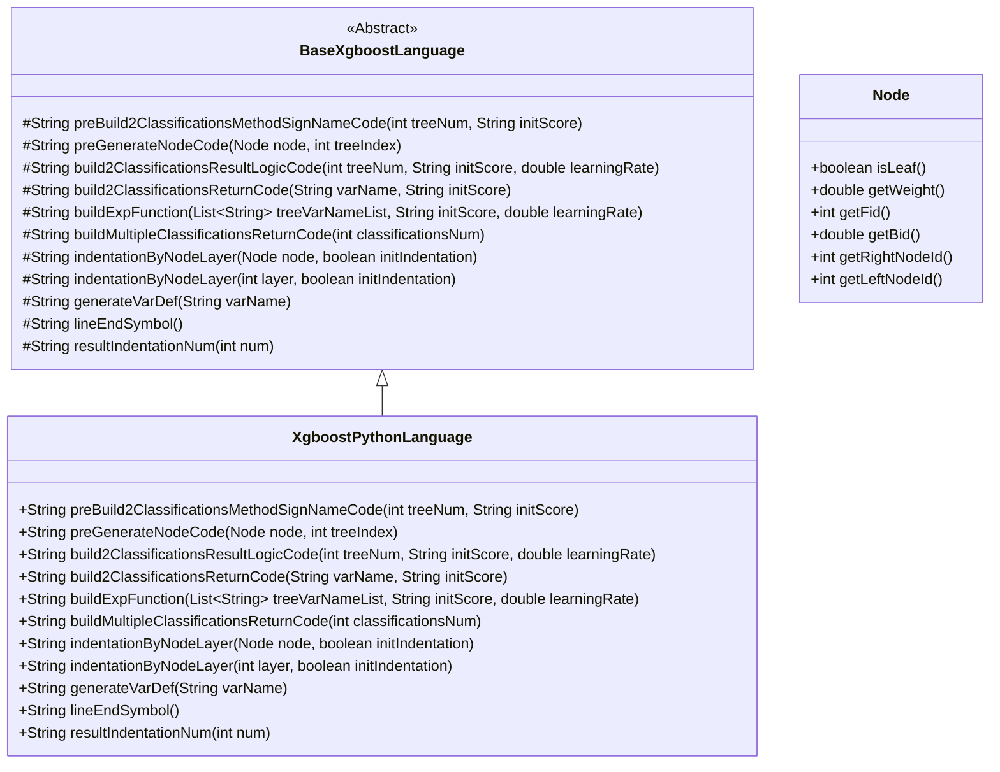
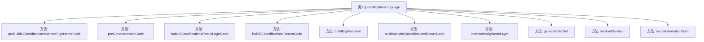

# 基础信息

|      |      |
|------|------|
| 名称 | XgboostPythonLanguage |
| 编码语言 | .java |
| 代码路径 | WeFe/board/board-service/src/main/java/com/welab/wefe/board/service/service/modelexport/XgboostPythonLanguage.java |
| 包名 | com.welab.wefe.board.service.service.modelexport |
| 依赖项 | ['java.util.List'] |
| 概述说明 | XgboostPythonLanguage类继承BaseXgboostLanguage，实现Python代码生成逻辑，包括节点条件判断、分类结果计算和返回逻辑，支持二分类和多分类任务。 |

# 说明

该代码定义了一个名为XgboostPythonLanguage的类，继承自BaseXgboostLanguage，专门用于生成Python语言的XGBoost模型代码。主要功能包括构建二分类和多分类模型的评分方法、节点代码生成、结果逻辑处理等。通过重写父类方法，实现了Python特有的语法结构，如导入math库、定义score函数、生成条件判断和叶子节点赋值等。代码还处理了模型输出的概率计算和返回格式，包括sigmoid函数转换和二分类概率返回。整体结构清晰，通过字符串拼接生成符合Python语法的代码片段。

# 类列表 Class Summary

| 名称   | 类型  | 说明 |
|-------|------|-------------|
| XgboostPythonLanguage | class | XgboostPythonLanguage类继承BaseXgboostLanguage，实现Python代码生成逻辑，包括节点处理、分类结果计算和返回逻辑。 |

## 类 XgboostPythonLanguage

|      |      |
|------|------|
| 访问范围 | public |
| 类型 | class |
| 名称 | XgboostPythonLanguage |
| 说明 | XgboostPythonLanguage类继承BaseXgboostLanguage，实现Python代码生成逻辑，包括节点处理、分类结果计算和返回逻辑。 |

### UML类图

类图描述：
该图展示了XGBoost模型导出为Python代码的实现结构。XgboostPythonLanguage继承自抽象基类BaseXgboostLanguage，实现了将决策树转换为Python代码的核心方法。包含生成方法签名、节点条件判断、分类结果计算等关键操作，其中Node类提供树节点信息。实现重点关注二分类和多分类场景下的代码生成逻辑，通过模板方法模式确保代码结构的统一性，同时支持自定义缩进和变量定义等语法细节处理。

### 内部方法调用关系图

该流程图展示了XgboostPythonLanguage类的主要方法结构及其继承关系。作为XGBoost模型的Python语言生成器，该类专注于构建决策树评分逻辑，包含预处理方法签名、节点代码生成、分类结果计算等核心功能。方法间通过字符串拼接协作，最终生成可执行的Python代码，用于模型推理。流程图中清晰呈现了从基础代码生成到复杂分类逻辑构建的完整调用链。

### 字段列表 Field List

| 名称  | 类型  | 说明 |
|-------|-------|------|

### 方法列表

| 名称  | 类型  | 说明 |
|-------|-------|------|
| preGenerateNodeCode | String | 该方法为决策树节点生成代码：叶子节点输出变量名和权重，非叶子节点生成条件判断分支代码，包含左右子节点占位符。 |
| indentationByNodeLayer | String | 重写方法，调用父类实现，固定initIndentation为false，返回基于层级的缩进字符串。 |
| build2ClassificationsReturnCode | String | 方法生成返回代码字符串，格式为"return [(1) - (变量名), 变量名]"，包含缩进和行结束符。 |
| generateVarDef | String | 这是一个Java方法，用于生成变量定义字符串，将变量名与初始值"0.0"拼接返回。 |
| buildExpFunction | String | 该方法生成数学表达式字符串，计算指数函数值，参数包括树变量列表、初始分数和学习率。 |
| preBuild2ClassificationsMethodSignNameCode | String | 生成Python评分函数模板，包含导入math库、定义score函数及预留方法体占位符。 |
| indentationByNodeLayer | String | 重写父类方法，根据节点层级返回缩进字符串，默认不初始化缩进。 |
| buildMultipleClassificationsReturnCode | String | 该方法生成多分类返回代码，通过指定分类数量构建包含数组结构的字符串，格式为"return [分类代码]"。 |
| build2ClassificationsResultLogicCode | String | 该方法生成二分类逻辑回归代码，计算s1变量作为sigmoid函数输出，并返回分类结果。 |
| lineEndSymbol | String | Java方法重写，返回空字符串作为行结束符。 |
| resultIndentationNum | String | 重写方法，固定缩进数为1，调用父类方法实现。 |

