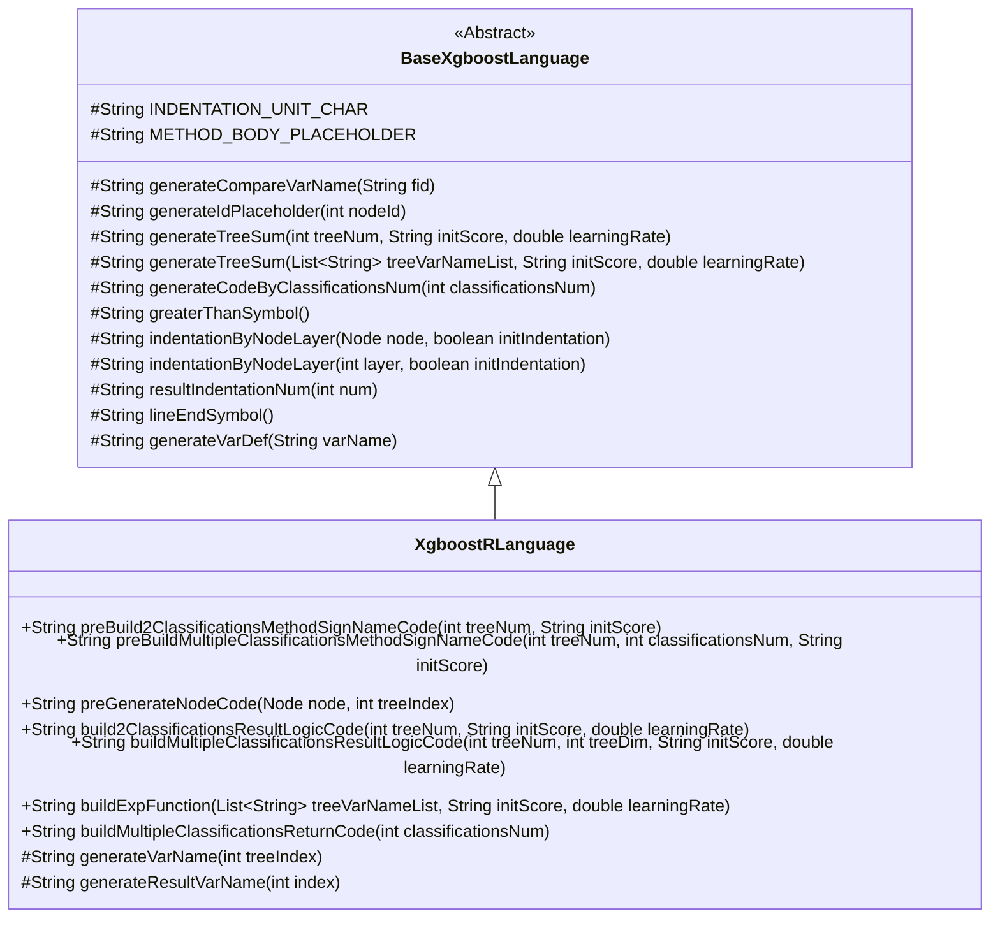

# 基础信息

|      |      |
|------|------|
| 名称 | XgboostRLanguage |
| 编码语言 | .java |
| 代码路径 | WeFe/board/board-service/src/main/java/com/welab/wefe/board/service/service/modelexport/XgboostRLanguage.java |
| 包名 | com.welab.wefe.board.service.service.modelexport |
| 依赖项 | ['java.util.List', 'java.util.Map'] |
| 概述说明 | XgboostRLanguage类继承BaseXgboostLanguage，实现R语言XGBoost模型代码生成，包括二分类和多分类逻辑、节点代码生成及格式化方法。 |

# 说明

XgboostRLanguage类继承BaseXgboostLanguage，实现了XGBoost模型在R语言中的代码生成逻辑。主要功能包括：为二分类任务生成预测函数框架，包含sigmoid转换和概率计算；为多分类任务构建预测函数框架，支持多维度输出；递归生成决策树节点代码，处理分支条件和叶节点权重；构建二分类和多分类结果计算逻辑，包括树模型加权求和、softmax转换及结果返回；提供基础工具方法如变量定义、代码缩进和行尾符号处理。通过方法重写实现了R语言特有的语法结构生成。

# 类列表 Class Summary

| 名称   | 类型  | 说明 |
|-------|------|-------------|
| XgboostRLanguage | class | XgboostRLanguage类继承BaseXgboostLanguage，实现R语言代码生成，支持二分类和多分类任务，包含节点代码生成、逻辑计算和返回结果等功能。 |

## 类 XgboostRLanguage

|      |      |
|------|------|
| 访问范围 | public |
| 类型 | class |
| 名称 | XgboostRLanguage |
| 说明 | XgboostRLanguage类继承BaseXgboostLanguage，实现R语言代码生成，支持二分类和多分类任务，包含节点代码生成、逻辑计算和返回结果等功能。 |

### UML类图

类图描述：
该图展示了XgboostRLanguage类继承自抽象基类BaseXgboostLanguage的层级关系。XgboostRLanguage实现了XGBoost模型在R语言中的代码生成功能，包含二分类和多分类的方法签名生成、节点代码生成、结果逻辑构建等核心方法。基类提供了通用的代码生成工具方法，如缩进控制、变量名生成、树求和等基础功能。子类通过重写抽象方法实现了R语言特有的代码生成逻辑，体现了模板方法设计模式的应用。

### 内部方法调用关系图

```mermaid
graph TD
    A["类XgboostRLanguage"]
    B["继承自: BaseXgboostLanguage"]
    C["方法: preBuild2ClassificationsMethodSignNameCode"]
    D["方法: preBuildMultipleClassificationsMethodSignNameCode"]
    E["方法: preGenerateNodeCode"]
    F["方法: build2ClassificationsResultLogicCode"]
    G["方法: buildMultipleClassificationsResultLogicCode"]
    H["方法: buildExpFunction"]
    I["方法: buildMultipleClassificationsReturnCode"]
    J["方法: indentationByNodeLayer"]
    K["方法: generateVarDef"]
    L["方法: lineEndSymbol"]
    M["方法: resultIndentationNum"]

    A --> B
    A --> C
    A --> D
    A --> E
    A --> F
    A --> G
    A --> H
    A --> I
    A --> J
    A --> K
    A --> L
    A --> M
```

这段代码是XgboostRLanguage类的实现，继承自BaseXgboostLanguage基类，主要用于生成R语言的XGBoost模型评分代码。核心功能包括：构建二分类和多分类的评分函数模板(preBuild方法)、生成决策树节点代码(preGenerateNodeCode)、构建结果计算逻辑(buildResultLogicCode)以及辅助方法如缩进控制(indentationByNodeLayer)和变量定义(generateVarDef)。类通过方法重写实现了R语言特有的代码生成逻辑，重点关注分类模型的数学计算和条件分支处理，最终输出符合R语法的预测函数。

### 字段列表 Field List

| 名称  | 类型  | 说明 |
|-------|-------|------|

### 方法列表

| 名称  | 类型  | 说明 |
|-------|-------|------|
| buildMultipleClassificationsResultLogicCode | String | 该方法生成多分类逻辑回归结果代码，遍历分类树映射，为每个分类生成变量定义和计算逻辑，最终返回拼接的代码字符串。 |
| indentationByNodeLayer | String | 重写方法，调用父类实现，固定initIndentation为false。 |
| buildExpFunction | String | 该方法生成指数函数表达式，包含树变量列表、初始分数和学习率参数，返回形如"exp(0 - (计算值))"的字符串。 |
| preBuildMultipleClassificationsMethodSignNameCode | String | 该方法生成R语言函数代码框架，包含主函数score和子函数subroutine，主函数调用子函数并返回结果，子函数体由占位符METHOD_BODY_PLACEHOLDER表示。 |
| preBuild2ClassificationsMethodSignNameCode | String | 该方法生成一个R函数代码，包含sigmoid计算和返回二元分类概率的逻辑。代码结构分为主函数score和子函数subroutine，主函数调用子函数并返回两个类别的概率值。 |
| build2ClassificationsResultLogicCode | String | 该方法生成分类结果逻辑代码，拼接树模型求和表达式并返回字符串。 |
| preGenerateNodeCode | String | 方法重写，根据节点类型生成代码：叶子节点返回变量名和权重，非叶子节点生成条件判断和分支占位符。 |
| indentationByNodeLayer | String | 重写方法，调用父类方法生成缩进字符串，忽略初始缩进参数。 |
| buildMultipleClassificationsReturnCode | String | 该方法生成多分类返回代码，通过参数指定分类数量，拼接字符串后返回格式化代码。 |
| generateVarDef | String | 方法重写，生成变量定义字符串，格式为"变量名 <- 0.0"加行结束符。 |
| lineEndSymbol | String | 重写方法lineEndSymbol，返回空字符串表示无行结束符。 |
| resultIndentationNum | String | 重写方法，固定缩进数为1，调用父类实现。 |

