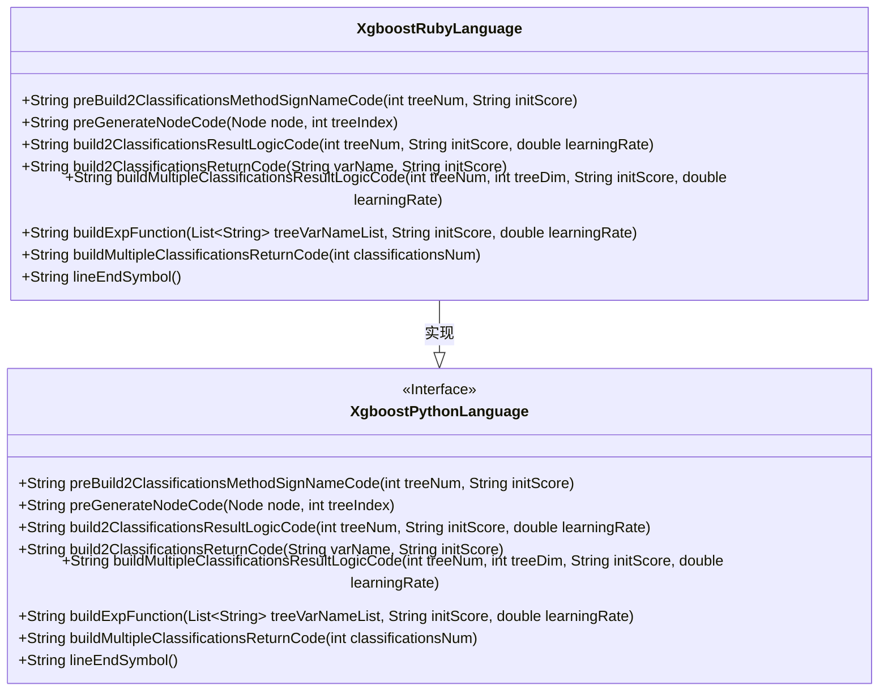
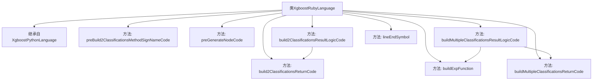
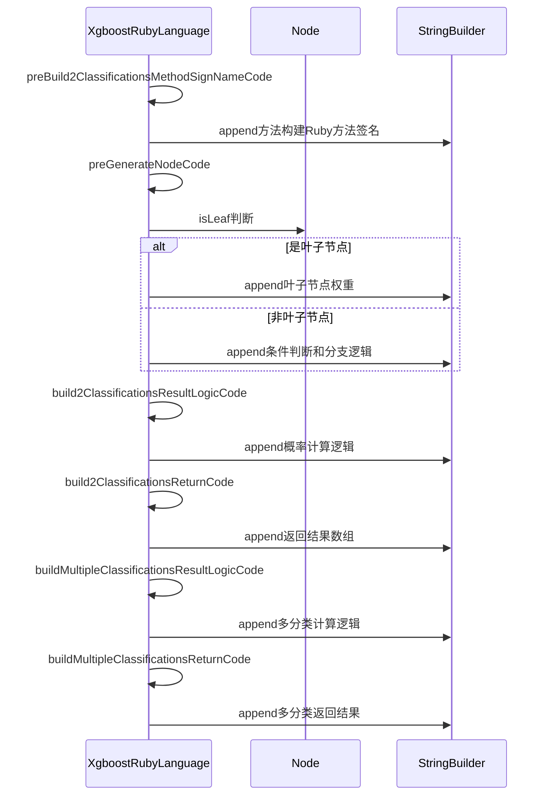

# 基础信息

|      |      |
|------|------|
| 名称 | XgboostRubyLanguage |
| 编码语言 | .java |
| 代码路径 | WeFe/board/board-service/src/main/java/com/welab/wefe/board/service/service/modelexport/XgboostRubyLanguage.java |
| 包名 | com.welab.wefe.board.service.service.modelexport |
| 依赖项 | ['java.util.List', 'java.util.Map'] |
| 概述说明 | XgboostRubyLanguage类继承XgboostPythonLanguage，重写多个方法生成Ruby代码，包括构建分类方法签名、节点条件判断、二分类和多分类结果逻辑及返回代码。 |

# 说明

XgboostRubyLanguage类继承自XgboostPythonLanguage，专门用于生成Ruby语言的XGBoost模型评分代码。它重写了多个方法以适配Ruby语法，包括构建二分类和多分类逻辑。主要功能包括生成节点判断代码、计算分类概率的数学表达式（如Sigmoid函数）、以及返回分类结果的数组结构。方法中处理了叶子节点权重、特征比较条件、树节点遍历逻辑，并确保生成的代码符合Ruby语法规范（如方法定义使用def/end，条件语句使用if/else/end）。多分类场景下动态生成变量并计算各类别概率，最终返回概率数组。所有方法均避免硬编码，通过抽象方法实现语法符号的灵活适配。

# 类列表 Class Summary

| 名称   | 类型  | 说明 |
|-------|------|-------------|
| XgboostRubyLanguage | class | XgboostRubyLanguage类继承XgboostPythonLanguage，重写多个方法以生成Ruby代码，包括构建分类方法签名、节点代码、二分类和多分类结果逻辑及返回代码。 |

## 类 XgboostRubyLanguage

|      |      |
|------|------|
| 访问范围 | public |
| 类型 | class |
| 名称 | XgboostRubyLanguage |
| 说明 | XgboostRubyLanguage类继承XgboostPythonLanguage，重写多个方法以生成Ruby代码，包括构建分类方法签名、节点代码、二分类和多分类结果逻辑及返回代码。 |

### UML类图

这段类图展示了XgboostRubyLanguage类继承自XgboostPythonLanguage接口的结构关系。XgboostPythonLanguage定义了多个抽象方法，包括预处理分类方法签名、生成节点代码、构建分类结果逻辑等核心功能。XgboostRubyLanguage作为具体实现类，重写了所有父接口方法，提供了针对Ruby语言特性的具体实现，如Ruby语法的方法定义、条件判断和数组返回等。类图清晰地反映了这种继承关系和方法覆盖的实现细节，体现了面向对象的多态特性。

### 内部方法调用关系图

这段代码是XGBoost模型在Ruby语言中的实现类，继承自Python版本基类。主要功能包括：构建二分类方法签名、生成决策树节点代码、实现二分类结果计算逻辑、构建多分类结果计算逻辑以及相关辅助方法。流程图展示了类继承关系和方法调用层级，时序图则详细描述了核心方法间的调用顺序和数据流转过程。该实现通过StringBuilder动态生成Ruby代码，支持决策树的条件判断、叶子节点处理和概率计算结果返回等功能。

### 字段列表 Field List

| 名称  | 类型  | 说明 |
|-------|-------|------|

### 方法列表

| 名称  | 类型  | 说明 |
|-------|-------|------|
| preBuild2ClassificationsMethodSignNameCode | String | 生成Python方法框架，定义score函数，预留方法体占位符，以end结束。 |
| preGenerateNodeCode | String | 该方法根据节点类型生成代码：叶子节点返回变量赋值，非叶子节点生成条件判断分支代码，包含右左子节点占位符和结束标记。 |
| build2ClassificationsReturnCode | String | 该方法生成返回两个分类的代码字符串，包含变量名和初始分数，使用缩进和换行符格式化。 |
| build2ClassificationsResultLogicCode | String | 该方法生成二分类逻辑回归代码，计算s1变量为sigmoid函数结果，并返回分类结果。关键步骤包括变量定义、sigmoid计算和返回逻辑。 |
| buildMultipleClassificationsResultLogicCode | String | 该方法为多分类逻辑回归生成计算代码，遍历分类树映射生成变量定义和逻辑计算，最终返回分类结果代码。 |
| buildExpFunction | String | Java方法：生成数学表达式字符串，计算0减去树变量列表求和后的自然指数结果。 |
| buildMultipleClassificationsReturnCode | String | 该方法生成包含多个分类返回码的字符串，使用缩进和方括号包裹分类数目生成的代码，最后添加换行符返回。 |
| lineEndSymbol | String | Java方法重写，返回空字符串作为行结束符。 |

