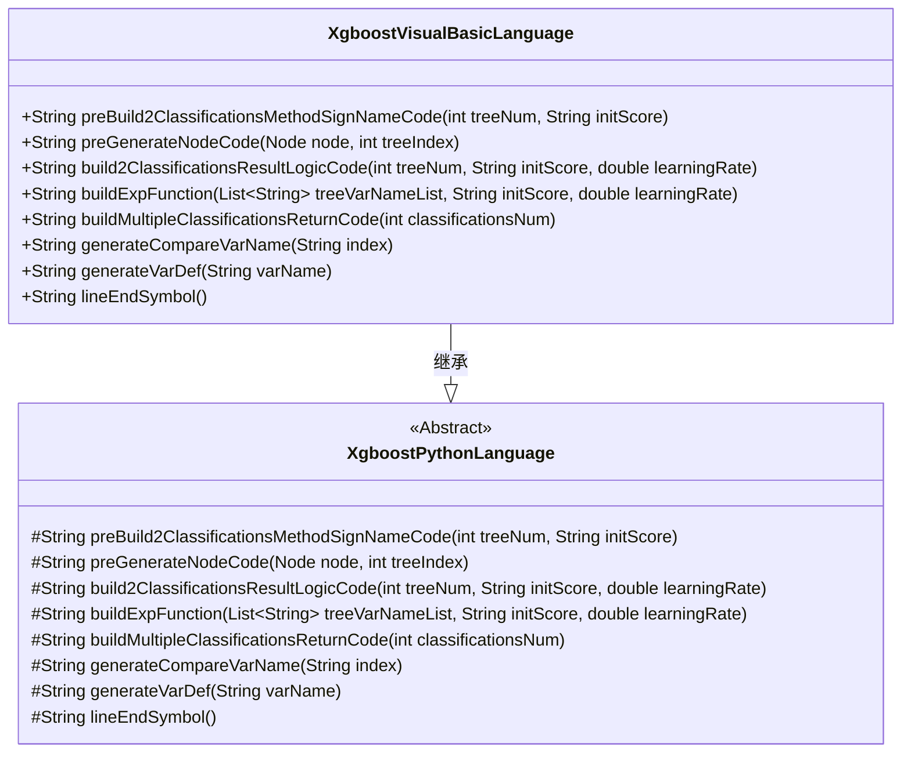
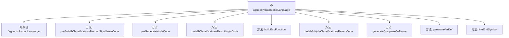

# 基础信息

|      |      |
|------|------|
| 名称 | XgboostVisualBasicLanguage |
| 编码语言 | .java |
| 代码路径 | WeFe/board/board-service/src/main/java/com/welab/wefe/board/service/service/modelexport/XgboostVisualBasicLanguage.java |
| 包名 | com.welab.wefe.board.service.service.modelexport |
| 依赖项 | ['java.util.List'] |
| 概述说明 | XgboostVisualBasicLanguage类继承XgboostPythonLanguage，重写方法生成VB代码，包括分类方法签名、节点条件判断、结果逻辑计算和变量定义等。 |

# 说明

该代码定义了一个XgboostVisualBasicLanguage类，继承自XgboostPythonLanguage类，用于将XGBoost模型转换为Visual Basic代码。主要功能包括：生成VB模块和评分函数框架，处理决策树节点的条件判断和叶节点权重赋值，构建二分类结果逻辑计算代码，实现指数函数和多分类返回逻辑，以及辅助方法如变量定义和比较变量生成。所有方法均遵循VB语法规范，通过字符串拼接动态生成代码，不包含具体实现细节。

# 类列表 Class Summary

| 名称   | 类型  | 说明 |
|-------|------|-------------|
| XgboostVisualBasicLanguage | class | XgboostVisualBasicLanguage类继承XgboostPythonLanguage，重写方法生成VB代码，包括分类方法签名、节点逻辑、结果计算和变量定义。 |

## 类 XgboostVisualBasicLanguage

|      |      |
|------|------|
| 访问范围 | public |
| 类型 | class |
| 名称 | XgboostVisualBasicLanguage |
| 说明 | XgboostVisualBasicLanguage类继承XgboostPythonLanguage，重写方法生成VB代码，包括分类方法签名、节点逻辑、结果计算和变量定义。 |

### UML类图

这段类图展示了XgboostVisualBasicLanguage类继承自抽象类XgboostPythonLanguage，并实现了所有父类的抽象方法。子类专门用于生成XGBoost模型的Visual Basic代码，包含决策树节点生成、分类结果计算、数学表达式构建等功能。方法命名清晰地反映了其用途，如preGenerateNodeCode处理节点代码生成，buildExpFunction构建指数函数表达式。类结构体现了模板方法模式，父类定义算法骨架，子类实现具体语言细节。

### 内部方法调用关系图

这段代码展示了一个XGBoost模型转换为Visual Basic语言的实现类，继承自基础Python语言生成类。核心功能包括：生成VB模块声明(preBuild2ClassificationsMethodSignNameCode)、递归构建决策树节点代码(preGenerateNodeCode)、二分类结果逻辑计算(build2ClassificationsResultLogicCode)、多分类结果返回逻辑(buildMultipleClassificationsReturnCode)等。所有方法都围绕将XGBoost模型参数转换为有效的VB代码字符串，特别注意处理了节点条件判断、变量定义、数学计算表达式等VB语法细节，最终输出符合VB语法的评分模块代码。

### 字段列表 Field List

| 名称  | 类型  | 说明 |
|-------|-------|------|

### 方法列表

| 名称  | 类型  | 说明 |
|-------|-------|------|
| buildExpFunction | String | 该方法生成指数函数表达式，计算负的树变量总和后取指数值，用于机器学习评分。 |
| preBuild2ClassificationsMethodSignNameCode | String | 方法生成模块代码，包含Score函数框架，返回双精度数组，预留方法体占位符。 |
| build2ClassificationsResultLogicCode | String | 生成二分类结果逻辑代码，计算s1和s2变量，s1为sigmoid函数结果，s2为1-s1和s1的数组，最终返回s2作为分数。 |
| buildMultipleClassificationsReturnCode | String | 该方法生成多分类返回代码，创建变量并计算每个分类的分数占比，最后汇总总分数。 |
| preGenerateNodeCode | String | 该方法根据节点类型生成代码：叶子节点返回变量赋值，非叶子节点生成条件判断结构，包含占位符和缩进。 |
| generateCompareVarName | String | 生成方法返回带索引的输入向量名，格式为"inputVector(index)"。 |
| generateVarDef | String | 这是一个Java方法，用于生成定义Double类型变量的VB代码，返回格式为"Dim 变量名 As Double"。 |
| lineEndSymbol | String | 方法重写，返回空字符串作为行结束符号。 |

