# 基础信息

|      |      |
|------|------|
| 名称 | modelexport |
| 编码语言 | .java |
| 代码路径 | WeFe/board/board-service/src/main/java/com/welab/wefe/board/service/service/modelexport |
| 包名 | docs.board.board-service.src.main.java.com.welab.wefe.board.service.service.modelexport |
| 概述说明 | 多个Java类实现XGBoost和逻辑回归模型的多语言代码生成，包括Java、Python、C#、R等，支持二分类和多分类，提供节点处理、方法签名生成和结果计算功能。 |

# 说明

## 概述  
该模块核心职责是实现机器学习模型（XGBoost和逻辑回归）的多语言代码生成及PMML格式转换，类似编译器前端将抽象模型转换为具体语言实现。接口规范包含两类：BaseXgboostLanguage和BaseLogisticRegressionLanguage作为基类定义模板方法，子类如XgboostPythonLanguage重写方法实现语言特定逻辑；LanguageSelector类（如XgboostLanguageSelector）提供语言适配器选择功能。  

关键数据结构包括Node类（描述树形结构的节点属性）和LANGUAGE_MAP（存储14种语言与实现类的映射）。外部依赖涉及Spring框架（如ModelExportService）、PMML 4.3标准及数学库（如Sigmoid函数）。例如XgboostPmmlLanguage递归处理节点生成XML，LogisticRegressionRubyLanguage生成Ruby语法的方法模板。  

## 主要业务场景  
模块支持两类典型流程：模型导出（如XgboostModelExportService预处理树数据后调用语言生成器）和跨语言评分（如LogisticRegressionJavaScriptLanguage生成JS函数）。交互模式统一为：输入模型参数和语言类型→选择适配器→生成代码/PMML→返回字符串。  

功能完整性体现在支持14种语言（如C#/Haskell/PowerShell）和PMML，覆盖二分类/多分类场景。例如XgboostGoLanguage处理多分类Softmax，LogisticRegressionPmmlLanguage序列化回归系数。API类型包含服务类（ModelExportService）和生成器类（如XgboostCLanguage），集成案例包括横向联邦学习模型导出和在线预测服务代码生成。

### 包内部结构视图

```mermaid
graph TD
    modelexport --> XgboostJavaLanguage.java
    modelexport --> LogisticRegressionJavaScriptLanguage.java
    modelexport --> Node.java
    modelexport --> LogisticRegressionLanguageSelector.java
    modelexport --> XgboostPmmlLanguage.java
    modelexport --> XgboostPythonLanguage.java
    modelexport --> BaseXgboostLanguage.java
    modelexport --> XgboostCSharpLanguage.java
    modelexport --> XgboostHaskellLanguage.java
    modelexport --> XgboostRLanguage.java
    modelexport --> LogisticRegressionPythonLanguage.java
    modelexport --> ModelExportService.java
    modelexport --> LogisticRegressionModelExportService.java
    modelexport --> XgboostRubyLanguage.java
    modelexport --> BaseLogisticRegressionLanguage.java
    modelexport --> LogisticRegressionRubyLanguage.java
    modelexport --> LogisticRegressionCSharpLanguage.java
    modelexport --> LogisticRegressionRLanguage.java
    modelexport --> XgboostVisualBasicLanguage.java
    modelexport --> XgboostPowerShellLanguage.java
    modelexport --> LogisticRegressionCLanguage.java
    modelexport --> LogisticRegressionVisualBasicLanguage.java
    modelexport --> LogisticRegressionGoLanguage.java
    modelexport --> XgboostLanguageSelector.java
    modelexport --> XgboostDartLanguage.java
    modelexport --> XgboostPhpLanguage.java
    modelexport --> LogisticRegressionJavaLanguage.java
    modelexport --> LogisticRegressionPowerShellLanguage.java
    modelexport --> XgboostJavaScriptLanguage.java
    modelexport --> LogisticRegressionHaskellLanguage.java
    modelexport --> LogisticRegressionPmmlLanguage.java
    modelexport --> XgboostModelExportService.java
    modelexport --> XgboostGoLanguage.java
    modelexport --> LogisticRegressionPhpLanguage.java
    modelexport --> XgboostCLanguage.java
    modelexport --> LogisticRegressionDartLanguage.java
```

该流程图展示了modelexport目录下的所有文件结构，包含34个文件节点，主要分为Xgboost和LogisticRegression两类机器学习模型导出相关的语言实现文件，以及基础类、选择器和服务类文件。所有文件都直接隶属于modelexport目录，没有更深层级的子目录结构。

# 文件列表

| 名称   | 类型  | 说明 |
|-------|------|-------------|
| [XgboostJavaLanguage.java](XgboostJavaLanguage.md) | file | XgboostJavaLanguage类继承自BaseXgboostLanguage，用于Java语言实现XGBoost功能。 |
| [LogisticRegressionJavaScriptLanguage.java](LogisticRegressionJavaScriptLanguage.md) | file | LogisticRegressionJavaScriptLanguage类继承BaseLogisticRegressionLanguage，重写generatePreMethodSignNameCode方法生成JavaScript评分函数模板。 |
| [Node.java](Node.md) | file | Node类表示树节点，包含站点名、ID、父子节点ID、权重、左右子节点、父节点、层级、代码等属性，提供getter和setter方法。 |
| [LogisticRegressionLanguageSelector.java](LogisticRegressionLanguageSelector.md) | file | LogisticRegressionLanguageSelector类通过静态映射存储不同语言的逻辑回归实现，根据输入语言返回对应实例。 |
| [XgboostPmmlLanguage.java](XgboostPmmlLanguage.md) | file | XgboostPmmlLanguage类继承BaseXgboostLanguage，实现将XGBoost模型转换为PMML格式的功能，包括构建头信息、数据字典、挖掘模型和分段结构，支持分类和回归任务，最终输出PMML字符串。 |
| [XgboostPythonLanguage.java](XgboostPythonLanguage.md) | file | XgboostPythonLanguage类继承BaseXgboostLanguage，实现Python代码生成逻辑，包括节点条件判断、分类结果计算和返回逻辑，支持二分类和多分类任务。 |
| [BaseXgboostLanguage.java](BaseXgboostLanguage.md) | file | BaseXgboostLanguage类用于生成XGBoost模型的Java代码，支持二分类和多分类任务。包含常量定义、树节点代码生成、方法签名构建、结果逻辑处理等功能。核心方法buildWholeCode整合预处理、方法签名和主体代码生成流程。 |
| [XgboostCSharpLanguage.java](XgboostCSharpLanguage.md) | file | XgboostCSharpLanguage类继承BaseXgboostLanguage，实现C#代码生成逻辑，包括二分类和多分类的评分方法构建、结果计算与返回逻辑。 |
| [XgboostHaskellLanguage.java](XgboostHaskellLanguage.md) | file | XgboostHaskellLanguage类继承BaseXgboostLanguage，实现Haskell代码生成逻辑，包括分类方法签名、节点代码生成和结果计算逻辑。 |
| [XgboostRLanguage.java](XgboostRLanguage.md) | file | XgboostRLanguage类继承BaseXgboostLanguage，实现R语言XGBoost模型代码生成，包括二分类和多分类逻辑、节点代码生成及格式化方法。 |
| [LogisticRegressionPythonLanguage.java](LogisticRegressionPythonLanguage.md) | file | LogisticRegressionPythonLanguage类继承BaseLogisticRegressionLanguage，重写生成Python评分方法签名和行尾符号方法，返回无行尾符。 |
| [ModelExportService.java](ModelExportService.md) | file | ModelExportService处理模型导出，支持横向联邦学习，根据任务ID、节点ID和语言参数调用不同模型导出服务，异常时记录日志并抛出错误。 |
| [LogisticRegressionModelExportService.java](LogisticRegressionModelExportService.md) | file | LogisticRegressionModelExportService类提供模型导出功能，根据参数和语言生成对应代码。方法export处理模型参数，提取头信息、截距和权重，调用语言解释器生成代码。getXgboostLanguage方法选择对应语言解释器。 |
| [XgboostRubyLanguage.java](XgboostRubyLanguage.md) | file | XgboostRubyLanguage类继承XgboostPythonLanguage，重写多个方法生成Ruby代码，包括构建分类方法签名、节点条件判断、二分类和多分类结果逻辑及返回代码。 |
| [BaseLogisticRegressionLanguage.java](BaseLogisticRegressionLanguage.md) | file | BaseLogisticRegressionLanguage类用于生成逻辑回归模型代码，包含方法占位符、缩进单位、生成方法签名和主体代码等功能。 |
| [LogisticRegressionRubyLanguage.java](LogisticRegressionRubyLanguage.md) | file | LogisticRegressionRubyLanguage类继承BaseLogisticRegressionLanguage，重写生成Ruby方法签名代码，无行尾和返回符号。 |
| [LogisticRegressionCSharpLanguage.java](LogisticRegressionCSharpLanguage.md) | file | C#逻辑回归类生成预方法签名代码，包含命名空间、静态类和评分方法框架。 |
| [LogisticRegressionRLanguage.java](LogisticRegressionRLanguage.md) | file | LogisticRegressionRLanguage类继承BaseLogisticRegressionLanguage，重写生成R语言评分函数模板的方法，函数体占位符缩进，无行尾符号。 |
| [XgboostVisualBasicLanguage.java](XgboostVisualBasicLanguage.md) | file | XgboostVisualBasicLanguage类继承XgboostPythonLanguage，重写方法生成VB代码，包括分类方法签名、节点条件判断、结果逻辑计算和变量定义等。 |
| [XgboostPowerShellLanguage.java](XgboostPowerShellLanguage.md) | file | XgboostPowerShellLanguage类继承BaseXgboostLanguage，实现XGBoost模型在PowerShell中的代码生成逻辑，包括分类评分、结果计算和返回等核心功能。 |
| [LogisticRegressionCLanguage.java](LogisticRegressionCLanguage.md) | file | LogisticRegressionCLanguage类继承BaseLogisticRegressionLanguage，重写generatePreMethodSignNameCode方法，生成C语言评分函数模板。 |
| [LogisticRegressionVisualBasicLanguage.java](LogisticRegressionVisualBasicLanguage.md) | file | LogisticRegressionVisualBasicLanguage类继承BaseLogisticRegressionLanguage，重写生成VB代码方法，包括方法签名、返回语句和变量比较格式。 |
| [LogisticRegressionGoLanguage.java](LogisticRegressionGoLanguage.md) | file | Go语言逻辑回归类生成预方法签名代码，返回包含占位符的方法字符串。 |
| [XgboostLanguageSelector.java](XgboostLanguageSelector.md) | file | XgboostLanguageSelector类通过静态映射存储不同语言的Xgboost实现，根据输入语言返回对应的实例。支持C、C#、Dart等14种语言。 |
| [XgboostDartLanguage.java](XgboostDartLanguage.md) | file | XgboostDartLanguage继承XgboostCLanguage，重写三个方法：生成Dart评分方法签名、二分类返回代码及多分类返回代码。 |
| [XgboostPhpLanguage.java](XgboostPhpLanguage.md) | file | XgboostPhpLanguage类继承BaseXgboostLanguage，实现PHP代码生成逻辑，包括二分类和多分类模型评分函数构建、变量命名、缩进控制等核心功能。 |
| [LogisticRegressionJavaLanguage.java](LogisticRegressionJavaLanguage.md) | file | Java实现的逻辑回归语言类，继承自基础逻辑回归语言类。 |
| [LogisticRegressionPowerShellLanguage.java](LogisticRegressionPowerShellLanguage.md) | file | LogisticRegressionPowerShellLanguage类继承BaseLogisticRegressionLanguage，重写生成PowerShell函数签名、变量名比较和行尾符号的方法。函数名为Score，参数为InputVector数组，变量比较使用索引访问。 |
| [XgboostJavaScriptLanguage.java](XgboostJavaScriptLanguage.md) | file | XgboostJavaScriptLanguage类继承BaseXgboostLanguage，实现JavaScript代码生成，包括构建分类方法签名、返回代码及变量定义等功能。 |
| [LogisticRegressionHaskellLanguage.java](LogisticRegressionHaskellLanguage.md) | file | Haskell逻辑回归类，生成模块定义、函数签名及占位符，无行尾符号和返回符，支持索引变量访问。 |
| [LogisticRegressionPmmlLanguage.java](LogisticRegressionPmmlLanguage.md) | file | LogisticRegressionPmmlLanguage类继承BaseLogisticRegressionLanguage，生成PMML格式的逻辑回归模型代码，包含头信息、数据字典、回归模型、挖掘模式和回归表。 |
| [XgboostModelExportService.java](XgboostModelExportService.md) | file | XgboostModelExportService导出XGBoost模型，处理树结构数据并生成目标语言代码。包含特征名映射、树预处理、节点分层及语言选择器功能。 |
| [XgboostGoLanguage.java](XgboostGoLanguage.md) | file | XgboostGoLanguage类继承BaseXgboostLanguage，实现Go语言XGBoost模型代码生成，包括二分类和多分类逻辑、数学计算、变量定义及格式化输出。 |
| [LogisticRegressionPhpLanguage.java](LogisticRegressionPhpLanguage.md) | file | PHP逻辑回归类，生成评分函数框架和输入变量索引代码。 |
| [XgboostCLanguage.java](XgboostCLanguage.md) | file | XgboostCLanguage类继承BaseXgboostLanguage，实现C语言代码生成，包括分类方法签名、结果逻辑和返回代码，支持二分类和多分类。 |
| [LogisticRegressionDartLanguage.java](LogisticRegressionDartLanguage.md) | file | Dart语言逻辑回归类，重写生成预方法签名代码方法，返回包含占位符的方法模板字符串。 |

