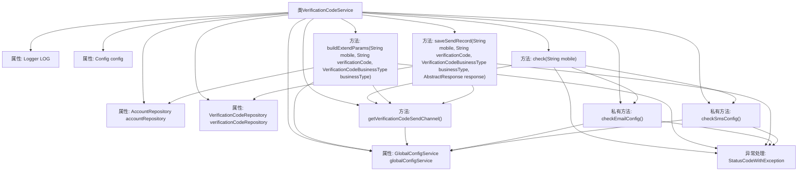

# 基础信息

|      |      |
|------|------|
| 名称 | VerificationCodeService |
| 编码语言 | .java |
| 代码路径 | WeFe/board/board-service/src/main/java/com/welab/wefe/board/service/service/verificationcode/VerificationCodeService.java |
| 包名 | com.welab.wefe.board.service.service.verificationcode |
| 依赖项 | ['com.welab.wefe.board.service.constant.Config', 'com.welab.wefe.board.service.database.entity.AccountMysqlModel', 'com.welab.wefe.board.service.database.entity.VerificationCodeMysqlModel', 'com.welab.wefe.board.service.database.repository.AccountRepository', 'com.welab.wefe.board.service.database.repository.VerificationCodeRepository', 'com.welab.wefe.board.service.service.globalconfig.GlobalConfigService', 'com.welab.wefe.common.StatusCode', 'com.welab.wefe.common.exception.StatusCodeWithException', 'com.welab.wefe.common.util.StringUtil', 'com.welab.wefe.common.verification.code.AbstractResponse', 'com.welab.wefe.common.verification.code.common.CaptchaSendChannel', 'com.welab.wefe.common.verification.code.common.VerificationCodeBusinessType', 'com.welab.wefe.common.verification.code.email.EmailClient', 'com.welab.wefe.common.verification.code.service.AbstractVerificationCodeService', 'com.welab.wefe.common.verification.code.sms.AliyunSmsClient', 'com.welab.wefe.common.web.util.DatabaseEncryptUtil', 'com.welab.wefe.common.wefe.dto.global_config.AlertConfigModel', 'com.welab.wefe.common.wefe.dto.global_config.AliyunSmsChannelConfigModel', 'com.welab.wefe.common.wefe.dto.global_config.MailServerModel', 'org.slf4j.Logger', 'org.slf4j.LoggerFactory', 'org.springframework.beans.factory.annotation.Autowired', 'org.springframework.stereotype.Service', 'java.util.Map', 'java.util.UUID'] |
| 概述说明 | VerificationCodeService类提供验证码服务，包括手机号校验、邮件/SMS配置检查、验证码发送记录保存及参数构建功能。 |

# 说明

VerificationCodeService是一个Spring服务类，继承自AbstractVerificationCodeService，提供验证码相关功能。主要功能包括：检查手机号有效性、用户状态及配置；根据发送渠道（邮件或阿里云短信）构建扩展参数；保存验证码发送记录；获取当前验证码发送渠道。服务依赖多个仓储和配置服务，包含详细的参数校验逻辑，确保邮件服务器和短信通道配置完整。异常情况下抛出StatusCodeWithException，携带状态码和错误信息。

# 类列表 Class Summary

| 名称   | 类型  | 说明 |
|-------|------|-------------|
| VerificationCodeService | class | 验证码服务类，提供手机号校验、验证码发送渠道配置检查、邮件或短信验证码参数构建及发送记录保存功能。 |

## 类 VerificationCodeService

|      |      |
|------|------|
| 访问范围 | @Service;public |
| 类型 | class |
| 名称 | VerificationCodeService |
| 说明 | 验证码服务类，提供手机号校验、验证码发送渠道配置检查、邮件或短信验证码参数构建及发送记录保存功能。 |

### UML类图

```mermaid
classDiagram
    class VerificationCodeService {
        -Logger LOG
        -AccountRepository accountRepository
        -GlobalConfigService globalConfigService
        -VerificationCodeRepository verificationCodeRepository
        -Config config
        +check(String mobile) void
        +buildExtendParams(String mobile, String verificationCode, VerificationCodeBusinessType businessType) Map~String,Object~
        +saveSendRecord(String mobile, String verificationCode, VerificationCodeBusinessType businessType, AbstractResponse response) void
        +getVerificationCodeSendChannel() CaptchaSendChannel
        -checkEmailConfig() void
        -checkSmsConfig() void
    }

    class AbstractVerificationCodeService {
        <<Abstract>>
    }

    class AccountRepository {
        <<Interface>>
    }

    class GlobalConfigService {
        <<Interface>>
    }

    class VerificationCodeRepository {
        <<Interface>>
    }

    class Config {
        <<Interface>>
    }

    class StatusCodeWithException {
        <<Exception>>
    }

    class AccountMysqlModel {
        +String phoneNumber
        +boolean enable
        +String email
    }

    class MailServerModel {
        +String mailHost
        +Integer mailPort
        +String mailUsername
        +String mailPassword
    }

    class AliyunSmsChannelConfigModel {
        +String accessKeyId
        +String accessKeySecret
        +String signName
        +String retrievePasswordTemplateCode
    }

    class VerificationCodeMysqlModel {
        +String bizId
        +String mobile
        +String code
        +String success
        +CaptchaSendChannel sendChannel
        +VerificationCodeBusinessType businessType
        +String respContent
    }

    class AlertConfigModel {
        +CaptchaSendChannel retrievePasswordCaptchaChannel
    }

    VerificationCodeService --|> AbstractVerificationCodeService : 继承
    VerificationCodeService --> AccountRepository : 依赖
    VerificationCodeService --> GlobalConfigService : 依赖
    VerificationCodeService --> VerificationCodeRepository : 依赖
    VerificationCodeService --> Config : 依赖
    VerificationCodeService ..> StatusCodeWithException : 抛出异常
    VerificationCodeService ..> AccountMysqlModel : 使用
    VerificationCodeService ..> MailServerModel : 使用
    VerificationCodeService ..> AliyunSmsChannelConfigModel : 使用
    VerificationCodeService ..> VerificationCodeMysqlModel : 使用
    VerificationCodeService ..> AlertConfigModel : 使用
```

这段代码展示了一个验证码服务类`VerificationCodeService`，它继承自抽象类`AbstractVerificationCodeService`，并实现了验证码的检查、构建扩展参数、保存发送记录等功能。该类依赖多个仓储接口和配置服务，包括`AccountRepository`、`GlobalConfigService`等，同时使用了多种模型类如`AccountMysqlModel`、`MailServerModel`等来处理业务逻辑。代码中包含了详细的参数校验和异常处理，确保验证码发送的安全性和可靠性。

### 内部方法调用关系图

该流程图展示了VerificationCodeService类的结构和主要方法调用关系。该类继承自AbstractVerificationCodeService，包含多个自动注入的属性和核心方法。主要方法包括check（验证手机号和配置）、buildExtendParams（构建扩展参数）、saveSendRecord（保存发送记录）等，这些方法都可能抛出StatusCodeWithException异常。流程图中清晰地显示了方法之间的调用链，特别是check方法会根据发送渠道调用checkEmailConfig或checkSmsConfig方法，而getVerificationCodeSendChannel方法会被多个方法调用以获取发送渠道配置。

### 字段列表 Field List

| 名称  | 类型  | 说明 |
|-------|-------|------|
| LOG = LoggerFactory.getLogger(VerificationCodeService.class) | Logger | 定义一个受保护的最终日志对象LOG，用于VerificationCodeService类的日志记录。 |
| accountRepository | AccountRepository | 使用@Autowired自动注入AccountRepository实例。 |
| verificationCodeRepository | VerificationCodeRepository | 自动注入验证码存储库实例。 |
| globalConfigService | GlobalConfigService | 使用@Autowired自动注入GlobalConfigService实例。 |
| config | Config | 自动注入Config配置实例。 |

### 方法列表

| 名称  | 类型  | 说明 |
|-------|-------|------|
| getVerificationCodeSendChannel | CaptchaSendChannel | 方法重写，返回全局配置中设置的找回密码验证码发送渠道。 |
| check | void | 检查手机号有效性：非空、格式正确、用户存在且未被禁用，根据验证码发送渠道检查邮件或短信配置。 |
| buildExtendParams | Map<String, Object> | 方法根据发送渠道构建验证码参数：邮箱方式使用邮件服务配置发送验证码；阿里云短信方式使用短信配置发送验证码。 |
| saveSendRecord | void | 方法保存验证码发送记录，包括手机号、验证码、业务类型、响应结果等信息到数据库。 |
| checkEmailConfig | void | 检查邮件配置，验证服务器地址、端口、用户名和密码是否设置，未设置则抛出异常。 |
| checkSmsConfig | void | 检查阿里云短信配置，验证AccessKeyId、AccessKeySecret、签名和模板码是否设置，未设置则抛出异常。 |

