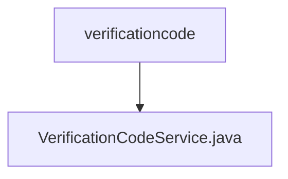

# 基础信息

|      |      |
|------|------|
| 名称 | verificationcode |
| 编码语言 | .java |
| 代码路径 | WeFe/board/board-service/src/main/java/com/welab/wefe/board/service/service/verificationcode |
| 包名 | docs.board.board-service.src.main.java.com.welab.wefe.board.service.service.verificationcode |
| 概述说明 | VerificationCodeService类提供验证码服务，包括手机号校验、邮件/SMS配置检查、验证码发送记录保存及参数构建功能。 |

# 说明

VerificationCodeService是一个Spring服务类，继承自AbstractVerificationCodeService，提供验证码相关功能。主要功能包括：检查手机号有效性、用户状态及配置；根据发送渠道（邮件或阿里云短信）构建扩展参数；保存验证码发送记录；获取当前验证码发送渠道。服务依赖多个仓储和配置服务，包含详细的参数校验逻辑，确保邮件服务器和短信通道配置完整。异常情况下抛出StatusCodeWithException，携带状态码和错误信息。

### 包内部结构视图

该流程图展示了WeFe项目中验证码服务的文件结构关系。顶层节点是verificationcode目录，其下级仅包含一个VerificationCodeService.java服务实现文件。这种简洁的层级结构表明该功能模块可能处于初期开发阶段或功能较为单一，当前仅包含核心服务类文件。

# 文件列表

| 名称   | 类型  | 说明 |
|-------|------|-------------|
| [VerificationCodeService.java](VerificationCodeService.md) | file | VerificationCodeService类提供验证码服务，包括手机号校验、邮件/SMS配置检查、验证码发送记录保存及参数构建功能。 |

