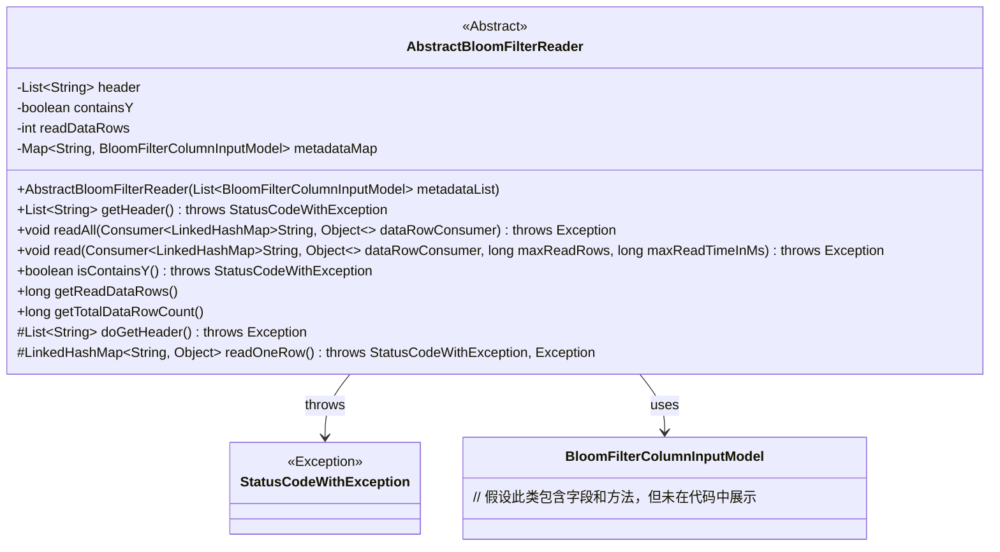
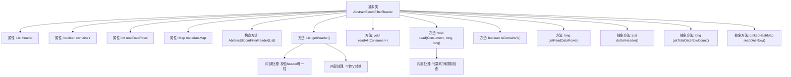

# 基础信息

|      |      |
|------|------|
| 名称 | AbstractBloomFilterReader |
| 编码语言 | .java |
| 代码路径 | WeFe/board/board-service/src/main/java/com/welab/wefe/board/service/util/AbstractBloomFilterReader.java |
| 包名 | com.welab.wefe.board.service.util |
| 依赖项 | ['com.welab.wefe.board.service.dto.fusion.BloomFilterColumnInputModel', 'com.welab.wefe.common.StatusCode', 'com.welab.wefe.common.exception.StatusCodeWithException', 'java.io.Closeable', 'java.util.LinkedHashMap', 'java.util.List', 'java.util.Map', 'java.util.function.Consumer', 'java.util.stream.Collectors'] |
| 概述说明 | 抽象类AbstractBloomFilterReader实现Closeable接口，提供读取布隆过滤器数据功能，包含获取表头、读取数据行、统计行数等方法，支持行数和时间限制读取。 |

# 说明

AbstractBloomFilterReader是一个抽象类，实现了Closeable接口，用于读取布隆过滤器数据。它包含header列表、containsY标志、已读行数readDataRows和metadataMap元数据映射。构造函数接收BloomFilterColumnInputModel列表并转换为映射。getHeader方法获取并处理表头数据，包括去重、修剪列名和转换Y为y。readAll和read方法用于读取数据行，支持最大行数和读取时间限制。isContainsY检查是否包含y列，getReadDataRows返回已读行数。抽象方法doGetHeader、getTotalDataRowCount和readOneRow需子类实现，分别用于获取表头、总行数和单行数据。

# 类列表 Class Summary

| 名称   | 类型  | 说明 |
|-------|------|-------------|
| AbstractBloomFilterReader | class | 抽象类AbstractBloomFilterReader实现Closeable接口，用于读取BloomFilter数据。包含获取表头、读取数据行、统计行数等功能，支持行数和时间限制读取。关键字段：header、containsY、readDataRows。 |

## 类 AbstractBloomFilterReader

|      |      |
|------|------|
| 访问范围 | public abstract |
| 类型 | class |
| 名称 | AbstractBloomFilterReader |
| 说明 | 抽象类AbstractBloomFilterReader实现Closeable接口，用于读取BloomFilter数据。包含获取表头、读取数据行、统计行数等功能，支持行数和时间限制读取。关键字段：header、containsY、readDataRows。 |

### UML类图

该类图展示了一个抽象类`AbstractBloomFilterReader`，它实现了`Closeable`接口，用于读取布隆过滤器数据。类中包含核心方法如`getHeader()`获取数据头信息，`readAll()`和`read()`读取数据行，并通过抽象方法`doGetHeader()`和`readOneRow()`强制子类实现具体逻辑。类通过`StatusCodeWithException`处理异常，并使用`BloomFilterColumnInputModel`存储元数据。设计上采用模板方法模式，将可变逻辑延迟到子类实现。

### 内部方法调用关系图

该流程图展示了抽象类AbstractBloomFilterReader的核心结构和功能。类包含4个成员变量和9个方法，其中3个是抽象方法。主要功能包括：通过构造方法初始化元数据映射；getHeader()方法实现header的获取、校验和格式转换；read()方法实现带限制条件的数据行读取；isContainsY()用于检查特殊字段存在性。抽象方法doGetHeader()、readOneRow()和getTotalDataRowCount()需要子类实现，体现了模板方法设计模式。流程特别标注了header处理的校验逻辑和读取操作的行数/时间限制控制点。

### 字段列表 Field List

| 名称  | 类型  | 说明 |
|-------|-------|------|
| metadataMap | Map<String, BloomFilterColumnInputModel> | 存储字符串键与布隆过滤器列输入模型的映射关系。 |
| readDataRows = 0 | int | 保护变量readDataRows记录已读取数据行数，初始值为0。 |
| header | List<String> | 声明一个受保护字符串列表变量header。 |
| containsY | boolean | 布尔变量，标识是否包含Y。 |

### 方法列表

| 名称  | 类型  | 说明 |
|-------|-------|------|
| getReadDataRows | long | 获取读取的数据行数。 |
| isContainsY | boolean | 检查是否包含Y属性，若header为空则先获取header，返回containsY布尔值。 |
| read | void | 该方法逐行读取数据，每行传递给消费者处理。支持限制读取行数或时间，超限即停止。 |
| getHeader | List<String> | 获取数据表头信息。若header为空，调用doGetHeader获取并处理：去空格、检查重复字段、转换Y为y。异常时抛出StatusCodeWithException。 |
| readAll | void | Java方法`readAll`通过`dataRowConsumer`处理数据行，调用`read`方法读取全部数据，无分页参数。可能抛出异常。 |
| doGetHeader | List<String> | 抽象方法，返回字符串列表，可能抛出异常。 |
| getTotalDataRowCount | long | 获取数据总行数的抽象方法。 |
| readOneRow | LinkedHashMap<String, Object> | 抽象方法readOneRow，返回LinkedHashMap<String, Object>，可能抛出StatusCodeWithException或Exception异常。 |

