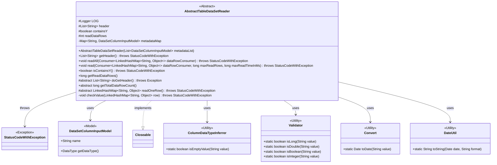
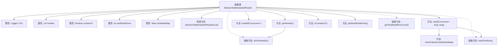
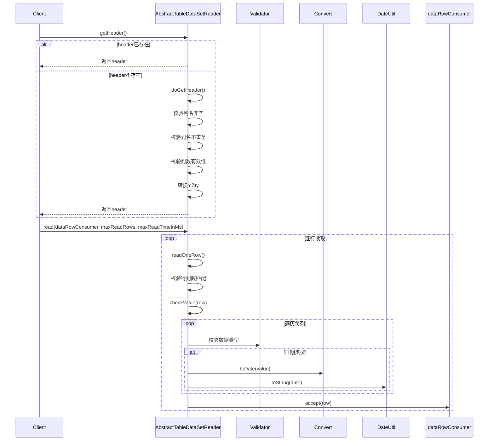

# 基础信息

|      |      |
|------|------|
| 名称 | AbstractTableDataSetReader |
| 编码语言 | .java |
| 代码路径 | WeFe/board/board-service/src/main/java/com/welab/wefe/board/service/util/AbstractTableDataSetReader.java |
| 包名 | com.welab.wefe.board.service.util |
| 依赖项 | ['com.welab.wefe.board.service.dto.entity.data_set.DataSetColumnInputModel', 'com.welab.wefe.common.Convert', 'com.welab.wefe.common.StatusCode', 'com.welab.wefe.common.Validator', 'com.welab.wefe.common.exception.StatusCodeWithException', 'com.welab.wefe.common.util.DateUtil', 'com.welab.wefe.common.util.StringUtil', 'com.welab.wefe.common.wefe.ColumnDataTypeInferrer', 'org.slf4j.Logger', 'org.slf4j.LoggerFactory', 'java.io.Closeable', 'java.util.Date', 'java.util.LinkedHashMap', 'java.util.List', 'java.util.Map', 'java.util.function.Consumer', 'java.util.stream.Collectors'] |
| 概述说明 | 抽象类AbstractTableDataSetReader实现Closeable接口，提供读取表格数据集功能，包含获取表头、读取数据行、校验数据类型等方法，支持行数限制和时间限制读取。 |

# 说明

AbstractTableDataSetReader是一个抽象类，实现了Closeable接口，用于读取表格数据集。它包含日志记录器、表头信息、是否包含Y列的标志、已读取行数统计和元数据映射等字段。构造函数接收元数据列表并转换为映射。提供了获取表头的方法，会进行列名非空、唯一性等校验，并自动将大写的Y转为小写。支持读取全部数据行或限制行数和时间的读取，会对每行数据做列数匹配检查。包含数据值类型校验逻辑，支持Long、Double、Boolean、Integer、DateTime等类型的验证，并对日期格式标准化。提供了判断是否包含Y列和获取已读行数的方法。定义了三个抽象方法：获取表头实现、获取总行数和读取单行数据。

# 类列表 Class Summary

| 名称   | 类型  | 说明 |
|-------|------|-------------|
| AbstractTableDataSetReader | class | 抽象类AbstractTableDataSetReader实现Closeable接口，提供读取表格数据集功能，包括获取表头、读取数据行、校验数据类型等操作，支持行数限制和时间限制。 |

## 类 AbstractTableDataSetReader

|      |      |
|------|------|
| 访问范围 | public abstract |
| 类型 | class |
| 名称 | AbstractTableDataSetReader |
| 说明 | 抽象类AbstractTableDataSetReader实现Closeable接口，提供读取表格数据集功能，包括获取表头、读取数据行、校验数据类型等操作，支持行数限制和时间限制。 |

### UML类图

这段代码定义了一个抽象类`AbstractTableDataSetReader`，用于读取表格数据集。该类提供了获取表头、读取数据行、验证数据类型等功能，并通过抽象方法要求子类实现具体的表头获取、行读取逻辑。类图展示了它与异常类、数据模型类以及多个工具类的关系。该类主要处理表格数据的读取和验证，包括列名检查、数据类型校验、读取行数限制等功能，是一个典型的数据读取器基类实现。

### 内部方法调用关系图

这段代码定义了一个抽象类AbstractTableDataSetReader，主要用于读取表格数据集。它包含了对表头的获取和校验逻辑，以及数据行的读取和验证功能。流程图展示了类的结构关系，时序图则描述了获取表头(readHeader)和读取数据行(read)两个主要操作的具体流程。该类通过抽象方法将具体实现留给子类，同时提供了完善的数据校验机制，包括列名非空检查、重复列检查、数据类型匹配验证等，确保数据读取的可靠性。

### 字段列表 Field List

| 名称  | 类型  | 说明 |
|-------|-------|------|
| readDataRows = 0 | int | 保护变量readDataRows记录已读取数据行数，初始值为0。 |
| header | List<String> | 声明一个受保护的字符串列表变量header。 |
| containsY | boolean | 布尔变量，标识是否包含Y。 |
| LOG = LoggerFactory.getLogger(this.getClass()) | Logger | 类中定义了一个受保护的final日志对象LOG，用于记录当前类的日志信息。 |
| metadataMap | Map<String, DataSetColumnInputModel> | 私有映射，键为字符串，值为数据集列输入模型。 |

### 方法列表

| 名称  | 类型  | 说明 |
|-------|-------|------|
| getTotalDataRowCount | long | 抽象方法，返回数据总行数的长整型值。 |
| checkValue | void | 检查行数据值类型是否匹配元数据定义。跳过空值，验证Long、Double、Boolean、Integer、DateTime等类型，不匹配时抛出异常。日期格式标准化为yyyy-MM-dd HH:mm:ss。 |
| doGetHeader | List<String> | 抽象方法，返回字符串列表，可能抛出异常。 |
| readAll | void | 方法readAll通过Consumer处理LinkedHashMap数据，无限制读取，可能抛出StatusCodeWithException异常。 |
| isContainsY | boolean | 检查是否包含Y属性，若header为空则先获取header，返回containsY布尔值。 |
| read | void | 该方法逐行读取数据，检查每行列数与表头是否一致，验证数据值后传递给消费者。支持限制读取行数和时间，超限时终止读取。 |
| getReadDataRows | long | 获取读取的数据行数。 |
| getHeader | List<String> | 获取数据集表头信息，检查列名非空、无重复且至少两列，处理Y为y并标记是否包含y。异常时抛出相应错误。 |
| readOneRow | LinkedHashMap<String, Object> | 抽象方法readOneRow，返回带顺序的键值对，可能抛出状态码异常。 |

