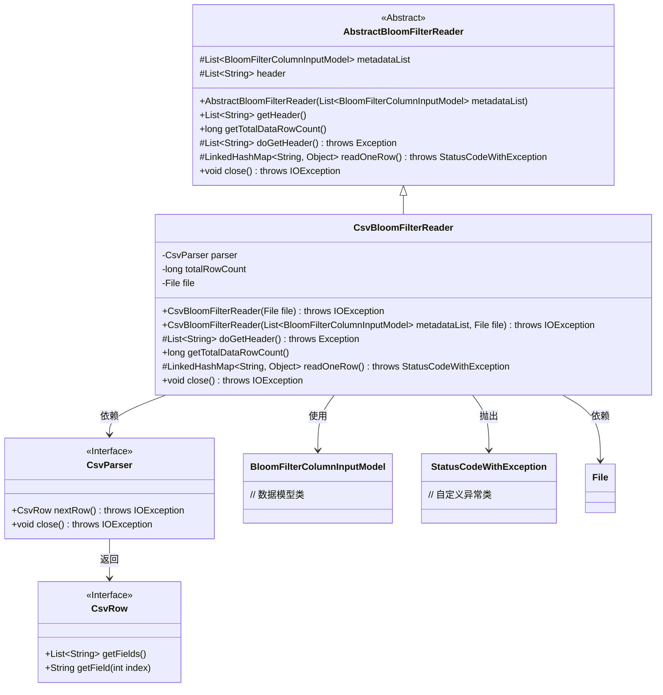
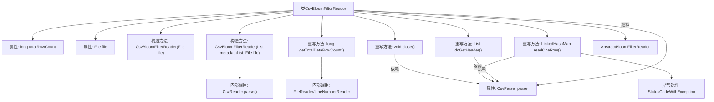

# 基础信息

|      |      |
|------|------|
| 名称 | CsvBloomFilterReader |
| 编码语言 | .java |
| 代码路径 | WeFe/board/board-service/src/main/java/com/welab/wefe/board/service/util/CsvBloomFilterReader.java |
| 包名 | com.welab.wefe.board.service.util |
| 依赖项 | ['com.welab.wefe.board.service.dto.fusion.BloomFilterColumnInputModel', 'com.welab.wefe.common.StatusCode', 'com.welab.wefe.common.exception.StatusCodeWithException', 'de.siegmar.fastcsv.reader.CsvParser', 'de.siegmar.fastcsv.reader.CsvReader', 'de.siegmar.fastcsv.reader.CsvRow', 'java.io.File', 'java.io.FileReader', 'java.io.IOException', 'java.io.LineNumberReader', 'java.nio.charset.StandardCharsets', 'java.util.LinkedHashMap', 'java.util.List'] |
| 概述说明 | CsvBloomFilterReader类继承AbstractBloomFilterReader，用于读取CSV文件并处理数据行。支持无头模式，跳过空行，统计总行数，逐行读取数据到LinkedHashMap，最后关闭解析器。 |

# 说明

CsvBloomFilterReader是一个继承自AbstractBloomFilterReader的类，用于读取CSV文件并处理布隆过滤器数据。它包含一个CSV解析器、文件对象和总行数统计功能。构造函数支持传入元数据列表和文件对象，初始化时配置CSV读取器跳过空行和表头。类提供了获取表头、计算总行数、逐行读取数据及关闭资源的方法。总行数通过文件行号统计，读取数据时将每行内容映射到LinkedHashMap中。异常处理包括文件读取错误和系统错误。

# 类列表 Class Summary

| 名称   | 类型  | 说明 |
|-------|------|-------------|
| CsvBloomFilterReader | class | CsvBloomFilterReader类继承AbstractBloomFilterReader，用于读取CSV文件数据。支持无头模式，跳过空行，统计总行数，逐行读取数据到LinkedHashMap，最后关闭解析器。 |

## 类 CsvBloomFilterReader

|      |      |
|------|------|
| 访问范围 | public |
| 类型 | class |
| 名称 | CsvBloomFilterReader |
| 说明 | CsvBloomFilterReader类继承AbstractBloomFilterReader，用于读取CSV文件数据。支持无头模式，跳过空行，统计总行数，逐行读取数据到LinkedHashMap，最后关闭解析器。 |

### UML类图

这段代码展示了一个CSV文件读取器的实现，专为布隆过滤器设计。CsvBloomFilterReader继承自抽象类AbstractBloomFilterReader，通过CsvParser解析CSV文件内容，支持获取表头、计算总行数和逐行读取数据。类图清晰地展示了继承关系、接口实现和关键依赖，包括文件处理、CSV解析和异常处理组件。该实现特别注重资源管理和错误处理，通过close()方法确保解析器正确关闭，并使用自定义异常StatusCodeWithException传递系统错误信息。

### 内部方法调用关系图

流程图描述了CsvBloomFilterReader类的结构和主要方法调用关系。该类继承自AbstractBloomFilterReader，包含CSV文件解析和行数统计功能。核心方法包括构造时初始化CSV解析器、读取表头、统计文件行数、逐行读取数据以及关闭资源。其中getTotalDataRowCount()通过LineNumberReader实现高效行数统计，readOneRow()方法将CSV行数据转换为有序映射表，并封装了异常处理逻辑。各方法均与CsvParser实例紧密交互，体现了对文件资源的统一管理。

### 字段列表 Field List

| 名称  | 类型  | 说明 |
|-------|-------|------|
| totalRowCount | long | 私有长整型变量，记录总行数。 |
| parser | CsvParser | 私有不可变的CSV解析器实例。 |
| file | File | 私有不可变文件对象。 |

### 方法列表

| 名称  | 类型  | 说明 |
|-------|-------|------|
| doGetHeader | List<String> | 重写doGetHeader方法，解析CSV下一行并返回字段列表。 |
| getTotalDataRowCount | long | 方法getTotalDataRowCount返回文件行数减1。若totalRowCount大于0直接返回，否则读取文件计算行数并缓存结果，异常时返回0。 |
| readOneRow | LinkedHashMap<String, Object> | 方法readOneRow读取CSV文件的一行数据，转换为LinkedHashMap，键为表头，值为对应字段。若读取失败抛出异常，无数据返回null。 |
| close | void | Java方法重写，关闭解析器并可能抛出IOException。 |

