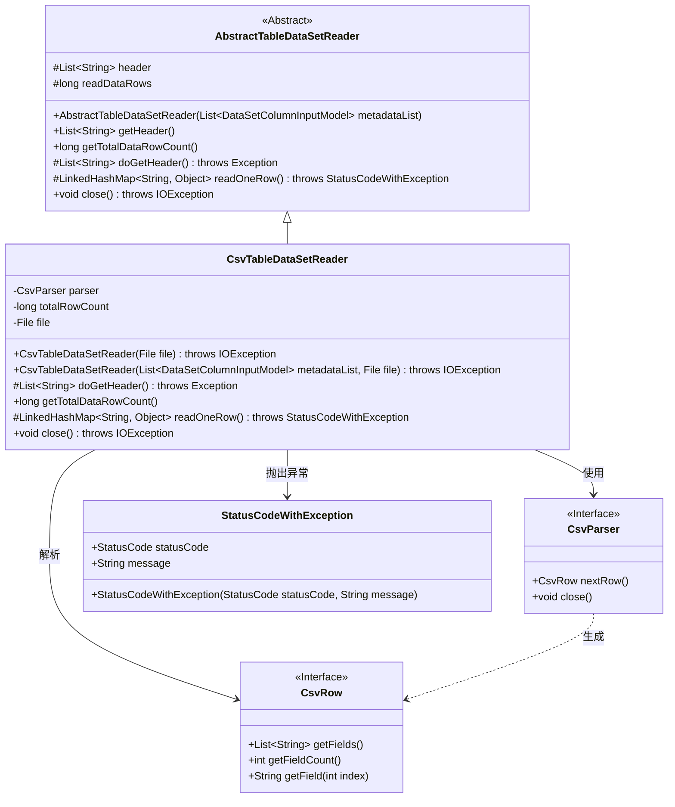
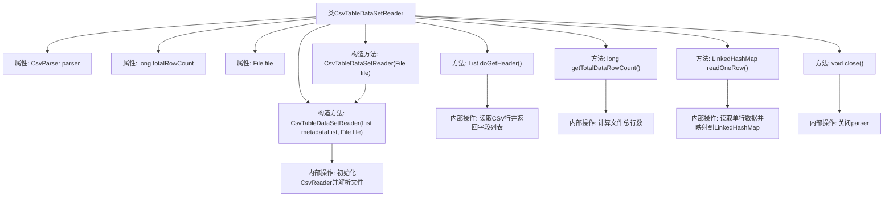

# 基础信息

|      |      |
|------|------|
| 名称 | CsvTableDataSetReader |
| 编码语言 | .java |
| 代码路径 | WeFe/board/board-service/src/main/java/com/welab/wefe/board/service/util/CsvTableDataSetReader.java |
| 包名 | com.welab.wefe.board.service.util |
| 依赖项 | ['com.welab.wefe.board.service.dto.entity.data_set.DataSetColumnInputModel', 'com.welab.wefe.common.StatusCode', 'com.welab.wefe.common.exception.StatusCodeWithException', 'de.siegmar.fastcsv.reader.CsvParser', 'de.siegmar.fastcsv.reader.CsvReader', 'de.siegmar.fastcsv.reader.CsvRow', 'java.io.File', 'java.io.FileReader', 'java.io.IOException', 'java.io.LineNumberReader', 'java.nio.charset.StandardCharsets', 'java.util.LinkedHashMap', 'java.util.List'] |
| 概述说明 | CsvTableDataSetReader类继承AbstractTableDataSetReader，用于读取CSV文件数据。包含获取表头、计算总行数、逐行读取数据及关闭解析器功能。支持自定义元数据和UTF-8编码。 |

# 说明

CsvTableDataSetReader是一个继承自AbstractTableDataSetReader的类，用于读取CSV文件数据。它包含一个CsvParser解析器、文件对象和行数计数器。构造函数支持传入文件路径和元数据列表，初始化时配置CSV读取器跳过空行和表头。方法包括获取表头、计算总行数、逐行读取数据到LinkedHashMap以及关闭解析器。总行数通过文件行号统计，读取失败时抛出异常。

# 类列表 Class Summary

| 名称   | 类型  | 说明 |
|-------|------|-------------|
| CsvTableDataSetReader | class | CsvTableDataSetReader类继承AbstractTableDataSetReader，用于读取CSV文件数据。构造函数初始化CSV解析器，支持无表头模式。方法包括获取表头、计算总行数、逐行读取数据到LinkedHashMap及关闭解析器。异常处理完善。 |

## 类 CsvTableDataSetReader

|      |      |
|------|------|
| 访问范围 | public |
| 类型 | class |
| 名称 | CsvTableDataSetReader |
| 说明 | CsvTableDataSetReader类继承AbstractTableDataSetReader，用于读取CSV文件数据。构造函数初始化CSV解析器，支持无表头模式。方法包括获取表头、计算总行数、逐行读取数据到LinkedHashMap及关闭解析器。异常处理完善。 |

### UML类图

该代码实现了一个CSV表格数据读取器，继承自抽象表格读取器。主要功能包括解析CSV文件头、计算总行数、逐行读取数据，并处理可能的异常情况。类图展示了继承关系、接口实现和关键依赖，其中CsvParser和CsvRow为接口，StatusCodeWithException是自定义异常类。读取器通过组合方式使用CSV解析器，同时实现了抽象类定义的四个核心方法。

### 内部方法调用关系图

该流程图展示了CsvTableDataSetReader类的完整结构，包含4个主要方法和2个构造方法。核心功能包括CSV文件解析、表头获取、行数统计、数据行读取和资源释放。构造方法会初始化CSV解析器，doGetHeader()读取首行作为表头，getTotalDataRowCount()通过行号统计计算总行数，readOneRow()将每行数据映射到有序字典，close()负责关闭解析器释放资源。

### 字段列表 Field List

| 名称  | 类型  | 说明 |
|-------|-------|------|
| parser | CsvParser | 私有不可变的CSV解析器实例。 |
| totalRowCount | long | 私有长整型变量，记录总行数。 |
| file | File | 私有不可变文件对象。 |

### 方法列表

| 名称  | 类型  | 说明 |
|-------|-------|------|
| doGetHeader | List<String> | 重写doGetHeader方法，解析CSV下一行并返回字段列表。 |
| getTotalDataRowCount | long | 方法getTotalDataRowCount返回文件行数。若totalRowCount已缓存则直接返回，否则读取文件计算行数并缓存结果。异常时返回0。 |
| readOneRow | LinkedHashMap<String, Object> | 方法readOneRow读取CSV一行数据，转为LinkedHashMap。若行空返回null，否则按表头映射字段值。出错抛异常提示行号和错误信息。 |
| close | void | Java方法重写，关闭解析器并可能抛出IO异常。 |

