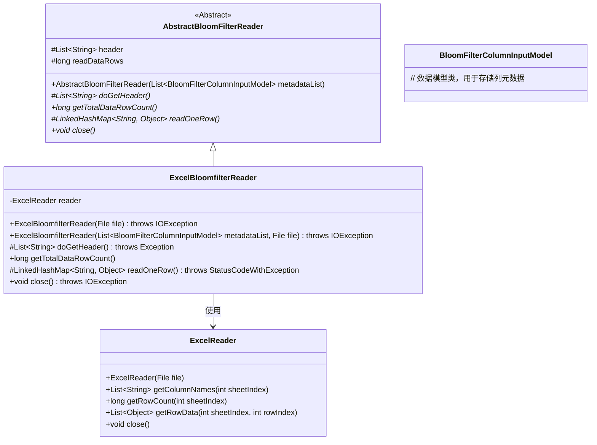
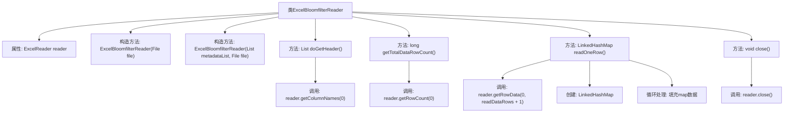

# 基础信息

|      |      |
|------|------|
| 名称 | ExcelBloomfilterReader |
| 编码语言 | .java |
| 代码路径 | WeFe/board/board-service/src/main/java/com/welab/wefe/board/service/util/ExcelBloomfilterReader.java |
| 包名 | com.welab.wefe.board.service.util |
| 依赖项 | ['com.welab.wefe.board.service.dto.fusion.BloomFilterColumnInputModel', 'com.welab.wefe.common.exception.StatusCodeWithException', 'com.welab.wefe.common.io.excel.ExcelReader', 'java.io.File', 'java.io.IOException', 'java.util.LinkedHashMap', 'java.util.List'] |
| 概述说明 | ExcelBloomfilterReader类继承AbstractBloomFilterReader，通过ExcelReader读取Excel文件数据，支持获取表头、总行数和逐行读取数据，读取后自动关闭。 |

# 说明

ExcelBloomfilterReader是一个继承自AbstractBloomFilterReader的类，用于读取Excel文件并处理布隆过滤器相关数据。它通过ExcelReader实例操作文件，支持从指定文件或结合元数据列表初始化。主要功能包括获取表头信息、计算数据行总数、逐行读取数据（自动补全缺失值为null）以及关闭文件资源。读取时维护列顺序，确保数据与表头对应，并在结束时正确释放资源。

# 类列表 Class Summary

| 名称   | 类型  | 说明 |
|-------|------|-------------|
| ExcelBloomfilterReader | class | ExcelBloomfilterReader类继承AbstractBloomFilterReader，通过ExcelReader读取Excel文件数据，支持获取表头、总行数和逐行读取数据，读取完成后需关闭资源。 |

## 类 ExcelBloomfilterReader

|      |      |
|------|------|
| 访问范围 | public |
| 类型 | class |
| 名称 | ExcelBloomfilterReader |
| 说明 | ExcelBloomfilterReader类继承AbstractBloomFilterReader，通过ExcelReader读取Excel文件数据，支持获取表头、总行数和逐行读取数据，读取完成后需关闭资源。 |

### UML类图

这段代码展示了一个Excel布隆过滤器读取器的实现。ExcelBloomfilterReader继承自抽象类AbstractBloomFilterReader，通过组合方式使用ExcelReader来读取Excel文件内容。主要功能包括获取表头、计算总行数、逐行读取数据等。类图清晰地展示了继承关系、组合关系以及核心方法定义，体现了读取Excel数据并转换为布隆过滤器所需格式的处理流程。

### 内部方法调用关系图

这段代码流程图展示了ExcelBloomfilterReader类的完整结构，该类继承自AbstractBloomFilterReader。主要功能包括通过ExcelReader读取Excel文件数据，实现获取表头、计算总行数、逐行读取数据以及关闭资源等操作。核心逻辑集中在readOneRow方法，该方法会读取指定行数据并转换为LinkedHashMap结构，同时处理列数不足时的默认值填充。整个流程严格遵循资源管理规范，通过close方法确保文件句柄正确释放。

### 字段列表 Field List

| 名称  | 类型  | 说明 |
|-------|-------|------|
| reader | ExcelReader | 私有不可变的Excel读取器实例。 |

### 方法列表

| 名称  | 类型  | 说明 |
|-------|-------|------|
| close | void | Java方法重写，关闭reader资源，可能抛出IOException异常。 |
| doGetHeader | List<String> | 该方法重写父类方法，调用reader获取第0列的列名列表并返回。 |
| getTotalDataRowCount | long | 该方法返回数据总行数，计算方式为读取器获取的行数减1。 |
| readOneRow | LinkedHashMap<String, Object> | 该方法读取一行数据并转换为键值对映射。若数据行为空则返回null，否则将数据行与表头对应填充，不足部分补null，最后返回映射结果。 |

