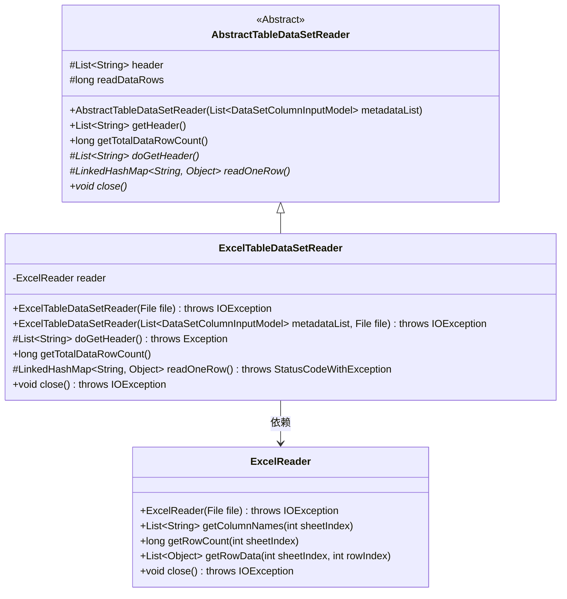
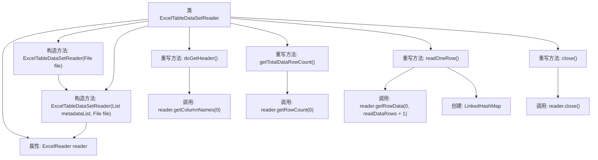

# 基础信息

|      |      |
|------|------|
| 名称 | ExcelTableDataSetReader |
| 编码语言 | .java |
| 代码路径 | WeFe/board/board-service/src/main/java/com/welab/wefe/board/service/util/ExcelTableDataSetReader.java |
| 包名 | com.welab.wefe.board.service.util |
| 依赖项 | ['com.welab.wefe.board.service.dto.entity.data_set.DataSetColumnInputModel', 'com.welab.wefe.common.exception.StatusCodeWithException', 'com.welab.wefe.common.io.excel.ExcelReader', 'java.io.File', 'java.io.IOException', 'java.util.LinkedHashMap', 'java.util.List'] |
| 概述说明 | ExcelTableDataSetReader类继承AbstractTableDataSetReader，通过ExcelReader读取Excel文件数据，提供获取表头、行数和逐行读取数据功能，最后关闭资源。 |

# 说明

ExcelTableDataSetReader是一个继承自AbstractTableDataSetReader的类，用于读取Excel表格数据。它通过ExcelReader处理文件输入，支持从指定文件读取数据，并可选择传入列元数据列表。主要功能包括获取表头信息、计算数据行数、逐行读取数据并转换为键值映射，最后关闭文件资源。读取时自动处理列数不足的情况，为缺失数据补充null值。

# 类列表 Class Summary

| 名称   | 类型  | 说明 |
|-------|------|-------------|
| ExcelTableDataSetReader | class | ExcelTableDataSetReader类继承AbstractTableDataSetReader，通过ExcelReader读取Excel文件数据，提供获取表头、总行数和逐行读取数据的功能，最后关闭资源。 |

## 类 ExcelTableDataSetReader

|      |      |
|------|------|
| 访问范围 | public |
| 类型 | class |
| 名称 | ExcelTableDataSetReader |
| 说明 | ExcelTableDataSetReader类继承AbstractTableDataSetReader，通过ExcelReader读取Excel文件数据，提供获取表头、总行数和逐行读取数据的功能，最后关闭资源。 |

### UML类图

类图描述：该图展示了ExcelTableDataSetReader继承自抽象类AbstractTableDataSetReader，并依赖ExcelReader的关系。AbstractTableDataSetReader定义了读取表格数据的核心抽象方法，ExcelTableDataSetReader实现了这些方法，通过ExcelReader具体操作Excel文件。ExcelReader封装了对Excel文件的底层读写操作，包括获取列名、行数和行数据等功能。整体结构体现了模板方法模式的应用。

### 内部方法调用关系图

这段代码是Excel表格数据读取器的实现类，继承自抽象表数据读取器。流程图展示了类结构、构造方法链式调用、以及四个核心重写方法的具体实现逻辑。关键操作包括通过ExcelReader获取列名、行数、行数据，以及使用LinkedHashMap存储解析后的数据行。关闭方法确保资源释放，所有操作都围绕Excel文件读取展开。

### 字段列表 Field List

| 名称  | 类型  | 说明 |
|-------|-------|------|
| reader | ExcelReader | 私有不可变的Excel读取器实例。 |

### 方法列表

| 名称  | 类型  | 说明 |
|-------|-------|------|
| readOneRow | LinkedHashMap<String, Object> | 方法重写，读取一行数据转为LinkedHashMap。若行为空返回null，否则将行数据与表头对应，不足补null。返回键值映射。 |
| getTotalDataRowCount | long | 方法getTotalDataRowCount返回reader中第0行的行数减1。 |
| close | void | 覆盖close方法，调用reader.close()并可能抛出IOException。 |
| doGetHeader | List<String> | Java方法重写，返回表格首行列名列表。 |

