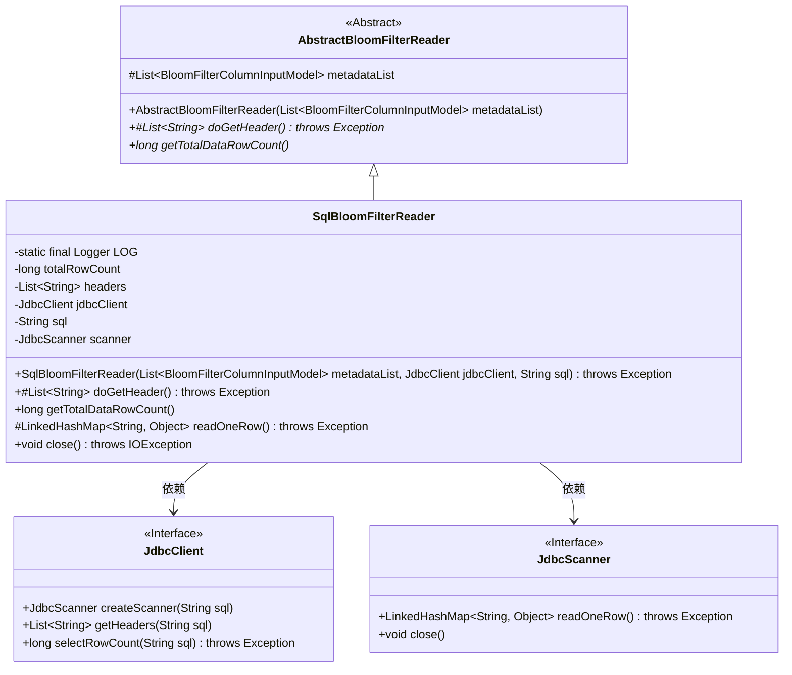
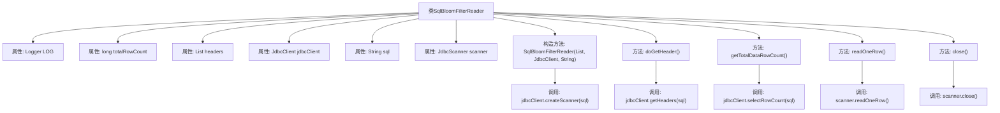

# 基础信息

|      |      |
|------|------|
| 名称 | SqlBloomFilterReader |
| 编码语言 | .java |
| 代码路径 | WeFe/board/board-service/src/main/java/com/welab/wefe/board/service/util/SqlBloomFilterReader.java |
| 包名 | com.welab.wefe.board.service.util |
| 依赖项 | ['com.welab.wefe.board.service.dto.fusion.BloomFilterColumnInputModel', 'com.welab.wefe.common.jdbc.JdbcClient', 'com.welab.wefe.common.jdbc.base.JdbcScanner', 'org.apache.commons.collections4.CollectionUtils', 'org.slf4j.Logger', 'org.slf4j.LoggerFactory', 'java.io.IOException', 'java.util.LinkedHashMap', 'java.util.List'] |
| 概述说明 | SqlBloomFilterReader类继承AbstractBloomFilterReader，通过JDBC客户端执行SQL查询，读取数据行和表头，支持获取总行数和关闭扫描器。 |

# 说明

SqlBloomFilterReader是一个继承自AbstractBloomFilterReader的类，用于从JDBC数据源读取数据并生成布隆过滤器。它包含以下关键功能：通过JdbcClient执行SQL查询并获取结果；缓存表头信息和总行数；提供读取单行数据的方法；支持资源释放。主要成员变量包括jdbcClient、sql查询语句、scanner扫描器、headers表头和totalRowCount总行数。核心方法包括获取表头、计算总行数、读取单行数据和关闭资源。

# 类列表 Class Summary

| 名称   | 类型  | 说明 |
|-------|------|-------------|
| SqlBloomFilterReader | class | SqlBloomFilterReader类继承AbstractBloomFilterReader，通过JDBC客户端执行SQL查询，读取数据行和表头，支持获取总行数和关闭扫描器。 |

## 类 SqlBloomFilterReader

|      |      |
|------|------|
| 访问范围 | public |
| 类型 | class |
| 名称 | SqlBloomFilterReader |
| 说明 | SqlBloomFilterReader类继承AbstractBloomFilterReader，通过JDBC客户端执行SQL查询，读取数据行和表头，支持获取总行数和关闭扫描器。 |

### UML类图

该类图展示了SqlBloomFilterReader继承自抽象类AbstractBloomFilterReader，并实现了数据库读取功能。SqlBloomFilterReader通过JdbcClient接口执行SQL查询，使用JdbcScanner接口逐行读取数据。主要功能包括获取表头信息、统计总行数、逐行读取数据以及资源关闭。类结构体现了对JDBC操作的封装，通过接口依赖实现松耦合设计，同时保留了父类的布隆过滤器元数据处理能力。

### 内部方法调用关系图

该流程图展示了SqlBloomFilterReader类的结构和主要方法调用关系。类继承自AbstractBloomFilterReader，包含6个属性和5个核心方法。构造方法初始化jdbcClient和sql，并创建JdbcScanner实例。doGetHeader()获取表头信息，getTotalDataRowCount()查询总行数，readOneRow()读取单行数据，close()关闭扫描器。所有数据库操作都通过jdbcClient和scanner完成，体现了清晰的职责划分和封装性。

### 字段列表 Field List

| 名称  | 类型  | 说明 |
|-------|-------|------|
| sql | String | 私有不可变字符串变量sql |
| totalRowCount = -1 | long | 声明一个私有长整型变量totalRowCount，初始值为-1。 |
| scanner | JdbcScanner | 私有JdbcScanner扫描器实例。 |
| jdbcClient | JdbcClient | 声明一个不可变的JdbcClient实例变量。 |
| LOG = LoggerFactory.getLogger(SqlBloomFilterReader.class) | Logger | 声明一个受保护的静态常量日志记录器，用于SqlBloomFilterReader类的日志输出。 |
| headers | List<String> | 声明一个私有字符串列表变量headers。 |

### 方法列表

| 名称  | 类型  | 说明 |
|-------|-------|------|
| readOneRow | LinkedHashMap<String, Object> | 方法readOneRow调用scanner.readOneRow()读取单行数据，返回LinkedHashMap<String, Object>，可能抛出异常。 |
| getTotalDataRowCount | long | 该方法用于获取数据总行数。若已缓存则直接返回，否则通过JDBC查询并缓存结果，出错时抛出运行时异常。 |
| doGetHeader | List<String> | 方法重写doGetHeader，检查headers是否为空，若空则通过jdbcClient获取并返回，否则直接返回现有headers。 |
| close | void | 该方法重写close()，检查scanner非空后关闭，可能抛出IOException。 |

