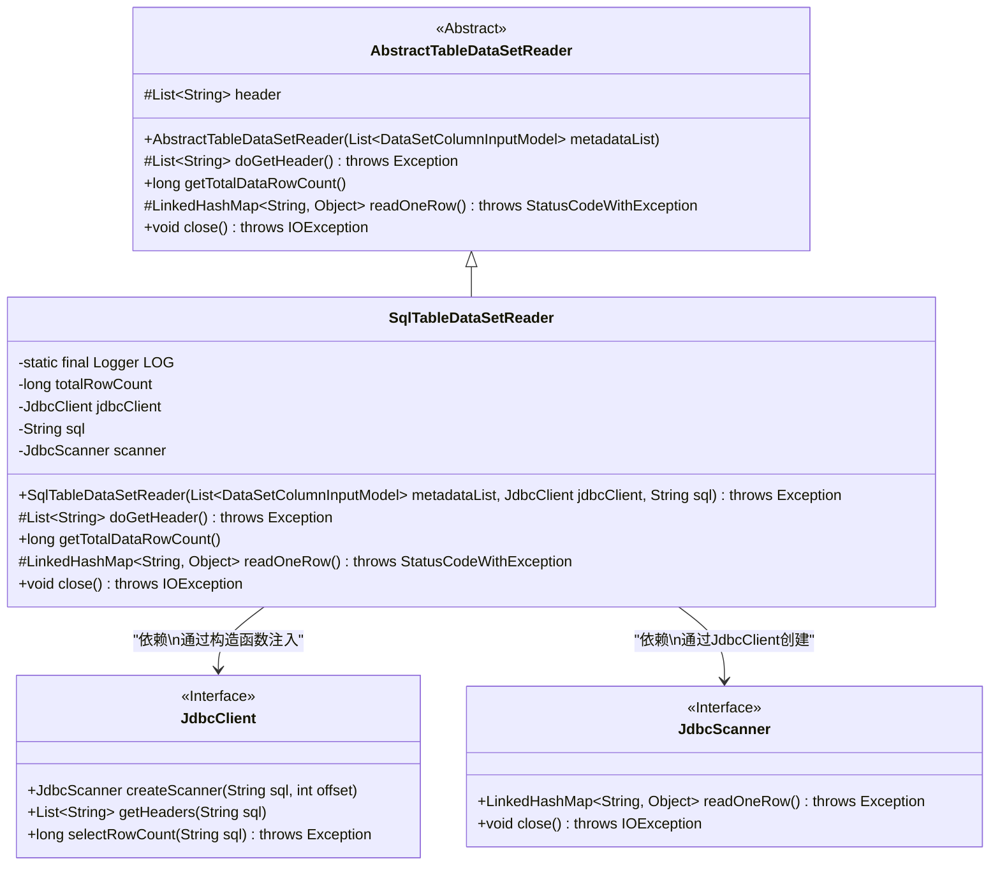
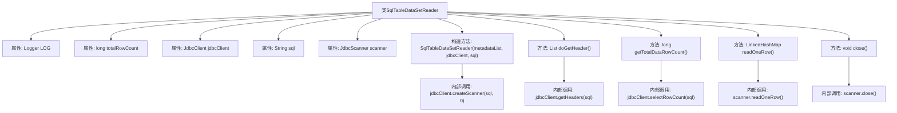

# 基础信息

|      |      |
|------|------|
| 名称 | SqlTableDataSetReader |
| 编码语言 | .java |
| 代码路径 | WeFe/board/board-service/src/main/java/com/welab/wefe/board/service/util/SqlTableDataSetReader.java |
| 包名 | com.welab.wefe.board.service.util |
| 依赖项 | ['com.welab.wefe.board.service.dto.entity.data_set.DataSetColumnInputModel', 'com.welab.wefe.common.StatusCode', 'com.welab.wefe.common.exception.StatusCodeWithException', 'com.welab.wefe.common.jdbc.JdbcClient', 'com.welab.wefe.common.jdbc.base.JdbcScanner', 'org.apache.commons.collections4.CollectionUtils', 'org.slf4j.Logger', 'org.slf4j.LoggerFactory', 'java.io.IOException', 'java.util.LinkedHashMap', 'java.util.List'] |
| 概述说明 | SqlTableDataSetReader类继承AbstractTableDataSetReader，通过JdbcClient执行SQL查询，支持获取表头、总行数和逐行读取数据，最后关闭扫描器。 |

# 说明

SqlTableDataSetReader是一个继承自AbstractTableDataSetReader的类，用于从SQL查询结果中读取数据。它包含一个JdbcClient实例和SQL查询字符串，通过JdbcScanner执行查询并逐行读取结果。类提供了获取表头信息、总行数和单行数据的方法，并在关闭时释放资源。异常处理包括捕获SQL错误并抛出StatusCodeWithException。

# 类列表 Class Summary

| 名称   | 类型  | 说明 |
|-------|------|-------------|
| SqlTableDataSetReader | class | SqlTableDataSetReader类继承AbstractTableDataSetReader，通过JdbcClient执行SQL查询，支持获取表头、总行数和逐行读取数据，使用后需关闭scanner。 |

## 类 SqlTableDataSetReader

|      |      |
|------|------|
| 访问范围 | public |
| 类型 | class |
| 名称 | SqlTableDataSetReader |
| 说明 | SqlTableDataSetReader类继承AbstractTableDataSetReader，通过JdbcClient执行SQL查询，支持获取表头、总行数和逐行读取数据，使用后需关闭scanner。 |

### UML类图

这段代码展示了一个SQL表数据读取器`SqlTableDataSetReader`的实现，它继承自抽象类`AbstractTableDataSetReader`。该类通过`JdbcClient`执行SQL查询并获取结果，使用`JdbcScanner`逐行读取数据。主要功能包括获取表头信息、计算总行数、逐行读取数据以及关闭资源。类图中清晰地体现了继承关系、接口实现和依赖注入的设计模式，展示了如何通过抽象基类和接口实现灵活的数据读取功能。

### 内部方法调用关系图

这段代码展示了一个SQL表数据读取器类，继承自抽象表数据读取器。主要功能包括：通过JDBC客户端执行SQL查询、获取表头信息、计算总行数、逐行读取数据以及关闭扫描器。流程图清晰地呈现了类属性、构造方法、核心方法及其内部调用关系，特别是与JDBC组件的交互过程。异常处理逻辑体现在readOneRow方法中，当读取失败时会抛出SQL错误状态码。

### 字段列表 Field List

| 名称  | 类型  | 说明 |
|-------|-------|------|
| scanner | JdbcScanner | 私有JdbcScanner扫描器实例。 |
| sql | String | 私有不可变字符串变量sql。 |
| totalRowCount = -1 | long | 私有长整型变量totalRowCount，初始值为-1。 |
| jdbcClient | JdbcClient | 私有不可变的JDBC客户端实例。 |
| LOG = LoggerFactory.getLogger(SqlTableDataSetReader.class) | Logger | 声明一个受保护的静态常量日志对象，用于SqlTableDataSetReader类的日志记录。 |

### 方法列表

| 名称  | 类型  | 说明 |
|-------|-------|------|
| getTotalDataRowCount | long | 方法getTotalDataRowCount返回数据总行数。若已缓存则直接返回，否则通过jdbcClient查询并缓存结果，出错时抛出异常。 |
| close | void | 重写close方法，确保scanner非空时调用其close方法，可能抛出IOException。 |
| doGetHeader | List<String> | 方法重写doGetHeader，检查header是否为空，为空则通过jdbcClient获取并返回。 |
| readOneRow | LinkedHashMap<String, Object> | 方法readOneRow调用scanner读取一行数据，异常时抛出SQL错误状态码和异常信息。 |

