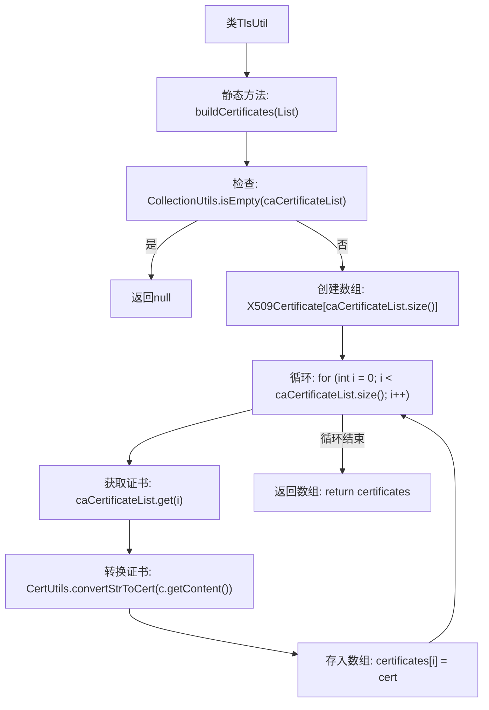

# 基础信息

|      |      |
|------|------|
| 名称 | TlsUtil |
| 编码语言 | .java |
| 代码路径 | WeFe/board/board-service/src/main/java/com/welab/wefe/board/service/util/TlsUtil.java |
| 包名 | com.welab.wefe.board.service.util |
| 依赖项 | ['com.webank.cert.toolkit.utils.CertUtils', 'com.welab.wefe.board.service.cache.CaCertificateCache', 'org.apache.commons.collections4.CollectionUtils', 'java.security.cert.X509Certificate', 'java.util.List'] |
| 概述说明 | TlsUtil类提供buildCertificates方法，将CaCertificate列表转换为X509Certificate数组，若列表为空返回null。 |

# 说明

TlsUtil类包含一个静态方法buildCertificates，用于将CaCertificateCache.CaCertificate列表转换为X509Certificate数组。方法首先检查输入列表是否为空，若为空则返回null。否则，创建一个与输入列表大小相同的X509Certificate数组。遍历列表中的每个CaCertificate对象，使用CertUtils.convertStrToCert方法将其内容字符串转换为X509Certificate对象，并存入数组。最后返回填充完毕的X509Certificate数组。

# 类列表 Class Summary

| 名称   | 类型  | 说明 |
|-------|------|-------------|
| TlsUtil | class | TlsUtil类提供buildCertificates方法，将CaCertificate列表转换为X509Certificate数组，若列表为空返回null。 |


## 类 TlsUtil

|      |      |
|------|------|
| 访问范围 | public |
| 类型 | class |
| 名称 | TlsUtil |
| 说明 | TlsUtil类提供buildCertificates方法，将CaCertificate列表转换为X509Certificate数组，若列表为空返回null。 |


### UML类图

```mermaid
classDiagram
    class TlsUtil {
        +buildCertificates(List~CaCertificateCache.CaCertificate~ caCertificateList) X509Certificate[]
    }

    class CaCertificateCache {
        <<Inner>>
        class CaCertificate {
            -String content
            +String getContent()
        }
    }

    class CertUtils {
        <<Utility>>
        +convertStrToCert(String certStr) X509Certificate
    }

    TlsUtil --> CertUtils : 调用转换方法
    TlsUtil --> CaCertificateCache.CaCertificate : 读取证书内容
```

该代码展示了TlsUtil工具类通过buildCertificates方法将CaCertificate列表转换为X509Certificate数组的过程。核心依赖CertUtils进行字符串到证书的转换，并操作CaCertificateCache内部类的CaCertificate对象获取证书内容。类图清晰地反映了工具类与辅助类之间的协作关系，以及内部类的层级结构。


### 内部方法调用关系图



该流程图展示了TlsUtil类中buildCertificates方法的完整逻辑流程。方法首先检查输入列表是否为空，为空则返回null；否则创建X509Certificate数组，通过循环将每个CA证书字符串转换为X509Certificate对象并存入数组，最后返回填充完成的数组。整个过程包含空值检查、数组初始化、循环处理和类型转换等关键步骤。

### 字段列表 Field List

| 名称  | 类型  | 说明 |
|-------|-------|------|

### 方法列表

| 名称  | 类型  | 说明 |
|-------|-------|------|
| buildCertificates | X509Certificate[] | 将CA证书列表转换为X509证书数组，空列表返回null。 |


