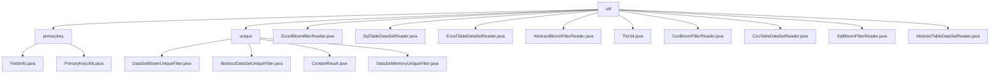

# 基础信息

|      |      |
|------|------|
| 名称 | util |
| 编码语言 | .java |
| 代码路径 | WeFe/board/board-service/src/main/java/com/welab/wefe/board/service/util |
| 包名 | docs.board.board-service.src.main.java.com.welab.wefe.board.service.util |
| 概述说明 | 模块1管理字段元数据并生成主键，含FieldInfo和PrimaryKeyUtils类，支持哈希处理。模块2提供数据集去重功能，含布隆过滤器和内存HashSet两种策略。多个Reader类（Excel、CSV、SQL）继承抽象类读取数据，支持表头处理、行数统计和资源释放。TlsUtil类转换证书格式。 |

# 说明

## 概述  
该模块核心职责分为两大方向：数据主键管理与数据集去重。主键管理通过FieldInfo封装字段属性，PrimaryKeyUtils提供哈希/拼接处理，类似ETL数据管道；去重功能采用布隆过滤器或内存HashSet策略，类似缓存穿透防护机制。统一接口规范包括FieldInfo的列解析方法、PrimaryKeyUtils的主键生成方法，以及AbstractDataSetUniqueFilter的contains枚举检测。关键数据结构涵盖FieldInfo的字段属性、布隆过滤器（1亿宽度/0.01误判率）和内存HashSet。外部依赖仅涉及Java基础库和Guava。例如主键模块对姓名+身份证做SHA1哈希，去重模块用布隆过滤器处理海量数据。

## 主要业务场景  
典型流程呈现双模式：主键生成链（配置字段→选择哈希算法）和去重检测链（输入字符串→返回In/NotIn/MaybeIn）。交互模式统一为工具类方法调用，如PrimaryKeyUtils.create()或AbstractDataSetUniqueFilter.contains()。完整功能覆盖从数据预处理（Excel/CSV/SQL读取）到核心处理（主键生成、去重校验）的闭环，例如SqlTableDataSetReader读取数据后经布隆过滤器去重。API集成案例包括JObject列值拼接、JDBC结果集处理，支持扩展新策略。多数据源适配器（Excel/CSV/SQL）均继承抽象读取器，强制实现表头解析、行数统计等规范。

### 包内部结构视图

该流程图展示了WeFe项目中board-service模块下util包的层级结构。util作为根目录包含primarykey和unique两个子目录，以及多个工具类文件。primarykey目录下包含主键相关工具类，unique目录下包含数据去重相关工具类，其余文件为各种数据读取器和工具类。

# 文件列表

| 名称   | 类型  | 说明 |
|-------|------|-------------|
| [ExcelBloomfilterReader.java](ExcelBloomfilterReader.md) | file | ExcelBloomfilterReader类继承AbstractBloomFilterReader，通过ExcelReader读取Excel文件数据，支持获取表头、总行数和逐行读取数据，读取后自动关闭。 |
| [SqlTableDataSetReader.java](SqlTableDataSetReader.md) | file | SqlTableDataSetReader类继承AbstractTableDataSetReader，通过JdbcClient执行SQL查询，支持获取表头、总行数和逐行读取数据，最后关闭扫描器。 |
| [ExcelTableDataSetReader.java](ExcelTableDataSetReader.md) | file | ExcelTableDataSetReader类继承AbstractTableDataSetReader，通过ExcelReader读取Excel文件数据，提供获取表头、行数和逐行读取数据功能，最后关闭资源。 |
| [AbstractBloomFilterReader.java](AbstractBloomFilterReader.md) | file | 抽象类AbstractBloomFilterReader实现Closeable接口，提供读取布隆过滤器数据功能，包含获取表头、读取数据行、统计行数等方法，支持行数和时间限制读取。 |
| [TlsUtil.java](TlsUtil.md) | file | TlsUtil类提供buildCertificates方法，将CaCertificate列表转换为X509Certificate数组，若列表为空返回null。 |
| [CsvBloomFilterReader.java](CsvBloomFilterReader.md) | file | CsvBloomFilterReader类继承AbstractBloomFilterReader，用于读取CSV文件并处理数据行。支持无头模式，跳过空行，统计总行数，逐行读取数据到LinkedHashMap，最后关闭解析器。 |
| [CsvTableDataSetReader.java](CsvTableDataSetReader.md) | file | CsvTableDataSetReader类继承AbstractTableDataSetReader，用于读取CSV文件数据。包含获取表头、计算总行数、逐行读取数据及关闭解析器功能。支持自定义元数据和UTF-8编码。 |
| [SqlBloomFilterReader.java](SqlBloomFilterReader.md) | file | SqlBloomFilterReader类继承AbstractBloomFilterReader，通过JDBC客户端执行SQL查询，读取数据行和表头，支持获取总行数和关闭扫描器。 |
| [AbstractTableDataSetReader.java](AbstractTableDataSetReader.md) | file | 抽象类AbstractTableDataSetReader实现Closeable接口，提供读取表格数据集功能，包含获取表头、读取数据行、校验数据类型等方法，支持行数限制和时间限制读取。 |
| [unique](unique/_module.md) | package | DataSetBloomUniqueFilter基于布隆过滤器高效去重，继承AbstractDataSetUniqueFilter，默认误判率0.01。AbstractDataSetUniqueFilter是抽象类，定义contains方法检查元素存在性。ContainResult枚举表示存在状态。DataSetMemoryUniqueFilter继承AbstractDataSetUniqueFilter，使用HashSet快速判断元素唯一性。 |
| [primarykey](primarykey/_module.md) | package | FieldInfo类管理字段信息，含列名、选项、索引等属性及对应方法。PrimaryKeyUtils类提供主键生成功能，支持MD5、SHA1、NONE三种处理方式，根据配置处理数据并拼接结果。 |

