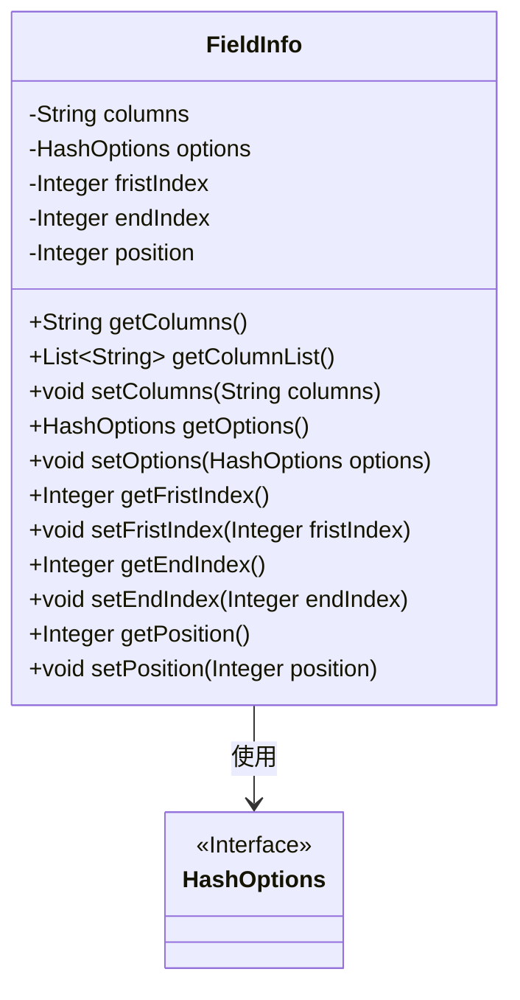

# 基础信息

|      |      |
|------|------|
| 名称 | FieldInfo |
| 编码语言 | .java |
| 代码路径 | WeFe/board/board-service/src/main/java/com/welab/wefe/board/service/util/primarykey/FieldInfo.java |
| 包名 | com.welab.wefe.board.service.util.primarykey |
| 依赖项 | ['com.welab.wefe.common.wefe.enums.HashOptions', 'java.util.Arrays', 'java.util.List'] |
| 概述说明 | FieldInfo类包含字段columns、options、fristIndex、endIndex和position，提供get/set方法及getColumnList分割columns为列表。 |

# 说明

FieldInfo类是一个包含字段信息的Java类，具有私有属性columns、options、fristIndex、endIndex和position。提供了对应的getter和setter方法，其中getColumnList方法将columns按逗号分割为字符串列表。该类用于管理字段的列名、哈希选项、起始索引、结束索引和位置信息。

# 类列表 Class Summary

| 名称   | 类型  | 说明 |
|-------|------|-------------|
| FieldInfo | class | FieldInfo类包含字段columns、options、fristIndex、endIndex、position，提供get/set方法及getColumnList分割columns为列表。 |

## 类 FieldInfo

|      |      |
|------|------|
| 访问范围 | public |
| 类型 | class |
| 名称 | FieldInfo |
| 说明 | FieldInfo类包含字段columns、options、fristIndex、endIndex、position，提供get/set方法及getColumnList分割columns为列表。 |

### UML类图

这段代码定义了一个FieldInfo类，用于存储字段信息，包含字段列名、哈希选项、起始索引、结束索引和位置等属性。类中提供了对这些属性的getter和setter方法，以及一个将列名字符串转换为列表的方法。FieldInfo类依赖于HashOptions接口，该接口可能定义了哈希处理的相关选项。整体设计体现了数据封装和基本操作封装的原则。

### 内部方法调用关系图

```mermaid
graph TD
    A["类FieldInfo"]
    B["属性: String columns"]
    C["属性: HashOptions options"]
    D["属性: Integer fristIndex"]
    E["属性: Integer endIndex"]
    F["属性: Integer position"]
    G["方法: String getColumns()"]
    H["方法: List<String> getColumnList()"]
    I["方法: void setColumns(String columns)"]
    J["方法: HashOptions getOptions()"]
    K["方法: void setOptions(HashOptions options)"]
    L["方法: Integer getFristIndex()"]
    M["方法: void setFristIndex(Integer fristIndex)"]
    N["方法: Integer getEndIndex()"]
    O["方法: void setEndIndex(Integer endIndex)"]
    P["方法: Integer getPosition()"]
    Q["方法: void setPosition(Integer position)"]

    A --> B
    A --> C
    A --> D
    A --> E
    A --> F
    A --> G
    A --> H
    A --> I
    A --> J
    A --> K
    A --> L
    A --> M
    A --> N
    A --> O
    A --> P
    A --> Q
```

这段代码定义了一个名为FieldInfo的类，包含5个私有属性和对应的getter/setter方法。其中columns属性存储字符串，getColumnList()方法将其按逗号分割为列表；options属性是HashOptions类型；fristIndex、endIndex和position是整型包装类。所有方法均为标准访问器，用于属性读写控制，体现了Java Bean的设计模式。

### 字段列表 Field List

| 名称  | 类型  | 说明 |
|-------|-------|------|
| options | HashOptions | 私有哈希配置项。 |
| endIndex | Integer | 私有整型变量，表示结束索引。 |
| columns | String | 私有字符串变量columns。 |
| position | Integer | 私有整型变量position。 |
| fristIndex | Integer | 声明一个私有整型变量fristIndex。 |

### 方法列表

| 名称  | 类型  | 说明 |
|-------|-------|------|
| getOptions | HashOptions | 方法getOptions返回HashOptions对象options。 |
| getColumnList | List<String> | 该方法将字符串columns按逗号分割并转为列表返回。 |
| getColumns | String | 这是一个Java方法，返回名为columns的字符串变量。 |
| setColumns | void | 方法setColumns用于设置字符串类型的columns属性值。 |
| getEndIndex | Integer | 获取结束索引的整数值。 |
| getFristIndex | Integer | 获取fristIndex值的公共方法，返回Integer类型。 |
| setFristIndex | void | 这是一个Java方法，用于设置类的fristIndex属性值。方法接收一个Integer参数，并将其赋值给类的成员变量fristIndex。 |
| setEndIndex | void | 设置结束索引的方法，将输入参数赋值给类的endIndex属性。 |
| setOptions | void | 设置哈希选项的方法，将输入参数赋值给当前对象的options属性。 |
| getPosition | Integer | 获取位置值的方法，返回整数类型的position变量。 |
| setPosition | void | 设置对象的位置属性，参数为整型数值。 |

