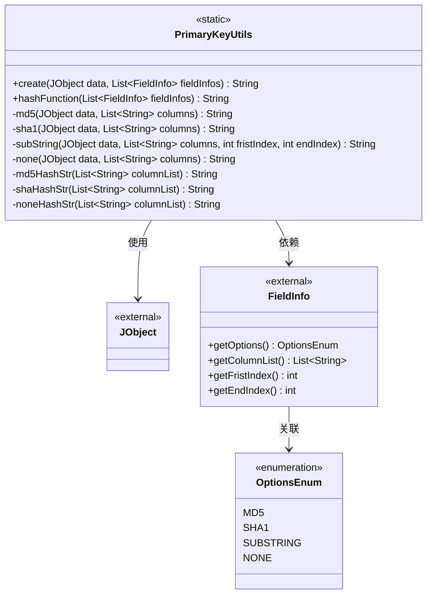
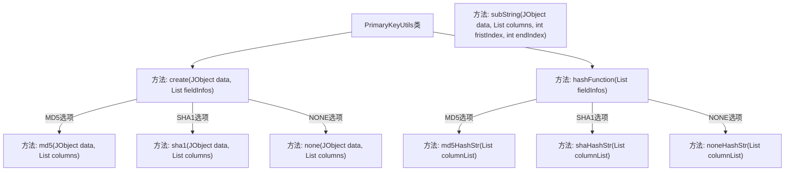
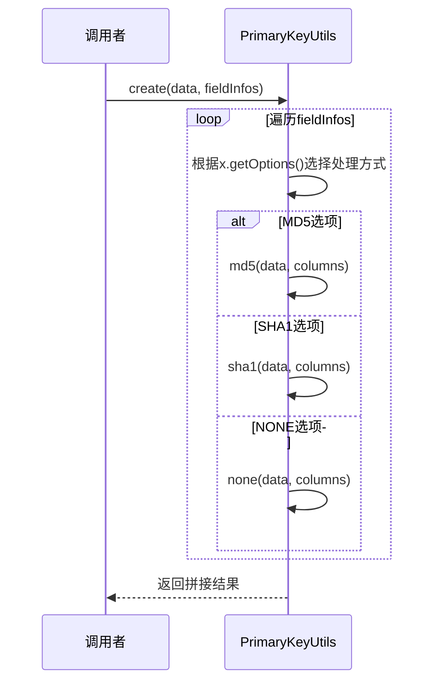

# 基础信息

|      |      |
|------|------|
| 名称 | PrimaryKeyUtils |
| 编码语言 | .java |
| 代码路径 | WeFe/board/board-service/src/main/java/com/welab/wefe/board/service/util/primarykey/PrimaryKeyUtils.java |
| 包名 | com.welab.wefe.board.service.util.primarykey |
| 依赖项 | ['com.welab.wefe.common.util.JObject', 'com.welab.wefe.common.util.Md5', 'com.welab.wefe.common.util.Sha1', 'com.welab.wefe.common.wefe.enums.HashOptions', 'java.util.ArrayList', 'java.util.List'] |
| 概述说明 | PrimaryKeyUtils类提供主键生成功能，支持MD5、SHA1、NONE等处理方式，根据字段规则拼接或加密数据生成主键。 |

# 说明

PrimaryKeyUtils类提供主键生成功能，支持MD5、SHA1、NONE三种处理方式。create方法根据FieldInfo配置，对JObject数据中的指定列进行相应处理并拼接结果。MD5和SHA1方法对列值拼接后进行哈希计算，NONE方法直接拼接列值。hashFunction方法生成字段处理规则的描述字符串，格式为哈希类型加列名列表。类内包含私有方法实现具体处理逻辑，包括字符串拼接和哈希计算。

# 类列表 Class Summary

| 名称   | 类型  | 说明 |
|-------|------|-------------|
| PrimaryKeyUtils | class | PrimaryKeyUtils类提供主键生成功能，支持MD5、SHA1、NONE等处理方式，根据字段规则拼接或加密数据生成主键。 |

## 类 PrimaryKeyUtils

|      |      |
|------|------|
| 访问范围 | public |
| 类型 | class |
| 名称 | PrimaryKeyUtils |
| 说明 | PrimaryKeyUtils类提供主键生成功能，支持MD5、SHA1、NONE等处理方式，根据字段规则拼接或加密数据生成主键。 |

### UML类图

类图描述：
PrimaryKeyUtils是一个工具类，提供静态方法用于生成主键和哈希字符串。它依赖JObject作为数据源，使用FieldInfo类获取字段配置信息，FieldInfo通过OptionsEnum枚举定义处理选项。类中包含多种私有加密处理方法（MD5/SHA1）和字符串处理逻辑，公有方法create()和hashFunction()分别实现主键生成和哈希字符串构建功能。所有方法均为静态，不维护实例状态。

### 内部方法调用关系图

这段代码实现了一个主键生成工具类，提供多种主键生成策略（MD5、SHA1、NONE等）。流程图展示了类结构和方法调用关系，时序图描述了create方法的执行流程。代码通过遍历字段信息列表，根据每个字段的配置选项选择对应的加密或处理方式，最终拼接生成主键字符串。hashFunction方法则生成描述性哈希函数字符串。

### 字段列表 Field List

| 名称  | 类型  | 说明 |
|-------|-------|------|

### 方法列表

| 名称  | 类型  | 说明 |
|-------|-------|------|
| md5 | String | 该方法接收JSON对象和列名列表，拼接指定列的值后生成MD5哈希值返回。 |
| hashFunction | String | 静态方法hashFunction根据字段选项对列列表进行MD5、SHA1或无哈希处理，拼接结果后返回去除末尾加号的字符串。 |
| md5HashStr | String | 该方法将字符串列表拼接为以加号分隔的字符串，并添加MD5前缀。例如输入[A,B]返回MD5(A+B)。 |
| shaHashStr | String | 该方法将字符串列表用加号连接，并在结果前添加"SHA()"前缀。 |
| create | String | 静态方法根据字段选项处理数据：MD5加密、SHA1哈希或无处理（NONE），拼接结果返回字符串。 |
| none | String | 静态方法`none`接收JObject和字符串列表，遍历列表拼接JObject中对应键的值，返回拼接后的字符串。 |
| sha1 | String | 该方法通过拼接JObject中指定列的值生成字符串，并返回其SHA1哈希值。输入为JObject和列名列表，输出为哈希字符串。 |
| noneHashStr | String | 静态方法noneHashStr接收字符串列表，用"+"连接所有元素后返回结果字符串。 |
| subString | String | 该方法从JObject提取指定列数据拼接成字符串，并截取指定索引范围的子串返回。 |

