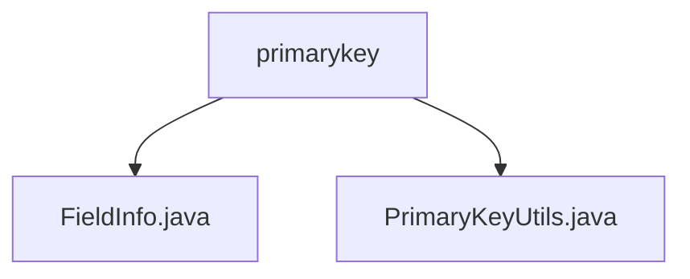

# 基础信息

|      |      |
|------|------|
| 名称 | primarykey |
| 编码语言 | .java |
| 代码路径 | WeFe/board/board-service/src/main/java/com/welab/wefe/board/service/util/primarykey |
| 包名 | docs.board.board-service.src.main.java.com.welab.wefe.board.service.util.primarykey |
| 概述说明 | FieldInfo类管理字段信息，含列名、选项、索引等属性及对应方法。PrimaryKeyUtils类提供主键生成功能，支持MD5、SHA1、NONE三种处理方式，根据配置处理数据并拼接结果。 |

# 说明

## 概述  
该模块核心职责是管理字段元数据并生成主键，通过FieldInfo类封装字段属性，PrimaryKeyUtils类提供哈希和拼接处理能力。接口规范包括FieldInfo的列名分割方法（getColumnList）和PrimaryKeyUtils的主键生成方法（create/hashFunction）。关键数据结构为FieldInfo，包含columns、options等字段属性。外部依赖仅为Java基础库。例如FieldInfo解析"name,age"为列表，PrimaryKeyUtils对两列值进行MD5哈希。

## 主要业务场景  
典型流程为：配置FieldInfo定义字段范围（如fristIndex-endIndex），通过PrimaryKeyUtils选择哈希方式（MD5/SHA1/NONE）生成主键。交互模式类似ETL数据管道，先提取字段再转换。完整功能覆盖从字段管理到主键生成的闭环，例如对用户表的姓名和身份证列进行SHA1哈希。API类型包含工具类方法，集成案例可见JObject数据的列值拼接与哈希处理。

### 包内部结构视图

该流程图展示了WeFe项目中board-service模块下primarykey工具类的文件结构。primarykey目录包含两个Java文件：FieldInfo.java和PrimaryKeyUtils.java，这两个文件共同构成了主键工具类的实现。FieldInfo.java可能用于存储字段信息，而PrimaryKeyUtils.java则提供主键相关的工具方法。

# 文件列表

| 名称   | 类型  | 说明 |
|-------|------|-------------|
| [FieldInfo.java](FieldInfo.md) | file | FieldInfo类包含字段columns、options、fristIndex、endIndex和position，提供get/set方法及getColumnList分割columns为列表。 |
| [PrimaryKeyUtils.java](PrimaryKeyUtils.md) | file | PrimaryKeyUtils类提供主键生成功能，支持MD5、SHA1、NONE等处理方式，根据字段规则拼接或加密数据生成主键。 |

