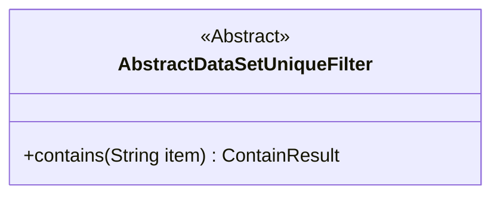
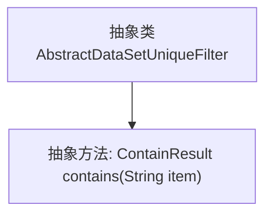

# 基础信息

|      |      |
|------|------|
| 名称 | AbstractDataSetUniqueFilter |
| 编码语言 | .java |
| 代码路径 | WeFe/board/board-service/src/main/java/com/welab/wefe/board/service/util/unique/AbstractDataSetUniqueFilter.java |
| 包名 | com.welab.wefe.board.service.util.unique |
| 依赖项 | [] |
| 概述说明 | 抽象类AbstractDataSetUniqueFilter定义了一个判断元素是否存在的抽象方法contains，参数为字符串item，返回ContainResult类型结果。 |

# 说明

这是一个名为AbstractDataSetUniqueFilter的抽象类，定义了一个用于判断元素是否存在的抽象方法。该类包含一个名为contains的抽象方法，接收一个字符串参数item，返回一个ContainResult类型的结果。该方法用于确定过滤器是否包含指定元素。整个类结构简洁，专注于元素存在性检查的核心功能。

# 类列表 Class Summary

| 名称   | 类型  | 说明 |
|-------|------|-------------|
| AbstractDataSetUniqueFilter | class | 抽象类AbstractDataSetUniqueFilter定义了一个抽象方法contains，用于判断是否包含指定元素。 |

## 类 AbstractDataSetUniqueFilter

|      |      |
|------|------|
| 访问范围 | public abstract |
| 类型 | class |
| 名称 | AbstractDataSetUniqueFilter |
| 说明 | 抽象类AbstractDataSetUniqueFilter定义了一个抽象方法contains，用于判断是否包含指定元素。 |

### UML类图

这段类图描述了一个名为AbstractDataSetUniqueFilter的抽象类，该类定义了一个抽象方法contains，用于判断过滤器中是否包含指定元素。方法接收一个String类型的参数item，返回一个ContainResult类型的结果。该类被标记为抽象类（<<Abstract>>），意味着它不能被直接实例化，需要由子类实现具体的contains方法逻辑。这个设计为数据集唯一性过滤提供了基础框架，允许不同实现方式来处理元素存在性检查。

### 内部方法调用关系图

这段代码定义了一个名为AbstractDataSetUniqueFilter的抽象类，其中包含一个抽象方法contains(String item)，用于判断过滤器是否包含指定元素。该抽象类作为基类，需要子类实现具体的过滤逻辑。流程图清晰地展示了类与方法的从属关系，抽象类指向其唯一的抽象方法，体现了面向对象设计中"定义规范，延迟实现"的核心思想。

### 字段列表 Field List

| 名称  | 类型  | 说明 |
|-------|-------|------|

### 方法列表

| 名称  | 类型  | 说明 |
|-------|-------|------|
| contains | ContainResult | 抽象方法，检查是否包含指定项，返回ContainResult类型结果。 |

