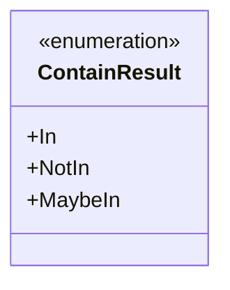
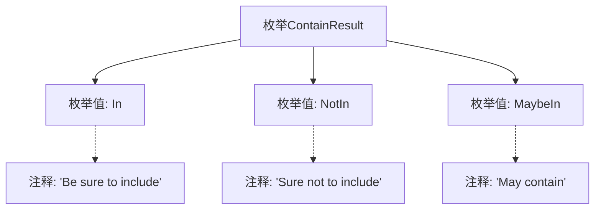

# 基础信息

|      |      |
|------|------|
| 名称 | ContainResult |
| 编码语言 | .java |
| 代码路径 | WeFe/board/board-service/src/main/java/com/welab/wefe/board/service/util/unique/ContainResult.java |
| 包名 | com.welab.wefe.board.service.util.unique |
| 依赖项 | [] |
| 概述说明 | 枚举ContainResult定义三种状态：In表示包含，NotIn表示不包含，MaybeIn表示可能包含。 |

# 说明

该内容定义了一个名为ContainResult的枚举类型，包含三个枚举值：In表示确定包含，NotIn表示确定不包含，MaybeIn表示可能包含。每个枚举值都附带注释说明其含义。

# 类列表 Class Summary

| 名称   | 类型  | 说明 |
|-------|------|-------------|
| ContainResult | enum | 枚举ContainResult定义三种状态：In表示确定包含，NotIn表示确定不包含，MaybeIn表示可能包含。 |

## 类 ContainResult

|      |      |
|------|------|
| 访问范围 | public |
| 类型 | enum |
| 名称 | ContainResult |
| 说明 | 枚举ContainResult定义三种状态：In表示确定包含，NotIn表示确定不包含，MaybeIn表示可能包含。 |

### UML类图

该枚举类定义了三种可能的状态：In表示确定包含，NotIn表示确定不包含，MaybeIn表示可能包含。这是一个典型的三态枚举设计模式，常用于需要明确区分确定性和不确定性结果的场景。枚举值通过Javadoc注释清晰地说明了每种状态的具体含义，增强了代码的可读性和自描述性。

### 内部方法调用关系图

该流程图展示了ContainResult枚举的结构，包含三个枚举值（In、NotIn、MaybeIn）及其对应的注释说明。In表示确定包含，NotIn表示确定不包含，MaybeIn表示可能包含。每个枚举值通过虚线连接到其对应的注释文本，清晰地表达了每个枚举值的语义含义。整个结构简洁明了，便于理解枚举的设计意图和使用场景。

### 字段列表 Field List

| 名称  | 类型  | 说明 |
|-------|-------|------|

### 方法列表

| 名称  | 类型  | 说明 |
|-------|-------|------|

