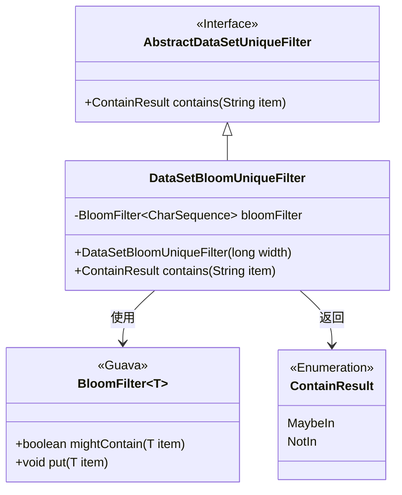
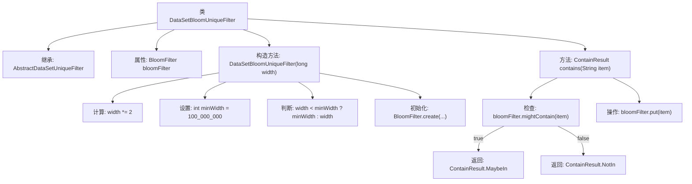

# 基础信息

|      |      |
|------|------|
| 名称 | DataSetBloomUniqueFilter |
| 编码语言 | .java |
| 代码路径 | WeFe/board/board-service/src/main/java/com/welab/wefe/board/service/util/unique/DataSetBloomUniqueFilter.java |
| 包名 | com.welab.wefe.board.service.util.unique |
| 依赖项 | ['com.google.common.base.Charsets', 'com.google.common.hash.BloomFilter', 'com.google.common.hash.Funnels'] |
| 概述说明 | DataSetBloomUniqueFilter类使用布隆过滤器判断字符串是否存在。构造函数设置初始容量并创建过滤器。contains方法检查并添加元素，返回可能存在或不存在的结果。 |

# 说明

DataSetBloomUniqueFilter是一个基于布隆过滤器的数据集去重过滤器类，继承自AbstractDataSetUniqueFilter。它使用布隆过滤器来高效判断字符串是否可能重复。构造函数接收一个初始宽度参数，会自动扩大两倍并设置最小宽度为1亿。布隆过滤器使用UTF-8字符串漏斗，默认误判率为0.01。contains方法检查字符串是否可能存在，若可能存在返回MaybeIn，否则返回NotIn，并始终将字符串加入过滤器。

# 类列表 Class Summary

| 名称   | 类型  | 说明 |
|-------|------|-------------|
| DataSetBloomUniqueFilter | class | DataSetBloomUniqueFilter类使用布隆过滤器检查字符串唯一性，宽度不足时设为最小值1亿，误判率1%。contains方法返回MaybeIn或NotIn。 |

## 类 DataSetBloomUniqueFilter

|      |      |
|------|------|
| 访问范围 | public |
| 类型 | class |
| 名称 | DataSetBloomUniqueFilter |
| 说明 | DataSetBloomUniqueFilter类使用布隆过滤器检查字符串唯一性，宽度不足时设为最小值1亿，误判率1%。contains方法返回MaybeIn或NotIn。 |

### UML类图

该代码实现了一个基于布隆过滤器的数据集去重过滤器。DataSetBloomUniqueFilter继承自抽象类AbstractDataSetUniqueFilter，内部使用Guava的BloomFilter进行高效元素存在性判断。构造函数根据输入宽度动态调整布隆过滤器容量，最小保证1亿的容量。contains()方法通过mightContain()和put()操作实现去重逻辑，返回枚举结果表示元素可能存在或肯定不存在。布隆过滤器使用UTF-8字符串漏斗处理字符序列，默认误判率为1%。

### 内部方法调用关系图

该流程图展示了DataSetBloomUniqueFilter类的结构和主要逻辑流程。类继承自AbstractDataSetUniqueFilter，包含一个BloomFilter属性和两个主要方法：构造方法初始化布隆过滤器并调整参数，contains方法检查元素是否存在并更新过滤器。构造方法中会调整宽度参数并确保最小值，然后创建布隆过滤器实例。contains方法先检查元素可能存在性，然后添加元素，最后根据检查结果返回不同的枚举值。

### 字段列表 Field List

| 名称  | 类型  | 说明 |
|-------|-------|------|
| bloomFilter | BloomFilter<CharSequence> | 私有不可变的布隆过滤器，泛型为字符序列类型。 |

### 方法列表

| 名称  | 类型  | 说明 |
|-------|-------|------|
| contains | ContainResult | 方法检查布隆过滤器是否可能包含某元素，若可能返回MaybeIn，否则返回NotIn并添加该元素。 |

