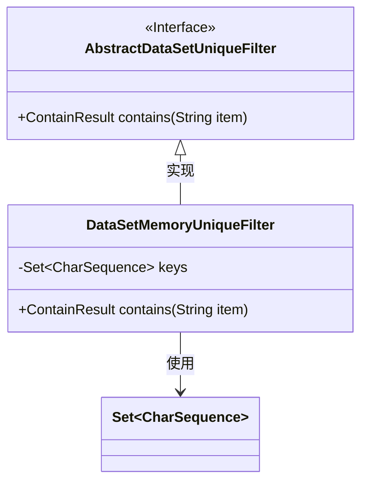
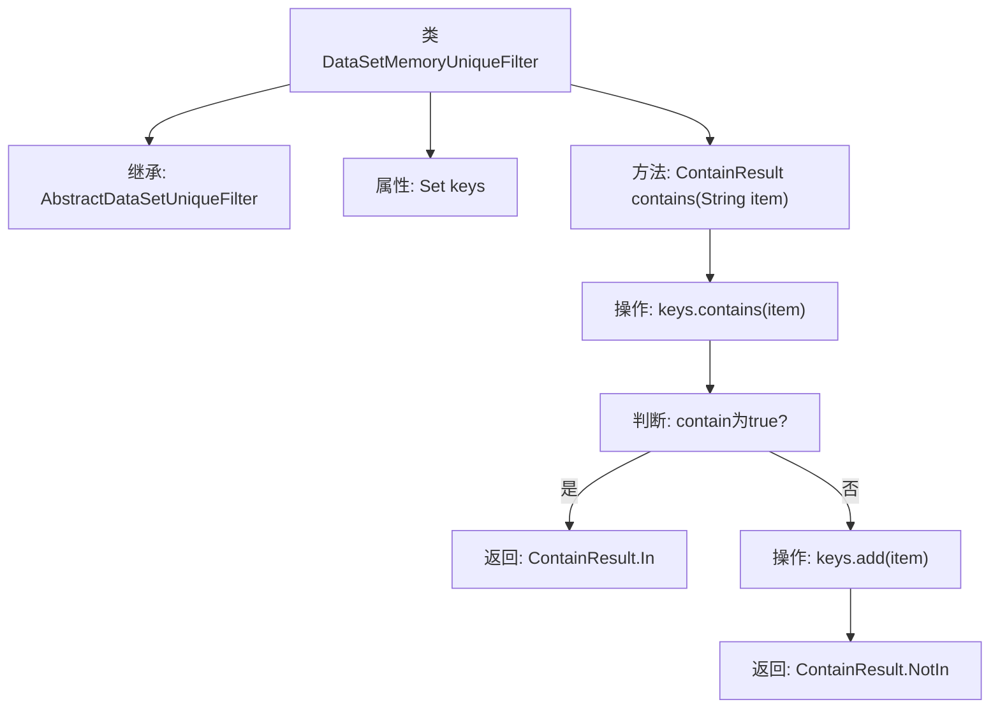

# 基础信息

|      |      |
|------|------|
| 名称 | DataSetMemoryUniqueFilter |
| 编码语言 | .java |
| 代码路径 | WeFe/board/board-service/src/main/java/com/welab/wefe/board/service/util/unique/DataSetMemoryUniqueFilter.java |
| 包名 | com.welab.wefe.board.service.util.unique |
| 依赖项 | ['java.util.HashSet', 'java.util.Set'] |
| 概述说明 | 数据集内存去重过滤器，使用HashSet存储键值，检查字符串是否存在，不存在则添加并返回NotIn，存在返回In。 |

# 说明

DataSetMemoryUniqueFilter是一个继承自AbstractDataSetUniqueFilter的类，用于实现基于内存的唯一性过滤功能。它内部使用HashSet存储字符序列键值，通过contains方法检查输入字符串是否已存在集合中。若存在返回ContainResult.In枚举值，否则将字符串加入集合并返回ContainResult.NotIn。该实现通过内存数据结构快速判断元素唯一性。

# 类列表 Class Summary

| 名称   | 类型  | 说明 |
|-------|------|-------------|
| DataSetMemoryUniqueFilter | class | 数据集内存唯一过滤器，通过HashSet检查字符串是否已存在，不存在则添加并返回NotIn，存在返回In。 |

## 类 DataSetMemoryUniqueFilter

|      |      |
|------|------|
| 访问范围 | public |
| 类型 | class |
| 名称 | DataSetMemoryUniqueFilter |
| 说明 | 数据集内存唯一过滤器，通过HashSet检查字符串是否已存在，不存在则添加并返回NotIn，存在返回In。 |

### UML类图

类图描述：
该图展示了一个内存唯一性过滤器的类结构，DataSetMemoryUniqueFilter实现了AbstractDataSetUniqueFilter接口，用于检查字符串是否已存在于HashSet集合中。如果存在返回ContainResult.In，否则将字符串加入集合并返回ContainResult.NotIn。图中清晰显示了接口与实现类的关系，以及类对Set集合的依赖关系，体现了基于内存的去重功能实现机制。

### 内部方法调用关系图

该流程图描述了DataSetMemoryUniqueFilter类的结构和contains方法逻辑流程。类继承自AbstractDataSetUniqueFilter，核心是通过HashSet实现去重功能。contains方法首先检查元素是否存在集合中，存在则返回In状态，否则添加元素并返回NotIn状态。整个流程展示了内存级数据去重的典型实现方式，通过哈希集合保证高效查询和唯一性。

### 字段列表 Field List

| 名称  | 类型  | 说明 |
|-------|-------|------|
| keys = new HashSet<>() | Set<CharSequence> | 声明一个不可变的HashSet集合，用于存储CharSequence类型的键。 |

### 方法列表

| 名称  | 类型  | 说明 |
|-------|-------|------|
| contains | ContainResult | 检查字符串是否在集合中，存在返回In，不存在则添加并返回NotIn。 |

