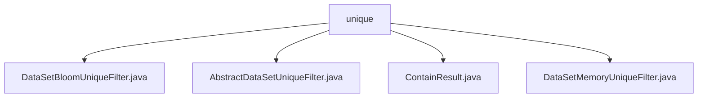

# 基础信息

|      |      |
|------|------|
| 名称 | unique |
| 编码语言 | .java |
| 代码路径 | WeFe/board/board-service/src/main/java/com/welab/wefe/board/service/util/unique |
| 包名 | docs.board.board-service.src.main.java.com.welab.wefe.board.service.util.unique |
| 概述说明 | DataSetBloomUniqueFilter基于布隆过滤器高效去重，继承AbstractDataSetUniqueFilter，默认误判率0.01。AbstractDataSetUniqueFilter是抽象类，定义contains方法检查元素存在性。ContainResult枚举表示存在状态。DataSetMemoryUniqueFilter继承AbstractDataSetUniqueFilter，使用HashSet快速判断元素唯一性。 |

# 说明

## 概述  
该模块提供数据集去重功能，核心职责是通过不同策略（布隆过滤器或内存HashSet）高效判断字符串唯一性。接口规范统一为AbstractDataSetUniqueFilter定义的contains方法，返回ContainResult枚举（In/NotIn/MaybeIn）。关键数据结构包括布隆过滤器（初始宽度1亿，误判率0.01）和内存HashSet。外部依赖仅涉及Guava的布隆过滤器实现。例如DataSetBloomUniqueFilter适合海量数据去重，DataSetMemoryUniqueFilter则适用于精确匹配场景。

## 主要业务场景  
模块支持两种去重模式：概率型（类似缓存穿透防护）和精确型（类似数据库主键校验）。典型流程为：输入字符串经contains方法检测，返回枚举结果并自动更新存储。例如布隆过滤器可能返回MaybeIn以平衡性能与准确性，而内存过滤器直接返回确定结果。集成时可通过抽象类扩展新策略，统一使用ContainResult作为交互契约。

### 包内部结构视图

该流程图展示了WeFe项目中board-service模块下unique工具包的类结构关系。根节点为unique目录，包含四个Java类文件：DataSetBloomUniqueFilter、AbstractDataSetUniqueFilter、ContainResult和DataSetMemoryUniqueFilter，这些类都属于数据去重功能相关的工具类实现。

# 文件列表

| 名称   | 类型  | 说明 |
|-------|------|-------------|
| [DataSetBloomUniqueFilter.java](DataSetBloomUniqueFilter.md) | file | DataSetBloomUniqueFilter类使用布隆过滤器判断字符串是否存在。构造函数设置初始容量并创建过滤器。contains方法检查并添加元素，返回可能存在或不存在的结果。 |
| [AbstractDataSetUniqueFilter.java](AbstractDataSetUniqueFilter.md) | file | 抽象类AbstractDataSetUniqueFilter定义了一个判断元素是否存在的抽象方法contains，参数为字符串item，返回ContainResult类型结果。 |
| [ContainResult.java](ContainResult.md) | file | 枚举ContainResult定义三种状态：In表示包含，NotIn表示不包含，MaybeIn表示可能包含。 |
| [DataSetMemoryUniqueFilter.java](DataSetMemoryUniqueFilter.md) | file | 数据集内存去重过滤器，使用HashSet存储键值，检查字符串是否存在，不存在则添加并返回NotIn，存在返回In。 |

