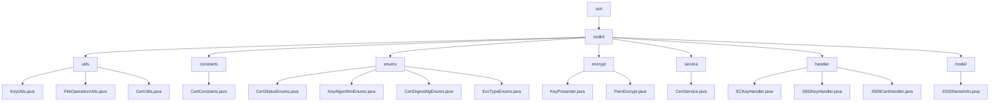

# 基础信息

|      |      |
|------|------|
| 名称 | cert |
| 编码语言 | .java |
| 代码路径 | WeFe/common/java/common-cert/src/main/java/com/webank/cert |
| 包名 | docs.common.java.common-cert.src.main.java.com.webank.cert |
| 概述说明 | 密码学工具集，含密钥管理、证书操作、文件处理。支持RSA/ECDSA/SM2算法，PFX/JKS解析，依赖BouncyCastle。适用PKI全周期管理，如密钥生成、证书签发、存储。含静态工具类如KeyUtils、CertUtils。 |

# 说明

## 概述  
该模块是密码学安全工具集，核心职责是密钥对管理、证书全生命周期操作和基础文件处理，类似轻量级PKI体系实现。接口规范涵盖密钥生成（支持RSA/ECDSA/SM2算法）、证书解析（PFX/JKS格式）、格式转换（PEM/PKCS#8）和X.500属性封装。关键数据结构包括SM2椭圆曲线参数、PKCS8私钥格式、CryptoKeyPair对象和X.500名称模型。外部依赖主要为BouncyCastle安全库和Lombok工具。例如KeyUtils实现SM2密钥生成，CertService处理根证书签发，X500NameInfo封装DN属性。

## 主要业务场景  
模块适用于数字证书全流程管理，典型场景包括：1)密钥对生成→证书签发→存储（如SSL证书部署）；2)证书状态跟踪（WAIT_VERIFY→VALID）；3)CRL吊销列表管理。交互模式采用静态工厂方法（如ECKeyHandler.generateECKeyPair()）和建造者模式（如X509CertHandler链式调用）。典型应用如国密场景：SM2密钥生成→SM3WITHSM2签名→PEM格式化存储。API类型覆盖密码学操作（ECDSA验证）、枚举查询（KeyAlgorithmEnums）和IO操作（原子化文件写入）。

### 包内部结构视图

该流程图展示了WeFe项目中common-cert模块的Java代码结构。根节点为cert，其下包含toolkit目录，toolkit又细分为utils、constants、enums、encrypt、service、handler和model等子模块。每个子模块包含对应的Java文件，如utils包含KeyUtils.java等工具类，enums包含CertStatusEnums.java等枚举类。整体结构清晰，体现了模块化设计思想。

# 文件列表

| 名称   | 类型  | 说明 |
|-------|------|-------------|
| [toolkit](toolkit/_module.md) | package | 密码学工具集，含密钥管理、证书操作、文件处理。支持RSA/ECDSA/SM2算法，PFX/JKS解析，依赖BouncyCastle。适用PKI全周期管理，如密钥生成、证书签发、存储。含静态工具类如KeyUtils、CertUtils。 |

